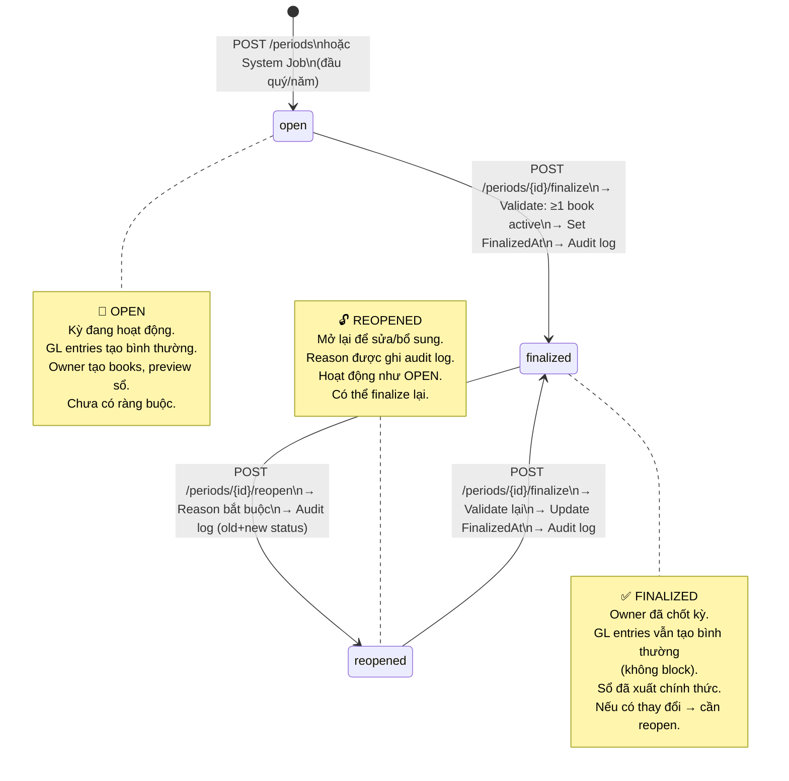
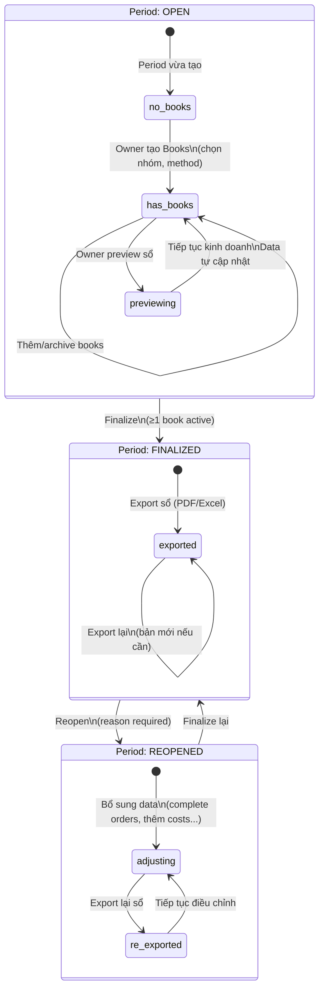
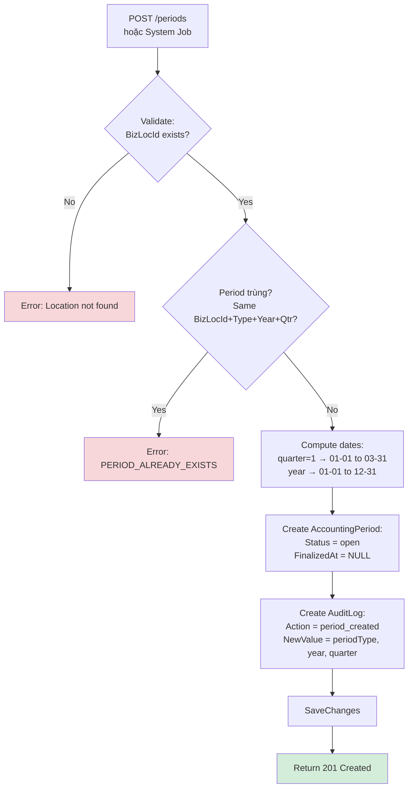
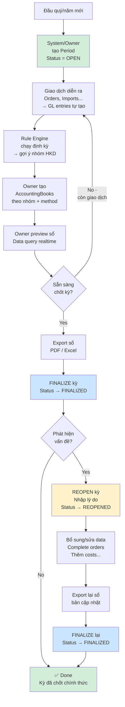
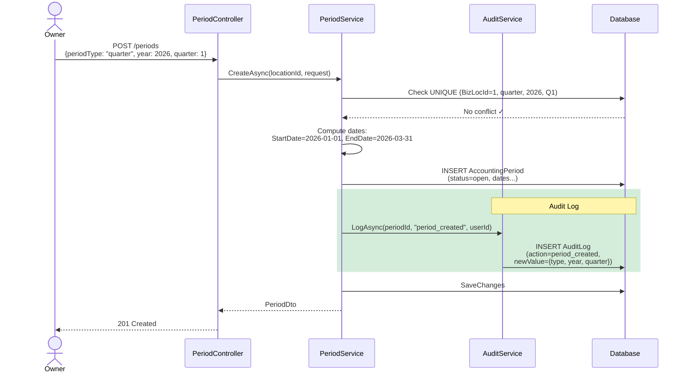
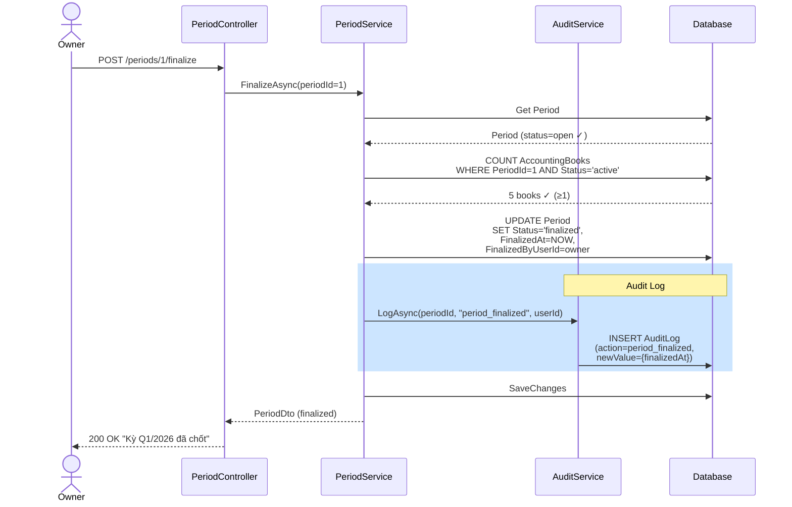
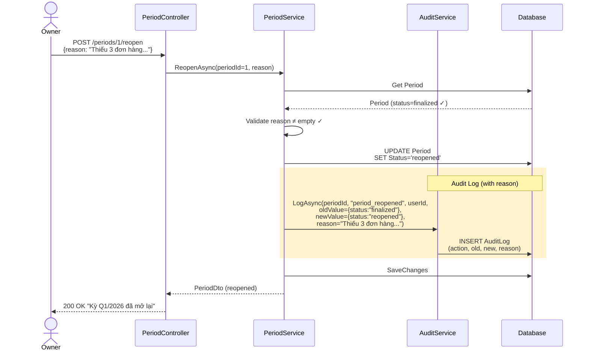

# Accounting Period — Entity Reference, Sample Data & Diagrams

> **Companion doc** cho [accounting-period-flow.md](accounting-period-flow.md).
> Giải thích chi tiết entities, data mẫu xuyên suốt Q1/2026, state machines và activity diagrams.
>
> **Flow doc**: [accounting-period-flow.md](accounting-period-flow.md) · **Index**: [report-accounting-flow.md](report-accounting-flow.md)

---

## Mục lục

1. [Kịch bản mẫu](#1-kịch-bản-mẫu)
2. [ERD — Quan hệ giữa các entity](#2-erd--quan-hệ-giữa-các-entity)
3. [Entity Details & Sample Data](#3-entity-details--sample-data)
   - [3.1 AccountingPeriods — Giải thích từng column](#31-accountingperiods--giải-thích-từng-column)
   - [3.2 AccountingPeriodAuditLogs — Giải thích từng column](#32-accountingperiodauditlogs--giải-thích-từng-column)
   - [3.3 Related Entities Summary](#33-related-entities-summary)
4. [State Machine Diagrams](#4-state-machine-diagrams)
   - [4.1 Period Lifecycle](#41-period-lifecycle)
   - [4.2 Period + Book Combined Lifecycle](#42-period--book-combined-lifecycle)
5. [Activity Diagrams](#5-activity-diagrams)
   - [5.1 Create Period](#51-create-period)
   - [5.2 Finalize Period](#52-finalize-period)
   - [5.3 Reopen Period](#53-reopen-period)
   - [5.4 Full Period Lifecycle — End-to-End](#54-full-period-lifecycle--end-to-end)
6. [Sequence Diagrams](#6-sequence-diagrams)
   - [6.1 Create Period → Audit Log](#61-create-period--audit-log)
   - [6.2 Finalize Period → Validate + Audit](#62-finalize-period--validate--audit)
   - [6.3 Reopen Period → Reason + Audit](#63-reopen-period--reason--audit)
7. [Data Flow Walkthrough](#7-data-flow-walkthrough)
8. [Audit Log Query Examples](#8-audit-log-query-examples)

---

## 1. Kịch bản mẫu

Tiếp nối kịch bản Q1/2026 từ [cost-gl-companion.md](cost-gl-companion.md):

### Timeline — Vòng đời kỳ Q1/2026

```
Tháng 1/2026:
├── 02/01  System auto tạo kỳ Q1/2026 (quarter, year=2026, quarter=1)
│          → Kỳ status = OPEN
│          → Audit log: period_created
├── 05/01  Import IMP-001 CONFIRMED → Cost + GL entry (xem cost-gl-companion)
├── ...    Các giao dịch diễn ra bình thường...
│          GL entries tự động tạo theo từng event

Tháng 2/2026:
├── ──────  Giao dịch tiếp tục, kỳ vẫn OPEN
├── 28/02  Cuối T2: Owner xem thử Rule Engine → gợi ý Nhóm 2
│          → Audit log: group_suggestion

Tháng 3/2026:
├── 31/03  Cuối Q1: Owner tạo AccountingBook (Nhóm 2, method_1)
│          → Audit log: book_created
│          → Owner preview sổ S2a, S2b, S2c...

Tháng 4/2026 (sau kỳ):
├── 05/04  Owner export sổ → file PDF
│          → Audit log: book_exported
├── 10/04  Owner FINALIZE kỳ Q1/2026
│          → Status: OPEN → FINALIZED
│          → Audit log: period_finalized
│          → FinalizedAt = 2026-04-10 09:00:00
├── 15/04  Phát hiện thiếu 3 đơn hàng ORD-099, ORD-100, ORD-101
│          → Owner REOPEN kỳ
│          → Status: FINALIZED → REOPENED
│          → Audit log: period_reopened (reason: "Thiếu 3 đơn hàng...")
├── 16/04  Complete 3 đơn hàng → GL entries mới tự tạo
│          → Book live view tự cập nhật
├── 18/04  Owner export lại sổ (bản mới)
│          → Audit log: book_exported
├── 20/04  Owner FINALIZE lại
│          → Status: REOPENED → FINALIZED
│          → Audit log: period_finalized
│          → FinalizedAt cập nhật = 2026-04-20 10:00:00

Song song:
├── 02/04  System auto tạo kỳ Q2/2026 → OPEN (kỳ mới bắt đầu)
```

### Tổng quan data Q1/2026

| Metric | Giá trị |
|--------|---------|
| Tổng doanh thu | 620,000,000đ |
| Tổng chi phí | 85,000,000đ |
| Rule Engine gợi ý | Nhóm 2 (DT quy năm ~820tr) |
| Sổ được tạo | S2a, S2b, S2c, S2d, S2e |
| Số lần export | 2 (trước và sau reopen) |
| Số lần finalize | 2 (lần 1 + lần 2 sau reopen) |

---

## 2. ERD — Quan hệ giữa các entity

```
┌──────────────────┐
│ BusinessLocations│
│──────────────────│
│BusinessLocationId│◄─────────────────────────────────┐
│Name              │                                   │
└────────┬─────────┘                                   │
         │ 1:N                                         │
         ▼                                             │
┌────────────────────────────────────────┐             │
│         AccountingPeriods              │             │
│────────────────────────────────────────│             │
│ PeriodId PK                            │             │
│ BusinessLocationId FK ─────────────────┤             │
│ PeriodType (quarter | year)            │             │
│ Year, Quarter                          │             │
│ StartDate, EndDate                     │             │
│ Status (open | finalized | reopened)   │             │
│ FinalizedAt, FinalizedByUserId         │             │
│ CreatedAt, UpdatedAt                   │             │
│                                        │             │
│ UQ: (BizLocId, PeriodType, Year, Qtr)  │             │
└────────┬─────────────────────┬─────────┘             │
         │ 1:N                 │ 1:N                   │
         ▼                     ▼                       │
┌────────────────────┐  ┌──────────────────────┐       │
│  AuditLogs         │  │  AccountingBooks      │       │
│────────────────────│  │──────────────────────│       │
│ LogId PK           │  │ BookId PK            │       │
│ PeriodId FK        │  │ BusinessLocationId FK│───────┘
│ Action             │  │ PeriodId FK          │
│ OldValue (JSON)    │  │ TemplateVersionId FK │
│ NewValue (JSON)    │  │ GroupNumber           │
│ Reason (TEXT)      │  │ TaxMethod             │
│ CreatedByUserId    │  │ RulesetId FK         │
│ CreatedAt          │  │ BusinessTypeId?       │
└────────────────────┘  │ Status (active|archived)│
                        │ CreatedAt, ArchivedAt │
                        └──────────┬────────────┘
                                   │ 1:N
                                   ▼
                        ┌──────────────────────┐
                        │  AccountingExports   │
                        │──────────────────────│
                        │ ExportId PK          │
                        │ BookId FK            │
                        │ GroupNumber           │
                        │ SummaryJson (JSON)    │
                        │ ExportFormat          │
                        │ FileUrl, FilePublicId │
                        │ ExportedByUserId     │
                        │ ExportedAt           │
                        └──────────────────────┘
```

**Quan hệ chính:**
- `AccountingPeriod.BusinessLocationId` → `BusinessLocations` (FK, mỗi kỳ thuộc 1 location)
- `AccountingPeriod` → `AccountingBooks` (1:N, nhiều sổ trong 1 kỳ)
- `AccountingPeriod` → `AccountingPeriodAuditLogs` (1:N, lịch sử thay đổi)
- `AccountingBook` → `AccountingExports` (1:N, nhiều lần export)
- **Unique constraint**: `(BusinessLocationId, PeriodType, Year, Quarter)` — không có 2 kỳ trùng

---

## 3. Entity Details & Sample Data

### 3.1 AccountingPeriods — Giải thích từng column

| Column | Type | Nullable | Ý nghĩa | Ví dụ giá trị |
|--------|------|:--------:|---------|---------------|
| `PeriodId` | BIGINT PK | ❌ | Auto-increment ID | `1`, `2`, `5` |
| `BusinessLocationId` | INT FK | ❌ | Kỳ thuộc location nào | `1` (Cửa hàng Minh Phát) |
| `PeriodType` | VARCHAR(10) | ❌ | Loại kỳ | `"quarter"`, `"year"` |
| `Year` | SMALLINT | ❌ | Năm kế toán | `2026` |
| `Quarter` | TINYINT | ✅ | Quý (1-4). `NULL` cho annual | `1`, `2`, `NULL` |
| `StartDate` | DATE | ❌ | Ngày bắt đầu kỳ | `2026-01-01` |
| `EndDate` | DATE | ❌ | Ngày kết thúc kỳ | `2026-03-31` |
| `Status` | VARCHAR(20) | ❌ | Trạng thái hiện tại | `"open"`, `"finalized"`, `"reopened"` |
| `FinalizedAt` | DATETIME | ✅ | Thời điểm chốt kỳ (lần cuối) | `NULL` khi open, `2026-04-10 09:00:00` |
| `FinalizedByUserId` | CHAR(36) | ✅ | Ai chốt | `u-owner-001` |
| `CreatedAt` | DATETIME | ❌ | Thời điểm tạo | `2026-01-02 00:00:00` |
| `UpdatedAt` | DATETIME | ✅ | Lần sửa cuối | `2026-04-20 10:00:00` |

**Quy tắc PeriodType + Quarter:**

| PeriodType | Quarter | StartDate | EndDate | Ý nghĩa |
|:----------:|:-------:|:---------:|:-------:|---------|
| `quarter` | `1` | 01-01 | 03-31 | Quý 1 |
| `quarter` | `2` | 04-01 | 06-30 | Quý 2 |
| `quarter` | `3` | 07-01 | 09-30 | Quý 3 |
| `quarter` | `4` | 10-01 | 12-31 | Quý 4 |
| `year` | `NULL` | 01-01 | 12-31 | Cả năm |

**Sample data:**

| PeriodId | BizLocId | Type | Year | Qtr | StartDate | EndDate | Status | FinalizedAt |
|:--------:|:--------:|:----:|:----:|:---:|:---------:|:-------:|:------:|:-----------:|
| 1 | 1 | `quarter` | 2026 | 1 | 2026-01-01 | 2026-03-31 | `finalized` | 2026-04-20 10:00 |
| 2 | 1 | `quarter` | 2026 | 2 | 2026-04-01 | 2026-06-30 | `open` | — |
| 3 | 1 | `year` | 2026 | — | 2026-01-01 | 2026-12-31 | `open` | — |
| 4 | 2 | `quarter` | 2026 | 1 | 2026-01-01 | 2026-03-31 | `open` | — |

**Đọc data:**
- Period #1: Q1/2026 cho Cửa hàng Minh Phát — đã finalize lần 2 (sau reopen) ngày 20/04
- Period #2: Q2/2026 auto tạo đầu tháng 4 — đang open
- Period #3: Kỳ năm 2026 — Quarter = NULL, chạy song song với quarterly
- Period #4: Location khác (BizLocId=2) — riêng biệt, không ảnh hưởng

---

### 3.2 AccountingPeriodAuditLogs — Giải thích từng column

| Column | Type | Nullable | Ý nghĩa | Ví dụ giá trị |
|--------|------|:--------:|---------|---------------|
| `LogId` | BIGINT PK | ❌ | Auto-increment ID | `1`, `15` |
| `PeriodId` | BIGINT FK | ❌ | Thuộc kỳ nào | `1` (Q1/2026) |
| `Action` | VARCHAR(50) | ❌ | Loại hành động | Xem bảng Actions bên dưới |
| `OldValue` | JSON | ✅ | Giá trị trước thay đổi | `{"status": "finalized"}` |
| `NewValue` | JSON | ✅ | Giá trị sau thay đổi | `{"status": "reopened"}` |
| `Reason` | TEXT | ✅ | Lý do (bắt buộc cho reopen) | `"Thiếu 3 đơn hàng..."` |
| `CreatedByUserId` | CHAR(36) | ❌ | Ai thực hiện | `u-owner-001`, `SYSTEM` |
| `CreatedAt` | DATETIME | ❌ | Thời điểm ghi log | `2026-04-10 09:00:00` |

**Action types:**

| Action | Ai trigger? | OldValue? | NewValue? | Reason bắt buộc? |
|--------|:-----------:|:---------:|:---------:|:-----------------:|
| `period_created` | System/Owner | — | ✅ | — |
| `period_finalized` | Owner | — | ✅ | — |
| `period_reopened` | Owner | ✅ | ✅ | ✅ Bắt buộc |
| `book_created` | Owner | — | ✅ | — |
| `book_exported` | Owner | — | ✅ | — |
| `group_suggestion` | System (Rule Engine) | — | ✅ | — |

**Sample data — Audit trail cho Period #1 (Q1/2026):**

| LogId | PeriodId | Action | OldValue | NewValue | Reason | By | At |
|:-----:|:--------:|:------:|----------|----------|--------|:--:|:--:|
| 1 | 1 | `period_created` | — | `{"periodType":"quarter","year":2026,"quarter":1}` | — | SYSTEM | 01-02 00:00 |
| 2 | 1 | `group_suggestion` | — | `{"suggestedGroup":2,"actualRevenue":620000000,"annualizedRevenue":820000000}` | — | SYSTEM | 02-28 23:59 |
| 3 | 1 | `book_created` | — | `{"bookId":15,"groupNumber":2,"taxMethod":"method_1","bookType":"S2a"}` | — | Owner | 03-31 10:00 |
| 4 | 1 | `book_created` | — | `{"bookId":16,"groupNumber":2,"taxMethod":"method_1","bookType":"S2b"}` | — | Owner | 03-31 10:00 |
| 5 | 1 | `book_created` | — | `{"bookId":17,"groupNumber":2,"taxMethod":"method_1","bookType":"S2c"}` | — | Owner | 03-31 10:00 |
| 6 | 1 | `book_exported` | — | `{"bookId":15,"format":"pdf","dataRowCount":45}` | — | Owner | 04-05 14:00 |
| 7 | 1 | `period_finalized` | — | `{"finalizedAt":"2026-04-10T09:00:00Z"}` | — | Owner | 04-10 09:00 |
| 8 | 1 | `period_reopened` | `{"status":"finalized"}` | `{"status":"reopened"}` | Thiếu 3 đơn hàng ORD-099, ORD-100, ORD-101 chưa complete | Owner | 04-15 08:30 |
| 9 | 1 | `book_exported` | — | `{"bookId":15,"format":"pdf","dataRowCount":48}` | — | Owner | 04-18 15:00 |
| 10 | 1 | `period_finalized` | — | `{"finalizedAt":"2026-04-20T10:00:00Z"}` | — | Owner | 04-20 10:00 |

**Đọc audit trail:**
- Log #1: System auto tạo kỳ đầu Q1
- Log #2: Rule Engine chạy cuối T2, gợi ý Nhóm 2 (DT 620tr → quy năm 820tr)
- Log #3-5: Owner tạo sổ S2a, S2b, S2c (có thể tạo thêm S2d, S2e)
- Log #6: Export lần 1 → 45 dòng data
- Log #7: Chốt kỳ lần 1
- Log #8: **Reopen** — lý do rõ ràng, ghi nhận old/new status
- Log #9: Export lần 2 → 48 dòng (thêm 3 đơn hàng)
- Log #10: Chốt kỳ lần 2 (final)

---

### 3.3 Related Entities Summary

> Các entity liên quan không thuộc flow này nhưng tương tác với Period:

| Entity | Vai trò | Detail doc |
|--------|---------|-----------|
| **AccountingBooks** | Sổ kế toán (saved config) thuộc Period. Không lưu data — query realtime từ GL/Orders/Costs | [accounting-book-flow.md](accounting-book-flow.md) |
| **AccountingExports** | Snapshot khi export sổ (file PDF/Excel + SummaryJson) | [accounting-book-flow.md](accounting-book-flow.md) |
| **TaxRulesets + TaxGroupRules** | Rule Engine xác định nhóm HKD → gợi ý cho Owner | [rule-engine-flow.md](rule-engine-flow.md) |
| **GeneralLedgerEntries** | Data nguồn — GL entries KHÔNG bị block bởi period status | [cost-gl-flow.md](cost-gl-flow.md) |
| **Orders, Costs, TaxPayments** | Data nguồn cho sổ, thuộc kỳ theo EntryDate/CostDate | Các flow tương ứng |

**Mối quan hệ Period ↔ GL entries:**

```
┌──────────────────────────────────────────────────────────────────┐
│  Period KHÔNG control GL entries:                                │
│                                                                  │
│  ▸ Period OPEN, FINALIZED, REOPENED → GL entries vẫn tạo bình    │
│    thường khi có sale/import/cost events                         │
│                                                                  │
│  ▸ Period chỉ là "khung thời gian" để nhóm data khi render sổ:   │
│    WHERE EntryDate BETWEEN Period.StartDate AND Period.EndDate   │
│                                                                  │
│  ▸ Finalize = "Owner xác nhận xong" — KHÔNG phải "lock data"     │
│                                                                  │
│  ▸ Nếu có GL mới sau FinalizedAt → sổ live tự cập nhật           │
│    → Owner cần export lại nếu muốn bản mới nhất                  │
└──────────────────────────────────────────────────────────────────┘
```

---

## 4. State Machine Diagrams

### 4.1 Period Lifecycle



**Transition table:**

| From | To | Trigger | Guard | Side Effects |
|------|----|---------|-------|-------------|
| `[*]` | `open` | POST /periods hoặc System Job | Unique (BizLocId, Type, Year, Qtr) | Audit log `period_created` |
| `open` | `finalized` | POST /periods/{id}/finalize | ≥1 AccountingBook active | `FinalizedAt = NOW`, audit log `period_finalized` |
| `finalized` | `reopened` | POST /periods/{id}/reopen | Reason ≠ empty | Audit log `period_reopened` (old+new+reason) |
| `reopened` | `finalized` | POST /periods/{id}/finalize | ≥1 AccountingBook active | `FinalizedAt = NOW` (update), audit log `period_finalized` |

**Transitions KHÔNG hợp lệ:**

| From | To | Tại sao? |
|------|----|---------|
| `open` | `reopened` | Chưa finalize → không có gì để reopen |
| `finalized` | `open` | Không quay về open — chỉ có reopened |
| `reopened` | `open` | Đã reopened thì finalize lại, không quay về open |
| Bất kỳ | Deleted | Period không xóa — luôn tồn tại để audit |

### 4.2 Period + Book Combined Lifecycle



---

## 5. Activity Diagrams

### 5.1 Create Period



### 5.2 Finalize Period

```mermaid
flowchart TD
    A[POST /periods/{id}/finalize] --> B{Period exists?}
    B -->|No| ERR1[Error: PERIOD_NOT_FOUND]
    B -->|Yes| C{Status = open\nhoặc reopened?}
    C -->|No - already finalized| ERR2[Error: PERIOD_ALREADY_FINALIZED]
    C -->|Yes| D{≥1 AccountingBook\nactive trong period?}
    D -->|No| ERR3[Error: PERIOD_NO_BOOKS]
    D -->|Yes| E[Update Period:\nStatus = finalized\nFinalizedAt = NOW\nFinalizedByUserId = owner]
    E --> F[Create AuditLog:\nAction = period_finalized\nNewValue = finalizedAt]
    F --> G[SaveChanges]
    G --> H[Return 200 OK\nKỳ đã chốt]

    style H fill:#d4edda
    style ERR1 fill:#f8d7da
    style ERR2 fill:#f8d7da
    style ERR3 fill:#f8d7da
```

### 5.3 Reopen Period

```mermaid
flowchart TD
    A[POST /periods/{id}/reopen] --> B{Period exists?}
    B -->|No| ERR1[Error: PERIOD_NOT_FOUND]
    B -->|Yes| C{Status = finalized?}
    C -->|No - open/reopened| ERR2[Error: PERIOD_NOT_FINALIZED\nChỉ finalized mới reopen được]
    C -->|Yes| D{Reason provided?\nreason ≠ empty?}
    D -->|No| ERR3[Error: PERIOD_REOPEN_REASON_REQUIRED]
    D -->|Yes| E[Update Period:\nStatus = reopened\nFinalizedAt giữ nguyên\ncho reference]
    E --> F[Create AuditLog:\nAction = period_reopened\nOldValue = status:finalized\nNewValue = status:reopened\nReason = request.reason]
    F --> G[SaveChanges]
    G --> H[Return 200 OK\nKỳ đã mở lại]

    style H fill:#d4edda
    style ERR1 fill:#f8d7da
    style ERR2 fill:#f8d7da
    style ERR3 fill:#f8d7da
```

### 5.4 Full Period Lifecycle — End-to-End



---

## 6. Sequence Diagrams

### 6.1 Create Period → Audit Log



### 6.2 Finalize Period → Validate + Audit



### 6.3 Reopen Period → Reason + Audit



---

## 7. Data Flow Walkthrough

Đi qua kịch bản Q1/2026 step by step:

```
══════════════════════════════════════════════════════════════
PHASE 1: OPEN (02/01 → 10/04/2026)
══════════════════════════════════════════════════════════════

1. System tạo kỳ:
   ┌─────────────────────────────────────────┐
   │ AccountingPeriod #1:                     │
   │   PeriodType: quarter                    │
   │   Year: 2026, Quarter: 1                 │
   │   StartDate: 2026-01-01                  │
   │   EndDate: 2026-03-31                    │
   │   Status: OPEN                           │
   │   FinalizedAt: NULL                      │
   └─────────────────────────────────────────┘
   + AuditLog #1: period_created

2. Q1 giao dịch diễn ra (xem cost-gl-companion):
   → 15+ GL entries tự tạo (sale, import_cost, manual_cost...)
   → Period KHÔNG can thiệp vào GL

3. Rule Engine evaluate (cuối T2):
   ┌─────────────────────────────────────────┐
   │ AuditLog #2: group_suggestion            │
   │   suggestedGroup: 2                      │
   │   actualRevenue: 620,000,000             │
   │   annualizedRevenue: 820,000,000         │
   │   (DT Q1 × 4/3 + buffer)                │
   └─────────────────────────────────────────┘

4. Owner tạo Books (31/03):
   ┌─────────────────────────────────────────┐
   │ AccountingBook #15: S2a (Nhóm 2)        │
   │ AccountingBook #16: S2b                  │
   │ AccountingBook #17: S2c                  │
   │ AccountingBook #18: S2d                  │
   │ AccountingBook #19: S2e                  │
   │                                          │
   │ All: PeriodId=1, GroupNumber=2,          │
   │      TaxMethod=method_1, Status=active   │
   └─────────────────────────────────────────┘
   + AuditLog #3-5: book_created × 5

5. Owner preview → thấy data live

6. Export lần 1 (05/04):
   ┌─────────────────────────────────────────┐
   │ AccountingExport #1:                     │
   │   BookId: 15 (S2a)                       │
   │   ExportFormat: pdf                      │
   │   DataRowCount: 45                       │
   │   SummaryJson: {totalRevenue: 620tr,     │
   │     totalCost: 85tr, ...}                │
   │   FileUrl: cloudinary.com/export_001.pdf │
   └─────────────────────────────────────────┘
   + AuditLog #6: book_exported


══════════════════════════════════════════════════════════════
PHASE 2: FINALIZE → REOPEN → RE-FINALIZE (10/04 → 20/04)
══════════════════════════════════════════════════════════════

7. Finalize (10/04 09:00):
   Period #1:
   │ Status: OPEN → FINALIZED
   │ FinalizedAt: 2026-04-10 09:00:00
   │ FinalizedByUserId: u-owner-001
   + AuditLog #7: period_finalized

8. Phát hiện vấn đề (15/04):
   Owner nhận ra 3 đơn hàng chưa complete

9. Reopen (15/04 08:30):
   Period #1:
   │ Status: FINALIZED → REOPENED
   + AuditLog #8: period_reopened
   │   OldValue: {status: "finalized"}
   │   NewValue: {status: "reopened"}
   │   Reason: "Thiếu 3 đơn hàng ORD-099, ORD-100, ORD-101..."

10. Bổ sung data (15-17/04):
    → Complete 3 orders → 3+ GL entries mới
    → Book live view tự cập nhật: 45 → 48 rows
    (Period vẫn REOPENED, không ảnh hưởng GL)

11. Export lại (18/04):
    ┌─────────────────────────────────────────┐
    │ AccountingExport #2:                     │
    │   BookId: 15 (S2a)                       │
    │   DataRowCount: 48 (↑3)                  │
    │   SummaryJson: {totalRevenue: 650tr, ... │
    │     (thêm 30tr từ 3 đơn hàng)}           │
    └─────────────────────────────────────────┘
    + AuditLog #9: book_exported

12. Re-finalize (20/04 10:00):
    Period #1:
    │ Status: REOPENED → FINALIZED
    │ FinalizedAt: 2026-04-20 10:00:00 (cập nhật)
    + AuditLog #10: period_finalized

    Kết quả: Kỳ Q1/2026 chốt chính thức, có đầy đủ audit trail
    cho cả 2 lần finalize + 1 lần reopen.
```

---

## 8. Audit Log Query Examples

### Query 1: Toàn bộ audit trail cho 1 kỳ

```sql
SELECT 
    LogId, Action, 
    OldValue, NewValue, Reason,
    CreatedByUserId AS "By",
    CreatedAt AS "At"
FROM AccountingPeriodAuditLogs
WHERE PeriodId = 1
ORDER BY CreatedAt ASC;
-- → 10 rows cho Q1/2026 (created → suggestion → books → exports → finalize → reopen → re-export → re-finalize)
```

### Query 2: Tất cả lần reopen (toàn hệ thống)

```sql
-- Tìm tất cả kỳ đã từng reopen — cần review/audit
SELECT 
    p.Year, p.Quarter, p.PeriodType,
    bl.Name AS LocationName,
    al.Reason,
    al.CreatedAt AS ReopenedAt,
    u.Name AS ReopenedBy
FROM AccountingPeriodAuditLogs al
JOIN AccountingPeriods p ON al.PeriodId = p.PeriodId
JOIN BusinessLocations bl ON p.BusinessLocationId = bl.BusinessLocationId
JOIN Users u ON al.CreatedByUserId = u.UserId
WHERE al.Action = 'period_reopened'
ORDER BY al.CreatedAt DESC;
```

### Query 3: Kỳ chưa finalize quá hạn

```sql
-- Tìm kỳ quarterly đã qua EndDate > 15 ngày mà chưa finalize
SELECT 
    p.PeriodId, p.Year, p.Quarter,
    p.EndDate,
    DATEDIFF(CURDATE(), p.EndDate) AS DaysOverdue,
    p.Status
FROM AccountingPeriods p
WHERE p.PeriodType = 'quarter'
  AND p.Status IN ('open', 'reopened')
  AND DATEDIFF(CURDATE(), p.EndDate) > 15
ORDER BY p.EndDate ASC;
-- → Gợi ý: System có thể gửi notification nhắc Owner finalize
```

### Query 4: Group suggestion history

```sql
-- Xem lịch sử gợi ý nhóm HKD qua các kỳ
SELECT 
    p.Year, p.Quarter,
    JSON_EXTRACT(al.NewValue, '$.suggestedGroup') AS SuggestedGroup,
    JSON_EXTRACT(al.NewValue, '$.actualRevenue') AS Revenue,
    JSON_EXTRACT(al.NewValue, '$.annualizedRevenue') AS AnnualizedRevenue,
    al.CreatedAt
FROM AccountingPeriodAuditLogs al
JOIN AccountingPeriods p ON al.PeriodId = p.PeriodId
WHERE al.Action = 'group_suggestion'
  AND p.BusinessLocationId = 1
ORDER BY p.Year, p.Quarter;
-- → Tracking nhóm gợi ý thay đổi qua các kỳ
```

### Query 5: Số lần export per book

```sql
SELECT 
    al.PeriodId,
    JSON_EXTRACT(al.NewValue, '$.bookId') AS BookId,
    JSON_EXTRACT(al.NewValue, '$.format') AS Format,
    COUNT(*) AS ExportCount
FROM AccountingPeriodAuditLogs al
WHERE al.Action = 'book_exported'
GROUP BY al.PeriodId, 
    JSON_EXTRACT(al.NewValue, '$.bookId'),
    JSON_EXTRACT(al.NewValue, '$.format')
ORDER BY ExportCount DESC;
-- → Xem book nào export nhiều lần (= có chỉnh sửa)
```

---

## Appendix: Diagram Summary

| Diagram | Type | Mô tả | Section |
|---------|:----:|-------|:-------:|
| Period Lifecycle | State Machine | open → finalized ↔ reopened | [4.1](#41-period-lifecycle) |
| Period + Book Combined | State Machine | Kết hợp period status + book actions | [4.2](#42-period--book-combined-lifecycle) |
| Create Period | Activity | Validate unique → create → audit | [5.1](#51-create-period) |
| Finalize Period | Activity | Validate books ≥1 → finalize → audit | [5.2](#52-finalize-period) |
| Reopen Period | Activity | Validate reason → reopen → audit | [5.3](#53-reopen-period) |
| Full Lifecycle E2E | Activity | Toàn bộ vòng đời từ tạo → finalize → reopen → done | [5.4](#54-full-period-lifecycle--end-to-end) |
| Create Period | Sequence | API → Service → DB + AuditService | [6.1](#61-create-period--audit-log) |
| Finalize Period | Sequence | Validate books → update status → audit | [6.2](#62-finalize-period--validate--audit) |
| Reopen Period | Sequence | Validate reason → update → audit with reason | [6.3](#63-reopen-period--reason--audit) |
