# Cost & General Ledger — Entity Reference, Sample Data & Diagrams

> **Companion doc** cho [cost-gl-flow.md](cost-gl-flow.md).
> Giải thích chi tiết entity Costs & GeneralLedgerEntries, data mẫu xuyên suốt kịch bản Q1/2026, state machines và activity/sequence diagrams.
>
> **Flow doc**: [cost-gl-flow.md](cost-gl-flow.md) · **Index**: [report-accounting-flow.md](report-accounting-flow.md)

---

## Mục lục

1. [Kịch bản mẫu](#1-kịch-bản-mẫu)
2. [ERD — Quan hệ giữa các entity](#2-erd--quan-hệ-giữa-các-entity)
   - [2.1 Full ERD (bao gồm Import Schema)](#21-full-erd-bao-gồm-import-schema)
   - [2.2 Phân tích đường quan hệ Import ↔ BusinessLocation](#22-phân-tích-đường-quan-hệ-import--businesslocation)
   - [2.3 Import Schema — Phiếu mua hàng không hóa đơn](#23-import-schema--phiếu-mua-hàng-không-hóa-đơn)
3. [Entity Details & Sample Data](#3-entity-details--sample-data)
   - [3.1 Costs — Giải thích từng column](#31-costs--giải-thích-từng-column)
   - [3.2 GeneralLedgerEntries — Giải thích từng column](#32-generalledgerentries--giải-thích-từng-column)
   - [3.3 ImportSchemas & ImportSchemaVersions](#33-importschemas--importschemaversions)
4. [State Machine Diagrams](#4-state-machine-diagrams)
   - [4.1 Cost Lifecycle](#41-cost-lifecycle)
   - [4.2 GL Entry Lifecycle](#42-gl-entry-lifecycle)
5. [Activity Diagrams](#5-activity-diagrams)
   - [5.1 GL Entry Generation — Order Completed](#51-gl-entry-generation--order-completed)
   - [5.2 Cost Auto-Generation — Import Confirmed](#52-cost-auto-generation--import-confirmed)
   - [5.3 Import Cancelled — Cost + GL Reversal](#53-import-cancelled--cost--gl-reversal)
   - [5.4 Manual Cost — Create + Delete](#54-manual-cost--create--delete)
   - [5.5 Order Cancelled — GL Reversal](#55-order-cancelled--gl-reversal)
6. [Sequence Diagrams](#6-sequence-diagrams)
   - [6.1 Order Completed → GL + Side Effects](#61-order-completed--gl--side-effects)
   - [6.2 Import Confirmed → Cost + GL](#62-import-confirmed--cost--gl)
   - [6.3 Order Cancelled → GL Reversal](#63-order-cancelled--gl-reversal)
   - [6.4 Debt Payment → GL Entry](#64-debt-payment--gl-entry)
   - [6.5 Tax Payment → GL Entry](#65-tax-payment--gl-entry)
   - [6.6 Manual Cost → GL Entry + Soft Delete Reversal](#66-manual-cost--gl-entry--soft-delete-reversal)
7. [Data Flow Walkthrough](#7-data-flow-walkthrough)
8. [Cross-Entity Queries](#8-cross-entity-queries)

---

## 1. Kịch bản mẫu

Toàn bộ sample data xoay quanh **một kịch bản xuyên suốt Q1/2026**:

### Nhân vật & Location

| Entity | Value | Ghi chú |
|--------|-------|---------|
| **Owner** | Anh Minh (`UserId: u-owner-001`) | Chủ cửa hàng |
| **Location** | Cửa hàng Minh Phát (`BusinessLocationId: 1`) | VLXD + Dịch vụ cắt sắt |
| **BusinessType 1** | Bán lẻ hàng hóa (`bt-retail`) | VAT 1%, TNCN 0.5% |
| **BusinessType 2** | Dịch vụ (`bt-service`) | VAT 5%, TNCN 2% |
| **Khách nợ** | Anh Ba (`DebtorId: 5`) | Thường mua ghi nợ |
| **Nhà cung cấp** | Công ty ABC | Xi măng, sắt thép |

### Timeline Q1/2026

```markdown
Tháng 1/2026:
├── 05/01  Import IMP-001 (Xi măng 500 bao × 85,000đ = 42,500,000đ) → CONFIRMED
│          → Auto: Cost #1 (import, 42.5tr) + GL entry #1 (Credit 42.5tr)
├── 10/01  Owner tạo chi phí thuê mặt bằng T1: 5,000,000đ
│          → Cost #2 (rent, manual) + GL entry #2 (Credit 5tr)
├── 15/01  Order ORD-001 hoàn thành = 5,950,000đ
│          → 4,000,000 TM + 1,950,000 ghi nợ Anh Ba
│          → GL entry #3 (Debit 4tr, cash) + GL entry #4 (Debit 1.95tr, debt)
├── 20/01  Order ORD-002 hoàn thành = 9,500,000đ → full TM
│          → GL entry #5 (Debit 9.5tr, cash)
├── 25/01  Anh Ba trả nợ 1,000,000đ (TM)
│          → GL entry #6 (Debit 1tr, cash, debt_payment)
├── 28/01  Chi tiền điện T1: 1,200,000đ
│          → Cost #3 (utilities, manual) + GL entry #7 (Credit 1.2tr)

Tháng 2/2026:
├── 05/02  Import IMP-002 (Sắt thép 200 cây × 120,000đ = 24,000,000đ) → CONFIRMED
│          → Cost #4 (import) + GL entry #8 (Credit 24tr)
├── 10/02  Order ORD-003 = 7,500,000đ → chuyển khoản
│          → GL entry #9 (Debit 7.5tr, bank)
├── 15/02  Order ORD-004 = 20,100,000đ → 15tr TM + 5.1tr CK (mixed)
│          → GL entry #10 (Debit 15tr, cash) + GL entry #11 (Debit 5.1tr, bank)
├── 20/02  Nộp thuế GTGT tạm tính Q4/2025: 3,500,000đ
│          → GL entry #12 (Credit 3.5tr, tax_payment)
├── 28/02  Chi thuê + điện T2: 6,200,000đ
│          → Cost #5+#6 + GL entry #13+#14

Tháng 3/2026:
├── 10/03  Order ORD-005 hoàn thành = 3,200,000đ TM
│          → GL entry #50 (Debit 3.2tr, cash)
├── 25/03  Owner CANCEL ORD-005 (đã completed)
│          → GL entry #51 (Credit 3.2tr, cash, reversal of #50)
├── ...thêm orders...

Tổng Q1/2026 (sau cancel):
├── Tổng doanh thu:   620,000,000đ
├── Tổng chi phí:      85,000,000đ
├── Tiền thực thu:    470,000,000đ (cash + bank, trừ debt)
```

---

## 2. ERD — Quan hệ giữa các entity

### 2.1 Full ERD (bao gồm Import Schema)

```markdown
┌──────────────────┐
│ ImportSchemas    │
│──────────────────│
│ImportSchemaId PK │
│TemplateCode (UQ) │──── e.g. "phieu_mua_hang", "phieu_nhap_kho"
│Name              │
│IsActive          │
│EverActivated     │
│CreatedAt         │
│DeletedAt         │
└────────┬─────────┘
         │ 1:N
         ▼
┌──────────────────────┐
│ ImportSchemaVersions │
│──────────────────────│
│ImportSchemaVersionId │
│ImportSchemaId FK     │
│SchemaJson (JSON)     │──── Template fields: [{name, type, required, ...}]
│IsActive              │──── Only 1 active version per schema
│CreatedAt             │
└──────────────────────┘
         ╎  (không có FK trực tiếp)
         ╎  Import.SchemaJson = snapshot
         ╎  copy từ active version
         ▼
┌──────────────────────────────────────────────────────────────┐
│                        Imports                               │
│──────────────────────────────────────────────────────────────│
│ ImportId PK                                                  │
│ ImportCode (UQ) ──────── e.g. "PNK-2026-001"                │
│ ImportType ───────────── INVOICE | INVENTORY_ADJUSTMENT |    │
│                          RETURN                               │
│ Status ───────────────── DRAFT | CONFIRMED | CANCELLED       │
│ BusinessLocationId FK ── ⚠️ Direct FK (xem phân tích 2.2)   │
│ Supplier                                                     │
│ SchemaJson (JSON) ────── Structured data thay vì ảnh chụp   │
│ TotalAmount                                                  │
│ ImageUrl / ImagePublicId ── Ảnh hóa đơn (Cloudinary)        │
│ ReceivedAt, Note                                             │
│ CreatedAt, UpdatedAt                                         │
└─────────┬──────────────────────────────────┬─────────────────┘
          │ 1:N                              │
          ▼                                  │
┌──────────────────────┐                     │
│   ProductImports     │                     │
│ (Import Detail)      │                     │
│──────────────────────│                     │
│ ImportId FK ─────────┤                     │
│ ProductId FK ────────┼──┐                  │
│ Quantity             │  │                  │
│ CostPrice            │  │                  │
│ TotalPrice           │  │                  │
│ BaseUnit             │  │                  │
└──────────────────────┘  │                  │
                          │                  │
                    ┌─────▼──────────┐       │
                    │   Products     │       │
                    │────────────────│       │
                    │ProductId PK    │       │
                    │BusinessLocId FK│───┐   │
                    │Name, Stock,    │   │   │
                    │CostPrice, ...  │   │   │
                    └────────────────┘   │   │
                                        │   │
         ┌──────────────────┐           │   │
         │ BusinessLocations│◄──────────┘   │
         │──────────────────│◄──────────────┘ (direct FK)
         │BusinessLocationId│
         │Name, Address, ...│
         └────────┬─────────┘
                  │
    ┌─────────────┼──────────────────────────────────────┐
    │             │                                      │
    ▼             ▼                                      ▼
┌────────┐  ┌──────────┐                    ┌───────────────────────────────┐
│ Orders │  │  Costs   │                    │     GeneralLedgerEntries      │
│────────│  │──────────│                    │───────────────────────────────│
│OrderId │  │CostId    │                    │EntryId                        │
│BizLocId│  │BizLocId  │                    │BusinessLocationId FK          │
│OrderCode│ │CostType  │                    │TransactionType ── sale |      │
│TotalAmt│  │ImportId? │◄── FK nullable     │  import_cost | manual_cost |  │
│CashAmt │  │Amount    │    (auto vs manual)│  debt_payment | tax_payment   │
│BankAmt │  │CostDate  │                    │ReferenceType + ReferenceId    │
│DebtAmt │  │PayMethod │                    │  ── "Logical FK" đa hình      │
│CompletedAt│DocumentUrl│                   │EntryDate, Description         │
│        │  │DeletedAt │                    │DebitAmount (tiền VÀO)         │
└────┬───┘  └────┬─────┘                    │CreditAmount (tiền RA)         │
     │           │                          │MoneyChannel (cash|bank|debt)  │
     │           └────── RefType=cost ──────│IsReversal, ReversedEntryId    │
     └──────────────── RefType=order ───────│CreatedAt                      │
                                            └───────────────────────────────┘

Các entity liên quan (reference qua ReferenceType + ReferenceId):
┌──────────────────────────┐    ┌──────────────────────────┐
│ DebtorPaymentTransactions│    │      TaxPayments         │
│──────────────────────────│    │──────────────────────────│
│ TransactionId            │    │ TaxPaymentId             │
│ DebtorId                 │    │ TaxType (VAT | PIT)      │
│ Amount                   │    │ Amount                   │
│ PaymentMethod            │    │ PaidAt                   │
│ PaidAt                   │    │ PaymentMethod            │
└──────────────────────────┘    └──────────────────────────┘
```

### 2.2 Phân tích đường quan hệ Import ↔ BusinessLocation

> **Câu hỏi**: Import có cần direct FK `BusinessLocationId` không? Hay đi qua chuỗi gián tiếp?

**Hai đường quan hệ cùng tồn tại:**

```markdown
Đường 1 — DIRECT FK (hiện tại trong code):
  Import.BusinessLocationId ──FK──► BusinessLocations.BusinessLocationId

Đường 2 — INDIRECT qua ProductImport:
  BusinessLocations
    └── Products (N)
          └── ProductImports (N)
                └── Import (1)
```

**So sánh:**

| Tiêu chí | Direct FK (hiện tại) | Indirect (qua Product chain) |
|----------|:-------------------:|:---------------------------:|
| **Query performance** | `WHERE BusinessLocationId = X` — direct, nhanh | JOIN 3 bảng — chậm hơn |
| **Data consistency** | Có thể mismatch: Import.BizLocId ≠ Product.BizLocId nếu không validate | Luôn consistent — derive từ Product |
| **Create Import** | Set trực tiếp `BusinessLocationId` khi tạo | Phải có ProductImport trước → biết location |
| **Import chưa có Product** | Vẫn tạo được (DRAFT không cần ProductImport) | Không xác định được location |
| **Report queries** | Simple: `WHERE BizLocId = X AND Status = 'CONFIRMED'` | Complex: phải JOIN qua Product |

**Kết luận hiện tại:**
- Code giữ **Direct FK** vì Import cần biết `BusinessLocationId` ngay lúc tạo DRAFT (chưa có ProductImport)
- Direct FK cũng giúp query GL + Costs + Imports cùng location mà không cần JOIN
- **Guard cần thiết**: Khi CONFIRM, validate rằng tất cả `ProductImport.Product.BusinessLocationId` == `Import.BusinessLocationId`

### 2.3 Import Schema — Phiếu mua hàng không hóa đơn

> **Vấn đề**: Owner mua hàng (ví dụ: mua xi măng nhỏ lẻ, mua ngoài chợ) mà **không có hóa đơn VAT**.
> Thay vì chụp ảnh hóa đơn (`ImageUrl`), cần ghi nhận **structured data** theo mẫu phiếu mua hàng.

**Cách hoạt động:**

```
ImportSchema (template definition)
  └── ImportSchemaVersion (versioned JSON schema)
        └── Import.SchemaJson = SNAPSHOT copy từ active version

Ví dụ:
┌─────────────────────────────────────────────────────────────┐
│ ImportSchema: "phieu_mua_hang_khong_hoa_don"                │
│ Name: "Phiếu mua hàng không hóa đơn"                       │
│                                                             │
│ Active SchemaVersion.SchemaJson:                            │
│ {                                                           │
│   "fields": [                                               │
│     {"name": "supplierName", "type": "text",                │
│      "label": "Người bán", "required": true},               │
│     {"name": "supplierPhone", "type": "phone",              │
│      "label": "SĐT người bán"},                             │
│     {"name": "purchaseDate", "type": "date",                │
│      "label": "Ngày mua", "required": true},                │
│     {"name": "itemDescription", "type": "text",             │
│      "label": "Mô tả hàng hóa", "required": true},         │
│     {"name": "totalAmount", "type": "currency",             │
│      "label": "Tổng tiền", "required": true},               │
│     {"name": "paymentMethod", "type": "select",             │
│      "options": ["cash", "bank"],                            │
│      "label": "Hình thức TT"},                               │
│     {"name": "receiverName", "type": "text",                │
│      "label": "Người nhận hàng"},                            │
│     {"name": "notes", "type": "textarea",                   │
│      "label": "Ghi chú"}                                     │
│   ]                                                         │
│ }                                                           │
│                                                             │
│ Khi Owner tạo Import với schema này:                        │
│ Import.SchemaJson = copy nội dung schema version active     │
│ Import.ImageUrl = NULL (không cần ảnh)                      │
│ Import.ImportType = "INVOICE" (hoặc type riêng nếu cần)    │
└─────────────────────────────────────────────────────────────┘
```

**Lưu ý quan trọng:**
- `Import.SchemaJson` là **snapshot** — copy nguyên nội dung tại thời điểm tạo Import
- Không dùng FK `ImportSchemaVersionId` trực tiếp → nếu schema version cập nhật sau, Import cũ vẫn giữ schema cũ
- Import có thể có **cả hai**: `SchemaJson` (structured data) + `ImageUrl` (ảnh bổ sung), hoặc chỉ 1 trong 2, hoặc không có gì (DRAFT)
- Dù dùng Schema hay Image, khi CONFIRMED → vẫn tạo Cost + GL entry bình thường theo RULE-COST-01 + RULE-GL-03

**Quan hệ chính:**
- `Costs.BusinessLocationId` → `BusinessLocations` (FK, mỗi chi phí thuộc 1 location)
- `Costs.ImportId` → `Imports` (FK nullable, NOT NULL = auto tạo từ Import)
- `GL.BusinessLocationId` → `BusinessLocations` (FK duy nhất enforce)
- `GL.ReferenceType + ReferenceId` → **Logical FK** (không enforce FK constraint vì đa hình — trỏ tới Orders, Imports, Costs, v.v.)
- `GL.ReversedEntryId` → `GL.EntryId` (self-reference, trỏ về entry bị hoàn)
- `ImportSchema` → `ImportSchemaVersion` (1:N, mỗi schema có nhiều version, chỉ 1 active)
- `Import.SchemaJson` ← snapshot copy từ `ImportSchemaVersion.SchemaJson` (không FK, embedded JSON)

---

## 3. Entity Details & Sample Data

### 3.1 Costs — Giải thích từng column

| Column | Type | Nullable | Ý nghĩa | Ví dụ giá trị |
|--------|------|:--------:|---------|---------------|
| `CostId` | BIGINT PK | ❌ | Auto-increment ID | `1`, `2`, `15` |
| `BusinessLocationId` | INT FK | ❌ | Chi phí thuộc location nào | `1` |
| `CostType` | VARCHAR(30) | ❌ | Phân loại chi phí | `import`, `salary`, `rent`, `utilities`, `transport`, `marketing`, `maintenance`, `other` |
| `ImportId` | BIGINT FK | ✅ | Liên kết tới Import. `NULL` = manual, `NOT NULL` = auto | `NULL` (manual), `101` (auto từ Import #101) |
| `Description` | VARCHAR(500) | ❌ | Mô tả chi phí | `"Nhập Xi măng IMP-001 từ Cty ABC"` |
| `Amount` | DECIMAL(15,2) | ❌ | Số tiền (luôn > 0) | `42500000.00` |
| `CostDate` | DATE | ❌ | Ngày phát sinh chi phí | `2026-01-05` |
| `PaymentMethod` | VARCHAR(20) | ✅ | Hình thức thanh toán | `cash`, `bank`, `NULL` (chưa xác định) |
| `DocumentUrl` | VARCHAR(500) | ✅ | Ảnh hóa đơn/biên lai (Cloudinary) | `https://res.cloudinary.com/.../invoice.jpg` |
| `DocumentPublicId` | VARCHAR(255) | ✅ | Cloudinary public ID (để xóa) | `bizflow/costs/inv_001` |
| `CreatedByUserId` | CHAR(36) | ❌ | Ai tạo | `u-owner-001` |
| `CreatedAt` | DATETIME | ❌ | Thời điểm tạo | `2026-01-05 08:30:00` |
| `UpdatedAt` | DATETIME | ✅ | Lần sửa cuối (auto) | `2026-01-06 10:00:00` |
| `DeletedAt` | DATETIME | ✅ | Soft delete timestamp | `NULL` (active), `2026-03-25 14:00:00` (deleted) |

**Phân biệt ImportId:**

| ImportId | Meaning | Editable? | Deletable? | Cách thay đổi |
|:--------:|---------|:---------:|:----------:|----------------|
| `NOT NULL` | Chi phí tự động từ Import CONFIRMED | ❌ Readonly | ❌ | Cancel Import gốc → auto soft delete + GL reversal |
| `NULL` | Owner tự khai báo | ✅ PUT | ✅ DELETE | Owner sửa/xóa trực tiếp |

**Sample data:**

| CostId | BizLocId | CostType | ImportId | Description | Amount | CostDate | PaymentMethod | DeletedAt |
|:------:|:--------:|:--------:|:--------:|-------------|-------:|:--------:|:-------------:|:---------:|
| 1 | 1 | `import` | 101 | Nhập Xi măng IMP-001 từ Cty ABC | 42,500,000 | 2026-01-05 | `bank` | — |
| 2 | 1 | `rent` | — | Thuê mặt bằng T1/2026 | 5,000,000 | 2026-01-10 | `bank` | — |
| 3 | 1 | `utilities` | — | Tiền điện T1/2026 | 1,200,000 | 2026-01-28 | `cash` | — |
| 4 | 1 | `import` | 102 | Nhập Sắt thép IMP-002 từ Cty ABC | 24,000,000 | 2026-02-05 | `bank` | — |
| 5 | 1 | `rent` | — | Thuê mặt bằng T2/2026 | 5,000,000 | 2026-02-28 | `bank` | — |
| 6 | 1 | `utilities` | — | Tiền điện T2/2026 | 1,200,000 | 2026-02-28 | `cash` | — |
| 7 | 1 | `salary` | — | Lương nhân viên T1+T2/2026 | 6,000,000 | 2026-02-28 | `cash` | — |
| 8 | 1 | `transport` | — | Vận chuyển hàng T1 | 800,000 | 2026-01-30 | `cash` | — |

**Tổng chi phí Q1 (kể cả T3):** ~85,000,000đ

---

### 3.2 GeneralLedgerEntries — Giải thích từng column

| Column | Type | Nullable | Ý nghĩa | Giá trị hợp lệ |
|--------|------|:--------:|---------|----------------|
| `EntryId` | BIGINT PK | ❌ | Auto-increment ID | `1`, `50`, `51` |
| `BusinessLocationId` | INT FK | ❌ | Entry thuộc location nào | `1` |
| `TransactionType` | VARCHAR(30) | ❌ | Loại giao dịch | `sale`, `import_cost`, `manual_cost`, `debt_payment`, `tax_payment` |
| `ReferenceType` | VARCHAR(30) | ❌ | Entity nguồn tạo ra entry này | `order`, `import`, `cost`, `debtor_payment`, `tax_payment` |
| `ReferenceId` | BIGINT | ❌ | ID của entity nguồn (logical FK) | `201` (OrderId), `101` (ImportId) |
| `EntryDate` | DATE | ❌ | Ngày giao dịch | `2026-01-15` |
| `Description` | VARCHAR(500) | ❌ | Diễn giải giao dịch | `"ORD-001: Bán hàng (tiền mặt)"` |
| `DebitAmount` | DECIMAL(15,2) | ❌ | Tiền **VÀO** business | Doanh thu bán hàng, thu nợ |
| `CreditAmount` | DECIMAL(15,2) | ❌ | Tiền **RA** business | Nhập hàng, chi phí, nộp thuế |
| `MoneyChannel` | VARCHAR(10) | ✅ | Kênh tiền thực tế | `cash`, `bank`, `debt`, `NULL` |
| `IsReversal` | BOOLEAN | ❌ | Entry này là hoàn/hủy? | `false` (bình thường), `true` (reversal) |
| `ReversedEntryId` | BIGINT | ✅ | Trỏ về EntryId gốc bị reverse | `NULL` (không phải reversal), `50` (reverse entry #50) |
| `CreatedAt` | DATETIME | ❌ | Thời điểm tạo | `2026-01-15 10:30:00` |

**Convention Debit/Credit:**

```
┌─────────────────────────────────────────────────────────────────┐
│  RULE: Mỗi entry chỉ có 1 trong 2 > 0, cái còn lại = 0          │
│                                                                 │
│  DebitAmount > 0  = Tiền chảy VÀO business                      │
│    → Bán hàng (sale), thu nợ (debt_payment)                     │
│                                                                 │
│  CreditAmount > 0 = Tiền chảy RA business                       │
│    → Nhập hàng (import_cost), chi phí (manual_cost),            │
│      nộp thuế (tax_payment)                                     │
│                                                                 │
│  Reversal: ĐẢO NGƯỢC chiều                                      │
│    → Entry gốc Debit 4tr → Reversal: Credit 4tr                 │
│    → Entry gốc Credit 42.5tr → Reversal: Debit 42.5tr           │ 
│    → Net effect = 0 (triệt tiêu)                                │
└─────────────────────────────────────────────────────────────────┘
```

**MoneyChannel giải thích:**

| Channel | Ý nghĩa | Khi nào? |
|---------|---------|----------|
| `cash` | Tiền mặt thực tế | Thanh toán tiền mặt |
| `bank` | Chuyển khoản ngân hàng | Thanh toán CK |
| `debt` | Ghi nợ — chưa thu/trả tiền | Bán hàng ghi nợ (tiền chưa thực nhận) |
| `NULL` | Không xác định kênh tiền | Import cost khi Owner chưa khai PaymentMethod |

**Sample data — Tháng 1/2026:**

| # | TransType | RefType | RefId | Date | Description | Debit | Credit | Channel | Rev? | RevId |
|:-:|:---------:|:-------:|:-----:|:----:|-------------|------:|-------:|:-------:|:----:|:-----:|
| 1 | `import_cost` | `import` | 101 | 01-05 | IMP-001: Nhập Xi măng từ Cty ABC | 0 | 42,500,000 | `bank` | — | — |
| 2 | `manual_cost` | `cost` | 2 | 01-10 | Thuê mặt bằng T1/2026 | 0 | 5,000,000 | `bank` | — | — |
| 3 | `sale` | `order` | 201 | 01-15 | ORD-001: Bán hàng (tiền mặt) | 4,000,000 | 0 | `cash` | — | — |
| 4 | `sale` | `order` | 201 | 01-15 | ORD-001: Bán hàng (ghi nợ Anh Ba) | 1,950,000 | 0 | `debt` | — | — |
| 5 | `sale` | `order` | 202 | 01-20 | ORD-002: Bán hàng (tiền mặt) | 9,500,000 | 0 | `cash` | — | — |
| 6 | `debt_payment` | `debtor_payment` | 301 | 01-25 | Thu nợ Anh Ba: 1,000,000đ (TM) | 1,000,000 | 0 | `cash` | — | — |
| 7 | `manual_cost` | `cost` | 3 | 01-28 | Tiền điện T1/2026 | 0 | 1,200,000 | `cash` | — | — |

**Đọc data:**
- Entry #3 + #4: ORD-001 thanh toán 2 hình thức → **2 GL entries** (splitting theo channel). Tổng DT = 4tr + 1.95tr = **5.95tr**
- Entry #6: Thu nợ **KHÔNG PHẢI** doanh thu mới. DT đã ghi ở entry #4 (debt). Entry #6 chỉ ghi nhận tiền mặt thực nhận.

**Sample data — Tháng 2/2026:**

| # | TransType | RefType | RefId | Date | Description | Debit | Credit | Channel | Rev? | RevId |
|:-:|:---------:|:-------:|:-----:|:----:|-------------|------:|-------:|:-------:|:----:|:-----:|
| 8 | `import_cost` | `import` | 102 | 02-05 | IMP-002: Nhập Sắt thép từ Cty ABC | 0 | 24,000,000 | `bank` | — | — |
| 9 | `sale` | `order` | 203 | 02-10 | ORD-003: Bán sắt (chuyển khoản) | 7,500,000 | 0 | `bank` | — | — |
| 10 | `sale` | `order` | 204 | 02-15 | ORD-004: Bán hàng (tiền mặt) | 15,000,000 | 0 | `cash` | — | — |
| 11 | `sale` | `order` | 204 | 02-15 | ORD-004: Bán hàng (chuyển khoản) | 5,100,000 | 0 | `bank` | — | — |
| 12 | `tax_payment` | `tax_payment` | 1 | 02-20 | Nộp thuế GTGT Q4/2025 | 0 | 3,500,000 | `bank` | — | — |
| 13 | `manual_cost` | `cost` | 5 | 02-28 | Thuê mặt bằng T2/2026 | 0 | 5,000,000 | `bank` | — | — |
| 14 | `manual_cost` | `cost` | 6 | 02-28 | Tiền điện T2/2026 | 0 | 1,200,000 | `cash` | — | — |
| 15 | `manual_cost` | `cost` | 7 | 02-28 | Lương nhân viên T1+T2 | 0 | 6,000,000 | `cash` | — | — |

**Đọc data:**
- Entry #10 + #11: ORD-004 mixed payment → 2 entries. `RefId = 204` giống nhau, `Channel` khác nhau
- Entry #12: Nộp thuế = tiền RA → `CreditAmount`

**Sample data — Reversal (ORD-005 cancelled 25/03):**

| # | TransType | RefType | RefId | Date | Description | Debit | Credit | Channel | Rev? | RevId |
|:-:|:---------:|:-------:|:-----:|:----:|-------------|------:|-------:|:-------:|:----:|:-----:|
| 50 | `sale` | `order` | 205 | 03-10 | ORD-005: Bán hàng (tiền mặt) | 3,200,000 | 0 | `cash` | ❌ | — |
| 51 | `sale` | `order` | 205 | 03-25 | [HỦY] ORD-005: Bán hàng (tiền mặt) | 0 | 3,200,000 | `cash` | ✅ | 50 |

**Đọc reversal:**
- Entry #51 **reverse** entry #50 → `IsReversal = true`, `ReversedEntryId = 50`
- Gốc: Debit 3.2tr → Reversal: Credit 3.2tr (đảo chiều)
- Net effect: 3,200,000 - 3,200,000 = **0** → ORD-005 không còn ảnh hưởng doanh thu

---

### 3.3 ImportSchemas & ImportSchemaVersions

> Hai bảng này quản lý **mẫu phiếu mua hàng không hóa đơn** — cho phép Owner ghi nhận import bằng structured data thay vì chỉ chụp ảnh.

#### ImportSchemas

| Column | Type | Nullable | Ý nghĩa | Ví dụ giá trị |
|--------|------|:--------:|---------|---------------|
| `ImportSchemaId` | INT PK | ❌ | Auto-increment ID | `1`, `2` |
| `TemplateCode` | VARCHAR(50) UQ | ❌ | Mã template duy nhất | `"phieu_mua_hang"`, `"phieu_nhap_kho"` |
| `Name` | VARCHAR(100) | ❌ | Tên hiển thị | `"Phiếu mua hàng không hóa đơn"` |
| `IsActive` | BOOLEAN | ✅ | Template có sẵn sàng sử dụng? | `true`, `false` |
| `EverActivated` | BOOLEAN | ❌ | Đã từng active → chỉ soft delete | `false` (mới tạo) → `true` (đã active) |
| `CreatedAt` | DATETIME | ❌ | Thời điểm tạo | `2026-01-01 00:00:00` |
| `DeletedAt` | DATETIME | ✅ | Soft delete | `NULL` (active) |

#### ImportSchemaVersions

| Column | Type | Nullable | Ý nghĩa | Ví dụ giá trị |
|--------|------|:--------:|---------|---------------|
| `ImportSchemaVersionId` | INT PK | ❌ | Auto-increment ID | `1`, `5` |
| `ImportSchemaId` | INT FK | ❌ | Schema cha | `1` |
| `SchemaJson` | LONGTEXT (JSON) | ❌ | JSON schema định nghĩa fields | Xem ví dụ bên dưới |
| `IsActive` | BOOLEAN | ❌ | Version này đang active? | Chỉ 1 version active per schema |
| `CreatedAt` | DATETIME | ❌ | Thời điểm tạo version | `2026-01-15 10:00:00` |

#### Sample data

| SchemaId | TemplateCode | Name | IsActive |
|:--------:|:------------:|------|:--------:|
| 1 | `phieu_mua_hang` | Phiếu mua hàng không hóa đơn | ✅ |
| 2 | `phieu_nhap_kho` | Phiếu nhập kho nội bộ | ✅ |

| VersionId | SchemaId | IsActive | SchemaJson (tóm tắt) |
|:---------:|:--------:|:--------:|----------------------|
| 1 | 1 | ❌ | v1 — 5 fields cơ bản |
| 2 | 1 | ✅ | v2 — 8 fields (thêm SĐT, ghi chú, phương thức TT) |
| 3 | 2 | ✅ | v1 — 4 fields cho nhập kho nội bộ |

#### Cách Import sử dụng Schema

```
Tạo Import MỚI (Owner chọn schema "Phiếu mua hàng"):
1. FE gọi GET /import-schemas → lấy danh sách schemas active
2. FE gọi GET /import-schemas/{id} → lấy active version + SchemaJson
3. FE render form dynamic từ SchemaJson
4. Owner điền form → FE gửi POST /imports
   {
     "importType": "INVOICE",
     "schemaJson": { ... copy schema + filled values ... },
     "supplier": "Chú Năm (sạp vật liệu chợ)",
     "imageUrl": null  ← không cần ảnh nếu đã có structured data
   }
5. Import.SchemaJson = snapshot (giá trị tại thời điểm tạo)
   → Nếu schema version update sau, Import cũ KHÔNG bị ảnh hưởng
```

**Lưu ý**: ImportSchema/ImportSchemaVersion **không ảnh hưởng** Cost & GL flow. Dù Import dùng Schema hay Image, khi CONFIRMED → vẫn phát sinh Cost + GL entry theo RULE-COST-01 + RULE-GL-03 như bình thường.

---

## 4. State Machine Diagrams

### 4.1 Cost Lifecycle

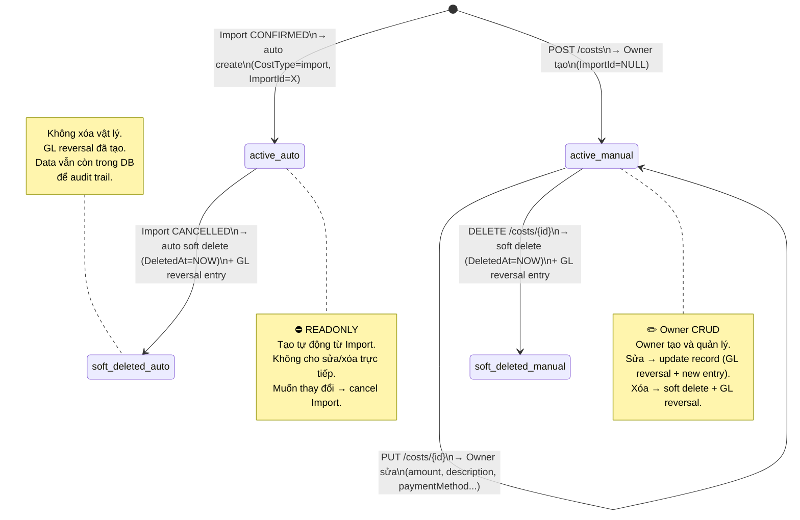

**Transition table:**

| From | To | Trigger | Guard | Side Effects |
|------|----|---------|-------|-------------|
| `[*]` | `active_auto` | Import.ConfirmAsync() | — | Cost record created + GL entry (import_cost, Credit) |
| `[*]` | `active_manual` | POST /costs | Owner auth | Cost record created + GL entry (manual_cost, Credit) |
| `active_auto` | `soft_deleted` | Import.CancelAsync() | Import was CONFIRMED | `DeletedAt = NOW` + GL reversal entry |
| `active_manual` | `active_manual` | PUT /costs/{id} | `ImportId IS NULL` | Update fields. GL: reversal of old + new entry |
| `active_manual` | `soft_deleted` | DELETE /costs/{id} | `ImportId IS NULL` | `DeletedAt = NOW` + GL reversal entry |

### 4.2 GL Entry Lifecycle

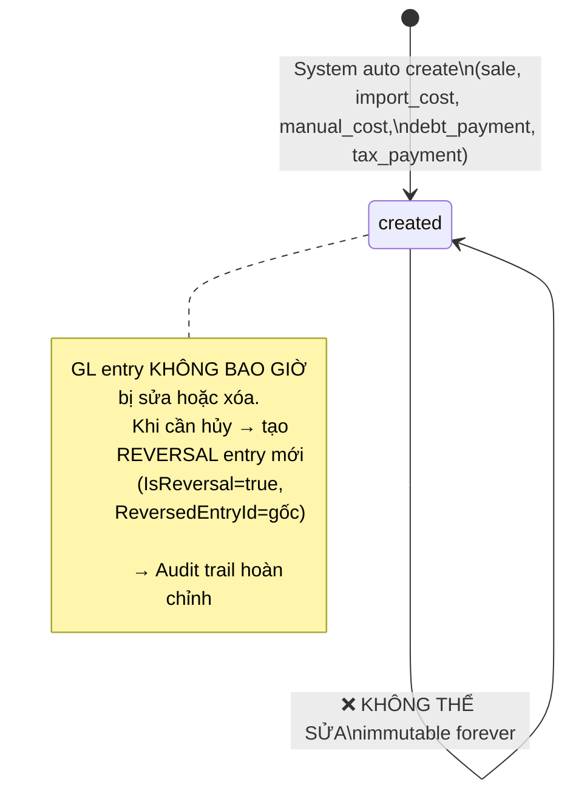

**Nguyên tắc bất biến (Immutability Rule):**

```
┌────────────────────────────────────────────────────────────┐
│  ❌ KHÔNG BAO GIỜ:                                        │
│     - UPDATE GL entry đã tạo                              │
│     - DELETE GL entry đã tạo                              │
│                                                            │
│  ✅ THAY VÌ ĐÓ:                                          │
│     - Tạo REVERSAL entry mới (đảo Debit ↔ Credit)        │
│     - IsReversal = true                                    │
│     - ReversedEntryId trỏ về entry gốc                    │
│                                                            │
│  → Đảm bảo audit trail: ai, khi nào, giao dịch gì,      │
│    hủy khi nào, bởi ai                                    │
└────────────────────────────────────────────────────────────┘
```

---

## 5. Activity Diagrams

### 5.1 GL Entry Generation — Order Completed

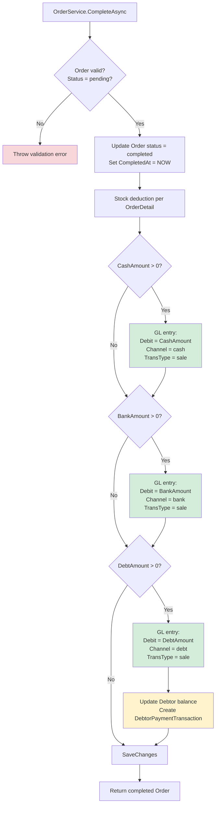

**Ví dụ ORD-001 (mixed: 4tr TM + 1.95tr nợ):**
- `CashAmount = 4,000,000 > 0` → tạo GL entry #3 (Debit 4tr, cash)
- `BankAmount = 0` → skip
- `DebtAmount = 1,950,000 > 0` → tạo GL entry #4 (Debit 1.95tr, debt) + update Debtor Anh Ba

### 5.2 Cost Auto-Generation — Import Confirmed

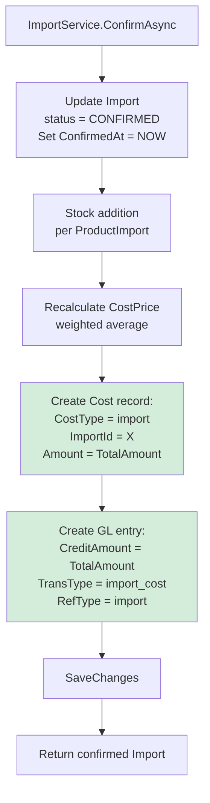

### 5.3 Import Cancelled — Cost + GL Reversal

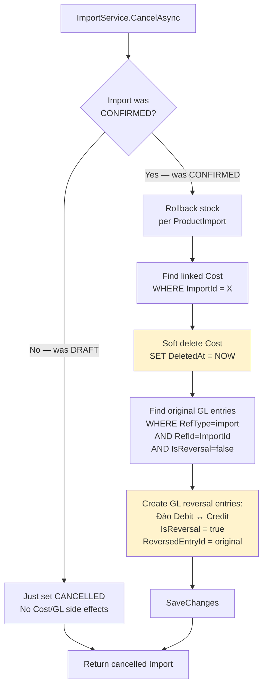

### 5.4 Manual Cost — Create + Delete

**Create:**

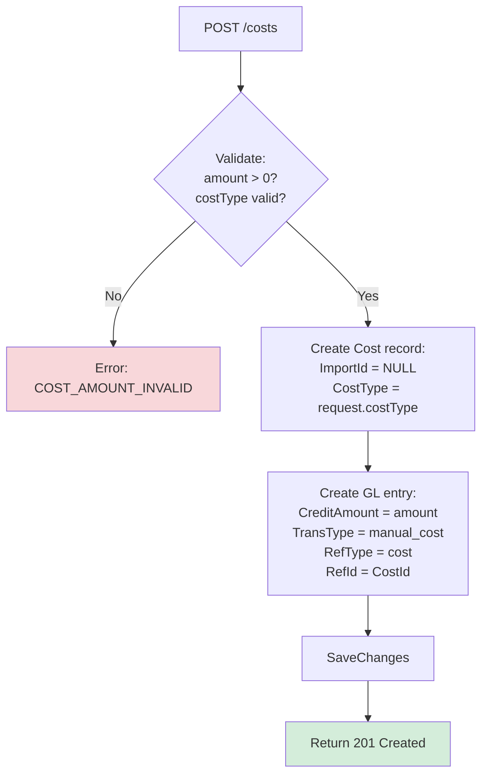

**Delete (Soft):**

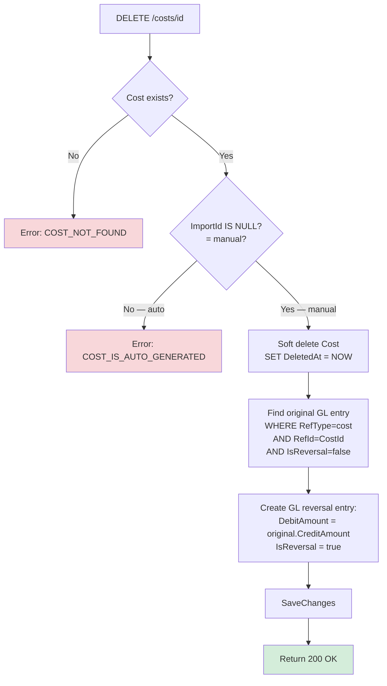

### 5.5 Order Cancelled — GL Reversal

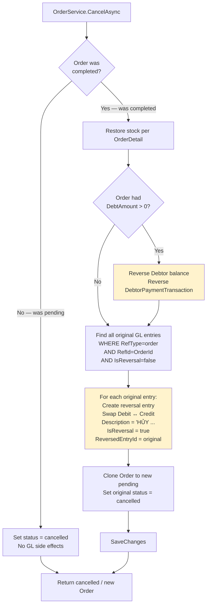

---

## 6. Sequence Diagrams

### 6.1 Order Completed → GL + Side Effects

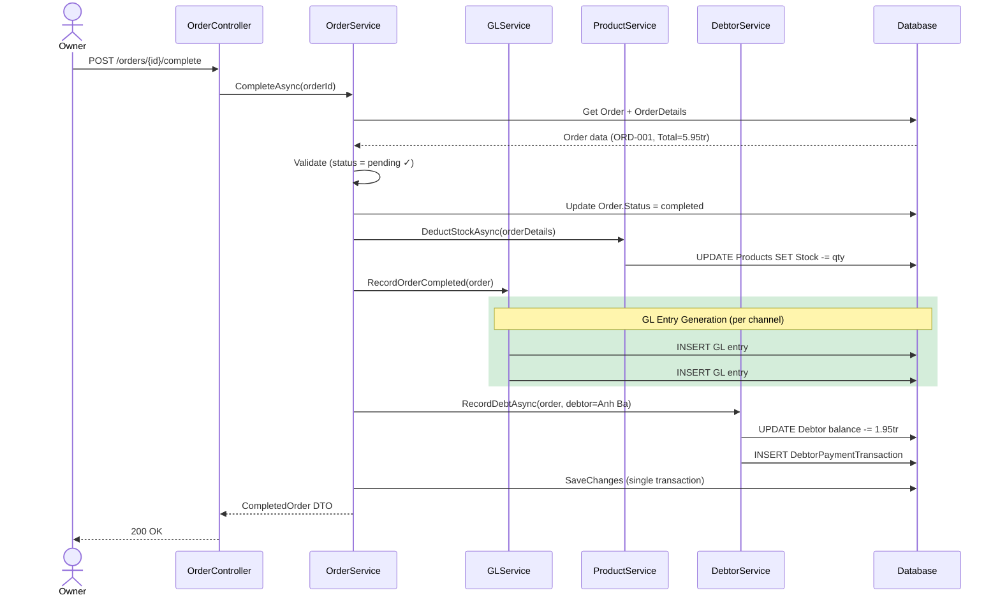

### 6.2 Import Confirmed → Cost + GL

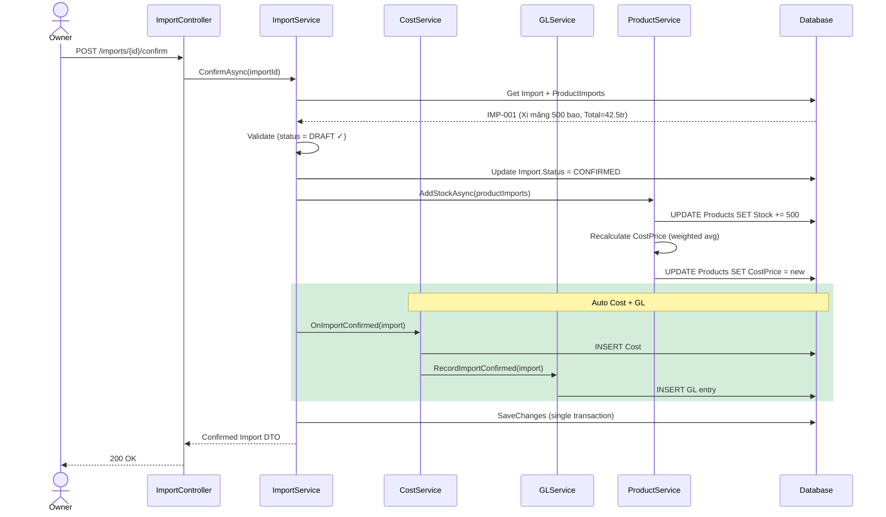

### 6.3 Order Cancelled → GL Reversal

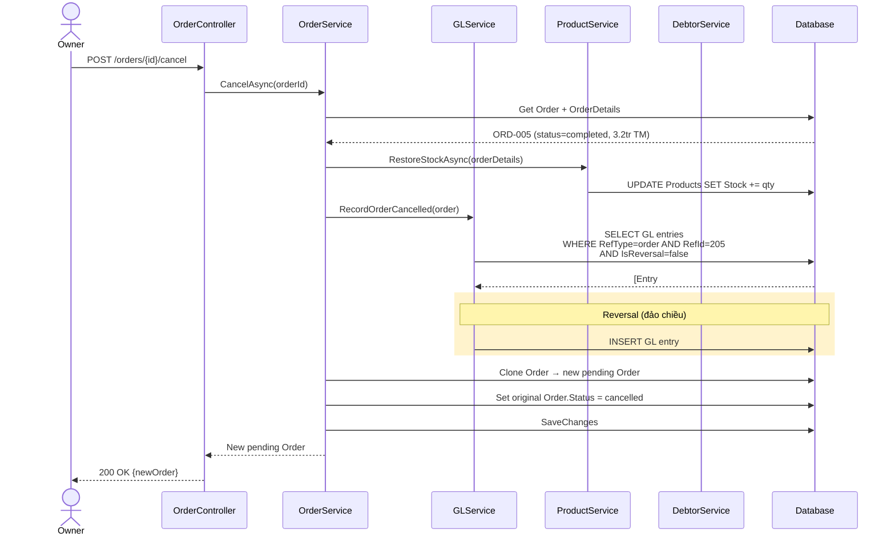

### 6.4 Debt Payment → GL Entry

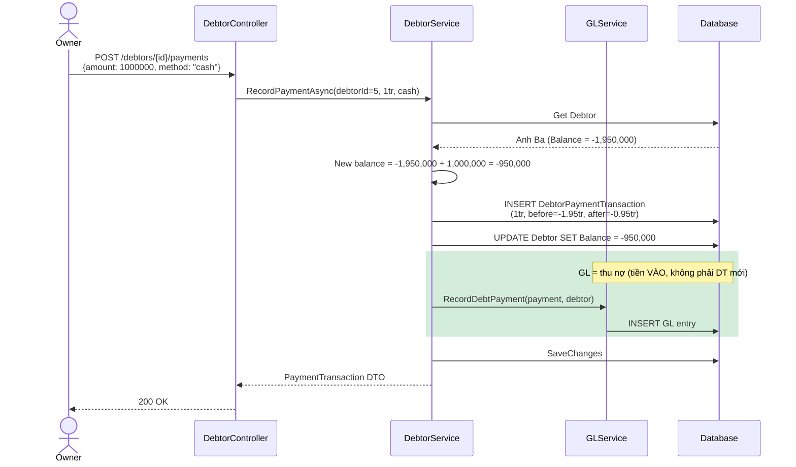

### 6.5 Tax Payment → GL Entry

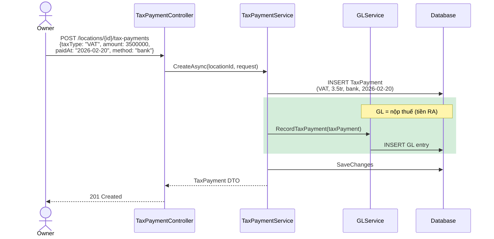

### 6.6 Manual Cost → GL Entry + Soft Delete Reversal

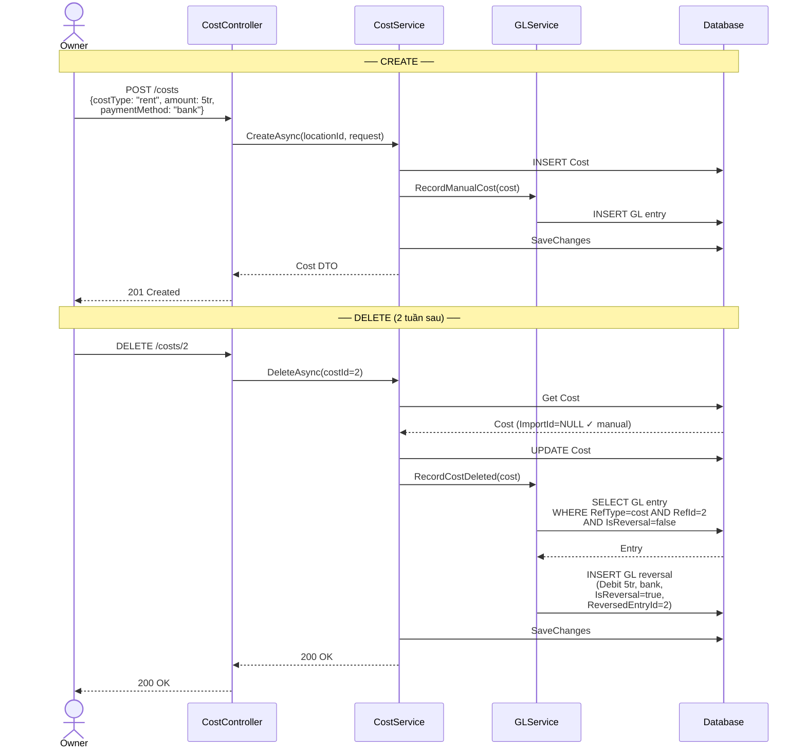

---

## 7. Data Flow Walkthrough

Đi qua 1 ngày (15/01/2026) để thấy data chảy qua từng entity:

```
15/01/2026 — Order ORD-001 hoàn thành
═══════════════════════════════════════

1. ORDER DATA (đã có sẵn):
   ┌─────────────────────────────────────────────────────┐
   │ OrderId: 201                                        │
   │ OrderCode: ORD-20260115-001                         │
   │ TotalAmount: 5,950,000                              │
   │ CashAmount: 4,000,000                               │
   │ BankAmount: 0                                       │
   │ DebtAmount: 1,950,000                               │
   │ DebtorId: 5 (Anh Ba)                                │
   │ OrderDetails:                                       │
   │   - Xi măng HT × 50 bao × 95,000 = 4,750,000       │
   │   - DV cắt sắt × 1 = 1,200,000                     │
   └─────────────────────────────────────────────────────┘
                        │
                        ▼
2. OrderService.CompleteAsync(201)
                        │
            ┌───────────┼────────────┐
            ▼           ▼            ▼
   ┌──── STOCK ────┐  ┌──── GL ────────────────┐  ┌──── DEBT ────────┐
   │ Xi măng:      │  │ Entry #3:              │  │ Debtor: Anh Ba   │
   │   Stock -= 50 │  │   Debit 4,000,000      │  │   Balance:       │
   │ (N/A for DV)  │  │   Channel: cash        │  │   0 → -1,950,000 │
   └───────────────┘  │   TransType: sale      │  │                  │
                      │   Ref: order/201       │  │ PaymentTx:       │
                      │                        │  │   Amount: 1.95tr │
                      │ Entry #4:              │  │   Type: sale     │
                      │   Debit 1,950,000      │  └──────────────────┘
                      │   Channel: debt        │
                      │   TransType: sale      │
                      │   Ref: order/201       │
                      └────────────────────────┘

3. Kết quả tổng:
   - DT ghi nhận: 5,950,000đ (entry #3 + #4)
   - Tiền thực thu: 4,000,000đ (chỉ cash)
   - Nợ Anh Ba: 1,950,000đ (sẽ thu sau)

═══════════════════════════════════════

25/01/2026 — Anh Ba trả nợ 1,000,000đ
═══════════════════════════════════════

1. DebtorService.RecordPaymentAsync(debtorId=5, 1tr, cash)
                        │
            ┌───────────┼───────────┐
            ▼                       ▼
   ┌──── DEBTOR ──────────┐  ┌──── GL ──────────────────┐
   │ Balance:              │  │ Entry #6:                │
   │   -1,950,000          │  │   Debit 1,000,000        │
   │   + 1,000,000         │  │   Channel: cash          │
   │   = -950,000          │  │   TransType: debt_payment│
   │                       │  │   Ref: debtor_payment/301│
   │ PaymentTx #301:       │  │                          │
   │   Before: -1,950,000  │  │ ⚠️ ĐÂY KHÔNG PHẢI DT    │
   │   After:  -950,000    │  │ DT đã ghi ở entry #4    │
   └───────────────────────┘  │ Đây chỉ là cash-in      │
                              └──────────────────────────┘

2. Kết quả:
   - DT KHÔNG thay đổi (vẫn 5.95tr từ ORD-001)
   - Tiền thực thu tăng thêm 1tr (cash-in)
   - Nợ Anh Ba còn 950,000đ
```

---

## 8. Cross-Entity Queries

### Query 1: Tổng doanh thu Q1/2026

```sql
-- Tổng doanh thu = SUM Debit từ sale entries (trừ reversal)
SELECT 
    SUM(CASE WHEN IsReversal = FALSE THEN DebitAmount ELSE 0 END) -
    SUM(CASE WHEN IsReversal = TRUE THEN CreditAmount ELSE 0 END) AS NetRevenue
FROM GeneralLedgerEntries
WHERE BusinessLocationId = 1
  AND TransactionType = 'sale'
  AND EntryDate BETWEEN '2026-01-01' AND '2026-03-31';
-- Result: 620,000,000đ
```

### Query 2: Tiền thực thu (cash + bank only)

```sql
-- Tiền THỰC THU = cash + bank, trừ debt
SELECT 
    MoneyChannel,
    SUM(DebitAmount) AS TotalIn,
    SUM(CreditAmount) AS TotalOut,
    SUM(DebitAmount) - SUM(CreditAmount) AS Net
FROM GeneralLedgerEntries
WHERE BusinessLocationId = 1
  AND MoneyChannel IN ('cash', 'bank')
  AND EntryDate BETWEEN '2026-01-01' AND '2026-03-31'
GROUP BY MoneyChannel;
-- cash: In=450tr, Out=85tr, Net=365tr
-- bank: In=120tr, Out=15tr, Net=105tr
-- Tổng thực thu: 470tr
```

### Query 3: Tổng chi phí theo loại

```sql
-- Tổng chi phí Q1 theo CostType (chỉ active, trừ soft deleted)
SELECT 
    CostType,
    COUNT(*) AS SoMuc,
    SUM(Amount) AS TongTien
FROM Costs
WHERE BusinessLocationId = 1
  AND CostDate BETWEEN '2026-01-01' AND '2026-03-31'
  AND DeletedAt IS NULL
GROUP BY CostType
ORDER BY TongTien DESC;
-- import:     2 mục, 66,500,000đ
-- rent:       3 mục, 15,000,000đ
-- salary:     1 mục,  6,000,000đ
-- utilities:  3 mục,  3,600,000đ
-- ...
```

### Query 4: Verify Cost-GL consistency

```sql
-- Xác minh: Tổng Costs active = Tổng GL credit (trừ reversal) cho import_cost + manual_cost
SELECT 
    'costs_total' AS source,
    SUM(Amount) AS total
FROM Costs
WHERE BusinessLocationId = 1
  AND DeletedAt IS NULL
  AND CostDate BETWEEN '2026-01-01' AND '2026-03-31'

UNION ALL

SELECT 
    'gl_total' AS source,
    SUM(CASE WHEN IsReversal = FALSE THEN CreditAmount ELSE -DebitAmount END) AS total
FROM GeneralLedgerEntries
WHERE BusinessLocationId = 1
  AND TransactionType IN ('import_cost', 'manual_cost')
  AND EntryDate BETWEEN '2026-01-01' AND '2026-03-31';
-- Hai con số phải BẰNG NHAU → data consistent
```

### Query 5: Nợ còn lại (từ GL)

```sql
-- Tổng nợ phát sinh vs đã thu (từ GL, không cần query Debtors table)
SELECT 
    SUM(CASE WHEN TransactionType = 'sale' AND MoneyChannel = 'debt' 
             THEN DebitAmount ELSE 0 END) AS TongNoPhaSinh,
    SUM(CASE WHEN TransactionType = 'debt_payment' 
             THEN DebitAmount ELSE 0 END) AS TongDaThu,
    SUM(CASE WHEN TransactionType = 'sale' AND MoneyChannel = 'debt' 
             THEN DebitAmount ELSE 0 END) -
    SUM(CASE WHEN TransactionType = 'debt_payment' 
             THEN DebitAmount ELSE 0 END) AS ConNo
FROM GeneralLedgerEntries
WHERE BusinessLocationId = 1
  AND IsReversal = FALSE
  AND EntryDate BETWEEN '2026-01-01' AND '2026-03-31';
-- NợPhátSinh: 50tr, ĐãThu: 35tr, CòNợ: 15tr
```

---

## Appendix: Diagram Summary

| Diagram | Type | Mô tả | Section |
|---------|:----:|-------|:-------:|
| Cost Lifecycle | State Machine | auto (readonly) vs manual (CRUD) | [4.1](#41-cost-lifecycle) |
| GL Entry Lifecycle | State Machine | immutable — chỉ tạo, không sửa/xóa | [4.2](#42-gl-entry-lifecycle) |
| GL Generation (Order) | Activity | Order complete → split entries per channel | [5.1](#51-gl-entry-generation--order-completed) |
| Cost Auto-Gen (Import) | Activity | Import confirmed → Cost + GL | [5.2](#52-cost-auto-generation--import-confirmed) |
| Import Cancel → Reversal | Activity | Cancel → soft delete Cost + GL reversal | [5.3](#53-import-cancelled--cost--gl-reversal) |
| Manual Cost Create/Delete | Activity | CRUD flow + GL side effects | [5.4](#54-manual-cost--create--delete) |
| Order Cancel → Reversal | Activity | Cancel completed order → GL reversals | [5.5](#55-order-cancelled--gl-reversal) |
| Order → GL + Side Effects | Sequence | Full interaction: API → Service → GL → Stock → Debt | [6.1](#61-order-completed--gl--side-effects) |
| Import → Cost + GL | Sequence | Import confirm → stock + cost + GL transaction | [6.2](#62-import-confirmed--cost--gl) |
| Order Cancel → Reversal | Sequence | Cancel → restore stock + reverse GL | [6.3](#63-order-cancelled--gl-reversal) |
| Debt Payment → GL | Sequence | Pay debt → update balance → GL cash-in | [6.4](#64-debt-payment--gl-entry) |
| Tax Payment → GL | Sequence | Record tax → GL cash-out | [6.5](#65-tax-payment--gl-entry) |
| Manual Cost CRUD → GL | Sequence | Create + Delete with GL entries | [6.6](#66-manual-cost--gl-entry--soft-delete-reversal) |
