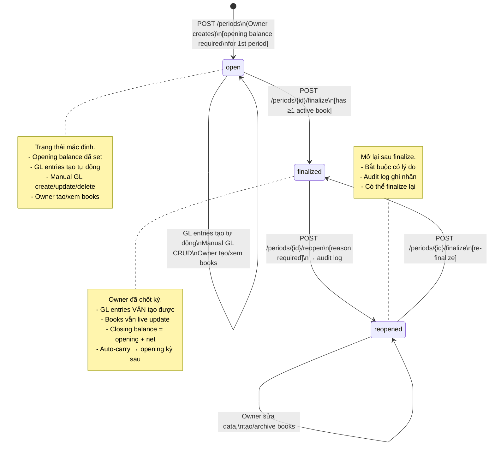
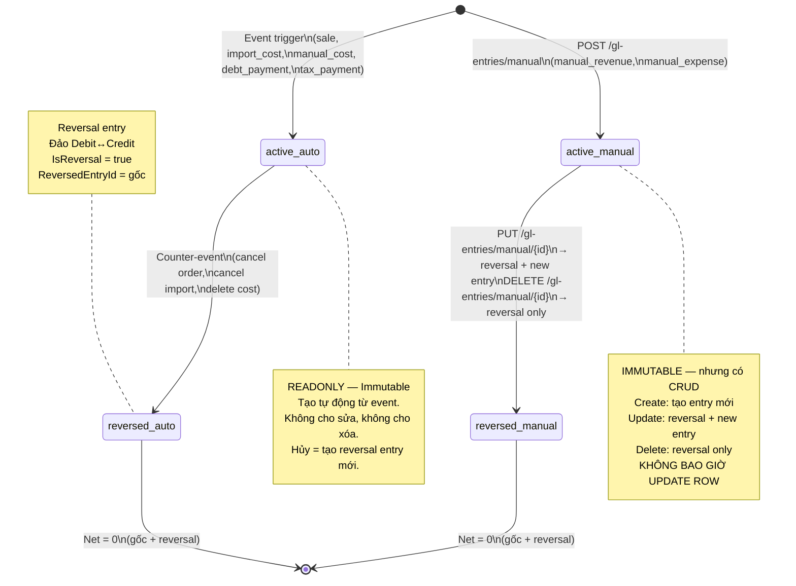
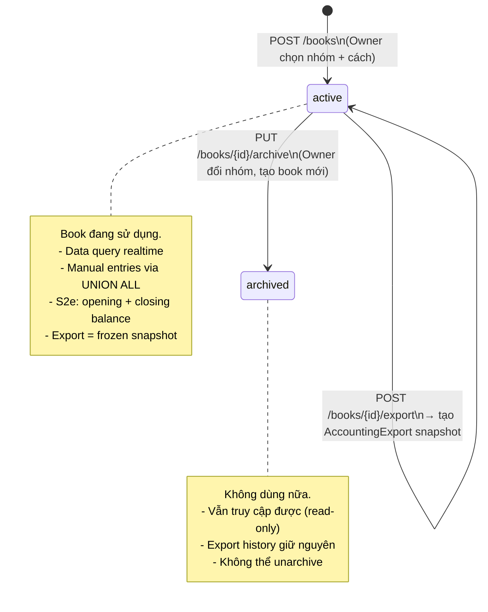
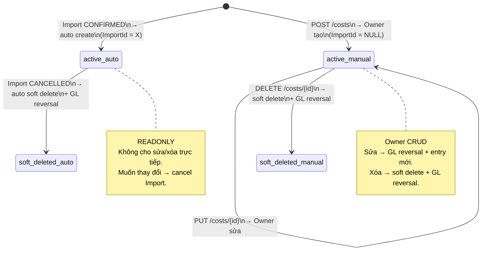
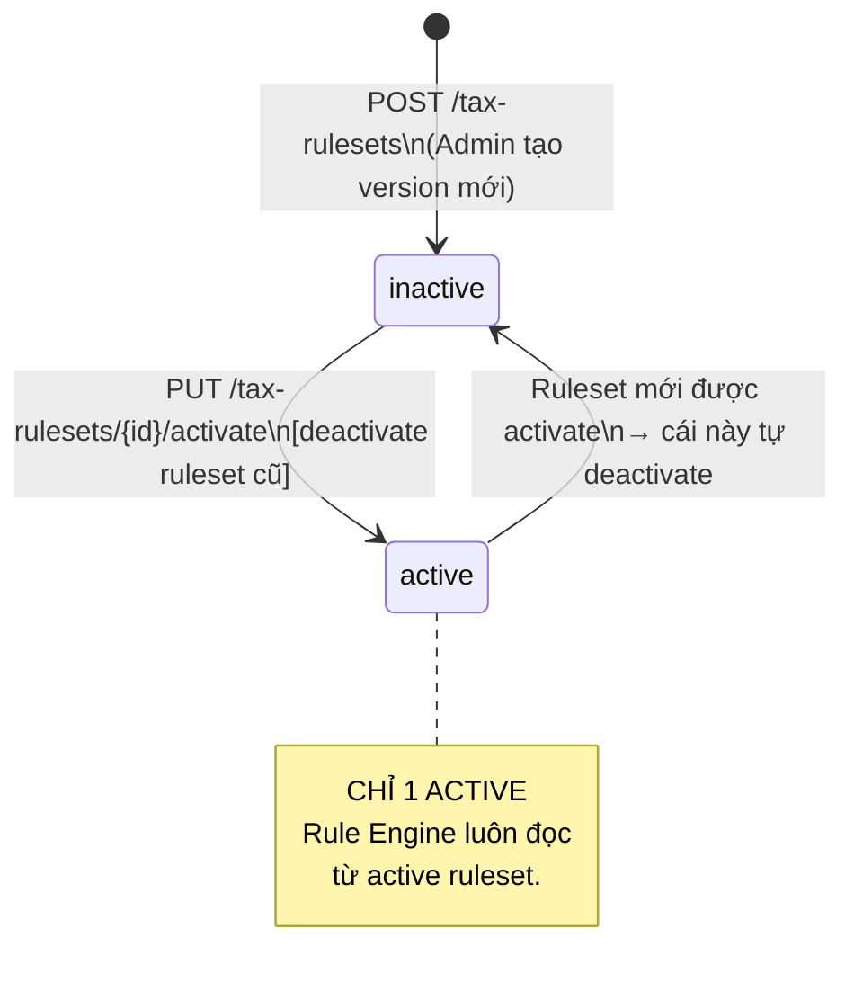
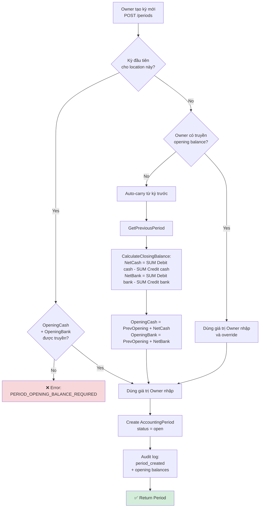
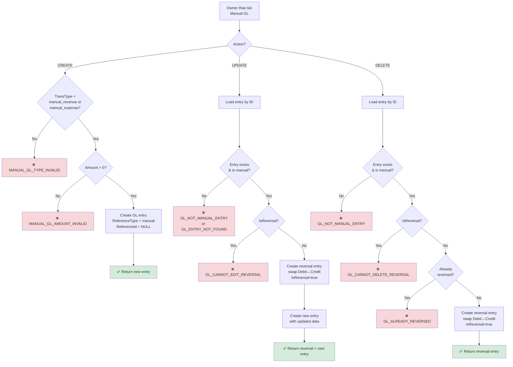
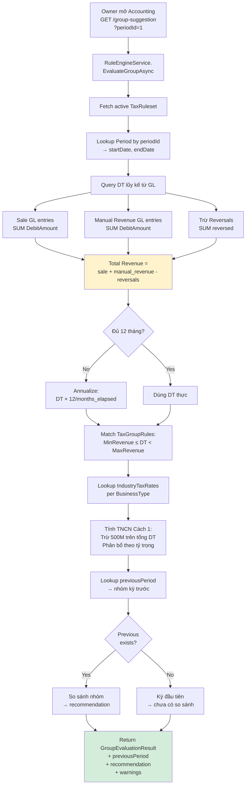

# Demo Scenarios — Report & Accounting Module

> **Tài liệu demo** cho module Report & Accounting (TT152/2025/TT-BTC).
> Kịch bản demo end-to-end, sample data, state machines, và activity diagrams.
>
> **Sub-docs**: [cost-gl-flow](cost-gl-flow.md) · [accounting-period-flow](accounting-period-flow.md) · [rule-engine-flow](rule-engine-flow.md) · [accounting-book-flow](accounting-book-flow.md) · [dashboard-report-flow](dashboard-report-flow.md)
> **Reference**: [report-accounting-entities](report-accounting-entities.md) · [report-accounting-diagrams](report-accounting-diagrams.md)

---

## Mục lục

1. [Tổng quan kịch bản](#1-tổng-quan-kịch-bản)
2. [Phase 1 — Thiết lập ban đầu](#2-phase-1--thiết-lập-ban-đầu)
3. [Phase 2 — Nhập DT/CP trước khi dùng app (Manual GL)](#3-phase-2--nhập-dtcp-trước-khi-dùng-app-manual-gl)
4. [Phase 3 — Hoạt động kinh doanh trong kỳ](#4-phase-3--hoạt-động-kinh-doanh-trong-kỳ)
5. [Phase 4 — Xem gợi ý nhóm & tạo sổ kế toán](#5-phase-4--xem-gợi-ý-nhóm--tạo-sổ-kế-toán)
6. [Phase 5 — Sửa/xóa Manual GL & Xem sổ live](#6-phase-5--sửaxóa-manual-gl--xem-sổ-live)
7. [Phase 6 — Xuất sổ, chốt kỳ & mở lại kỳ](#7-phase-6--xuất-sổ-chốt-kỳ--mở-lại-kỳ)
8. [Phase 7 — Kỳ tiếp theo (Auto-carry opening balance)](#8-phase-7--kỳ-tiếp-theo-auto-carry-opening-balance)
9. [State Machine Diagrams](#9-state-machine-diagrams)
10. [Activity Diagrams](#10-activity-diagrams)
11. [Tóm tắt Sample Data](#11-tóm-tắt-sample-data)

---

## 1. Tổng quan kịch bản

### Nhân vật & Location

| Entity | Value | Ghi chú |
|--------|-------|---------|
| **Owner** | Anh Minh (`u-owner-001`) | Chủ cửa hàng |
| **Location** | Cửa hàng Minh Phát (`BusinessLocationId: 1`) | VLXD + Dịch vụ cắt sắt |
| **BusinessType 1** | Bán lẻ hàng hóa (`bt-retail`) | VAT 1%, TNCN 0.5% |
| **BusinessType 2** | Dịch vụ (`bt-service`) | VAT 5%, TNCN 2% |
| **Khách hàng** | Anh Ba (`DebtorId: 5`) | Thường mua ghi nợ |
| **Nhà cung cấp** | Công ty ABC | Xi măng, sắt thép |

### Timeline demo

```
Phase 1:  Thiết lập — Cấu hình kế toán + Tạo kỳ Q1/2026 (opening balance)
Phase 2:  Manual GL — Nhập doanh thu/chi phí trước khi dùng app (Q4/2025)
Phase 3:  Kinh doanh — Imports, Orders, Costs, Debt payment, Tax payment (T1-T3/2026)
Phase 4:  Rule Engine — Xem gợi ý nhóm (periodId) → Tạo sổ S2a
Phase 5:  Sửa/xóa Manual GL — Demo reversal + new, sổ live update
Phase 6:  Xuất sổ + Chốt kỳ + Mở lại + Re-finalize
Phase 7:  Kỳ Q2/2026 — Auto-carry opening balance + previousPeriod recommendation
```

### Tóm tắt số liệu Q1/2026

| Metric | Giá trị |
|--------|--------:|
| DT bán lẻ (bt-retail) | 480,000,000đ |
| DT dịch vụ (bt-service) | 140,000,000đ |
| DT thủ công (manual_revenue) từ Q4/2025 | 50,000,000đ |
| **Tổng DT (cho Rule Engine)** | **670,000,000đ** |
| Tổng chi phí | 85,000,000đ |
| Số dư tiền mặt đầu kỳ | 50,000,000đ |
| Số dư ngân hàng đầu kỳ | 120,000,000đ |

---

## 2. Phase 1 — Thiết lập ban đầu

### Bước 1.1: Cấu hình AccountingSettings

> Owner vào trang Kế toán lần đầu → Hệ thống tự tạo AccountingSettings mặc định.

```yaml
# Hệ thống tự tạo (không cần API call)
AccountingSettings:
  AccountingSettingId: 1
  BusinessLocationId: 1
  FiscalYearStart: 1          # Năm dương lịch
  DefaultCurrency: "VND"
```

### Bước 1.2: Tạo kỳ kế toán Q1/2026

> **Demo point**: Kỳ đầu tiên — bắt buộc nhập opening balance (RULE-PERIOD-05).

```yaml
POST /api/v1/locations/1/accounting/periods
Authorization: Bearer {token_owner}

Request:
{
  "periodType": "quarter",
  "year": 2026,
  "quarter": 1,
  "openingCashBalance": 50000000,      # 50 triệu tiền mặt đầu kỳ
  "openingBankBalance": 120000000      # 120 triệu số dư ngân hàng
}

Response (201 Created):
{
  "periodId": 1,
  "periodType": "quarter",
  "year": 2026,
  "quarter": 1,
  "startDate": "2026-01-01",
  "endDate": "2026-03-31",
  "openingCashBalance": 50000000,
  "openingBankBalance": 120000000,
  "status": "open"
}
```

**Audit log tự tạo:**

```json
{
  "action": "period_created",
  "newValue": {
    "periodType": "quarter",
    "year": 2026,
    "quarter": 1,
    "openingCashBalance": 50000000,
    "openingBankBalance": 120000000
  }
}
```

**Demo error case — thiếu opening balance kỳ đầu:**

```yaml
POST /api/v1/locations/1/accounting/periods
Request: { "periodType": "quarter", "year": 2026, "quarter": 1 }
# Thiếu openingCashBalance + openingBankBalance

Response (400 Bad Request):
{
  "error": "PERIOD_OPENING_BALANCE_REQUIRED",
  "message": "Kỳ đầu tiên bắt buộc nhập số dư tiền mặt và ngân hàng đầu kỳ"
}
```

---

## 3. Phase 2 — Nhập DT/CP trước khi dùng app (Manual GL)

> **Demo point**: Owner đã kinh doanh 6 tháng trước khi cài BizFlow. Cần ghi lại doanh thu/chi phí cũ để sổ kế toán đầy đủ.

### Bước 2.1: Tạo Manual Revenue (DT trước app)

```yaml
POST /api/v1/locations/1/gl-entries/manual
Authorization: Bearer {token_owner}

Request:
{
  "transactionType": "manual_revenue",
  "entryDate": "2025-10-15",
  "description": "DT bán Xi măng T10/2025 (trước khi dùng app)",
  "amount": 20000000,
  "moneyChannel": "cash"
}

Response (201 Created):
{
  "entryId": 100,
  "transactionType": "manual_revenue",
  "referenceType": "manual",
  "referenceId": null,
  "entryDate": "2025-10-15",
  "description": "DT bán Xi măng T10/2025 (trước khi dùng app)",
  "debitAmount": 20000000,
  "creditAmount": 0,
  "moneyChannel": "cash",
  "isReversal": false,
  "createdAt": "2026-01-02T08:00:00Z"
}
```

### Bước 2.2: Tạo thêm 2 Manual Revenue entries

```yaml
# Entry 2 — DT T11/2025
POST /api/v1/locations/1/gl-entries/manual
{
  "transactionType": "manual_revenue",
  "entryDate": "2025-11-20",
  "description": "DT bán Sắt thép + DV cắt sắt T11/2025",
  "amount": 18000000,
  "moneyChannel": "bank"
}
→ Response: { "entryId": 101, "debitAmount": 18000000, ... }

# Entry 3 — DT T12/2025
POST /api/v1/locations/1/gl-entries/manual
{
  "transactionType": "manual_revenue",
  "entryDate": "2025-12-10",
  "description": "DT bán hàng T12/2025 (tiền mặt)",
  "amount": 12000000,
  "moneyChannel": "cash"
}
→ Response: { "entryId": 102, "debitAmount": 12000000, ... }
```

### Bước 2.3: Tạo Manual Expense (CP trước app)

```yaml
POST /api/v1/locations/1/gl-entries/manual
{
  "transactionType": "manual_expense",
  "entryDate": "2025-11-30",
  "description": "Thuê mặt bằng T11/2025",
  "amount": 5000000,
  "moneyChannel": "bank"
}
→ Response: { "entryId": 103, "creditAmount": 5000000, ... }
```

**Demo error case — loại không hợp lệ:**

```yaml
POST /api/v1/locations/1/gl-entries/manual
{
  "transactionType": "sale",       # ← Không phải manual type!
  "entryDate": "2025-12-01",
  "description": "...",
  "amount": 10000000,
  "moneyChannel": "cash"
}

Response (400):
{
  "error": "MANUAL_GL_TYPE_INVALID",
  "message": "Chỉ chấp nhận 'manual_revenue' hoặc 'manual_expense'"
}
```

### Tổng Manual GL entries sau Phase 2

| EntryId | TransType | Date | Description | Debit | Credit | Channel |
|:-------:|:---------:|:----:|-------------|------:|-------:|:-------:|
| 100 | `manual_revenue` | 2025-10-15 | DT bán Xi măng T10/2025 | 20,000,000 | 0 | cash |
| 101 | `manual_revenue` | 2025-11-20 | DT bán Sắt thép + DV T11/2025 | 18,000,000 | 0 | bank |
| 102 | `manual_revenue` | 2025-12-10 | DT bán hàng T12/2025 | 12,000,000 | 0 | cash |
| 103 | `manual_expense` | 2025-11-30 | Thuê mặt bằng T11/2025 | 0 | 5,000,000 | bank |

**Tổng manual revenue = 50,000,000đ** → sẽ tham gia tính DT cho Rule Engine.

---

## 4. Phase 3 — Hoạt động kinh doanh trong kỳ

> Các giao dịch trong Q1/2026 qua hệ thống — GL entries tự động tạo.

### Bước 3.1: Import hàng hóa

```yaml
# 05/01: Import IMP-001 — Nhập Xi măng
POST /api/v1/locations/1/imports/101/confirm
→ Trigger side effects:
   ✓ Stock += 500 bao Xi măng
   ✓ Cost tạo tự động (CostId: 1, Amount: 42,500,000đ)
   ✓ GL entry tự động (EntryId: 1, Credit: 42,500,000đ, TransType: import_cost)

# 05/02: Import IMP-002 — Nhập Sắt thép
POST /api/v1/locations/1/imports/102/confirm
→ Side effects:
   ✓ Cost (CostId: 4, Amount: 24,000,000đ)
   ✓ GL entry (EntryId: 8, Credit: 24,000,000đ)
```

### Bước 3.2: Bán hàng (Orders)

```yaml
# 15/01: Order ORD-001 (Xi măng 50 bao + DV cắt sắt = 5,950,000đ)
POST /api/v1/locations/1/orders/201/complete
→ GL entries tự động:
   ✓ EntryId: 3, Debit: 4,000,000đ, channel: cash
   ✓ EntryId: 4, Debit: 1,950,000đ, channel: debt (ghi nợ Anh Ba)

# 20/01: Order ORD-002 (Xi măng 100 bao = 9,500,000đ)
POST /api/v1/locations/1/orders/202/complete
→ GL entry: EntryId: 5, Debit: 9,500,000đ, channel: cash

# 10/02: Order ORD-003 (Sắt 50 cây = 7,500,000đ)
POST /api/v1/locations/1/orders/203/complete
→ GL entry: EntryId: 9, Debit: 7,500,000đ, channel: bank

# 15/02: Order ORD-004 (Xi măng + DV cắt sắt = 20,100,000đ)
POST /api/v1/locations/1/orders/204/complete
→ GL entries:
   ✓ EntryId: 10, Debit: 15,000,000đ, channel: cash
   ✓ EntryId: 11, Debit: 5,100,000đ, channel: bank
```

### Bước 3.3: Chi phí thủ công (Manual Costs)

```yaml
# 10/01: Thuê mặt bằng T1/2026
POST /api/v1/locations/1/costs
{ "costType": "rent", "description": "Thuê mặt bằng T1/2026",
  "amount": 5000000, "costDate": "2026-01-10", "paymentMethod": "bank" }
→ Cost (CostId: 2) + GL entry (EntryId: 2, Credit: 5,000,000đ)

# 28/01: Tiền điện T1/2026
POST /api/v1/locations/1/costs
{ "costType": "utilities", "description": "Tiền điện T1/2026",
  "amount": 1200000, "costDate": "2026-01-28", "paymentMethod": "cash" }
→ Cost (CostId: 3) + GL entry (EntryId: 7, Credit: 1,200,000đ)
```

### Bước 3.4: Thu nợ + Nộp thuế

```yaml
# 25/01: Anh Ba trả nợ 1 triệu
POST /api/v1/locations/1/debtors/5/payments
{ "amount": 1000000, "paymentMethod": "cash" }
→ GL entry: EntryId: 6, Debit: 1,000,000đ, TransType: debt_payment

# 20/02: Nộp thuế GTGT Q4/2025
POST /api/v1/locations/1/tax-payments
{ "taxType": "VAT", "amount": 3500000, "paidAt": "2026-02-20",
  "paymentMethod": "bank", "referenceNumber": "BL-20260220-001" }
→ GL entry: EntryId: 12, Credit: 3,500,000đ, TransType: tax_payment
```

### Bước 3.5: Hủy đơn hàng (Reversal demo)

```yaml
# 10/03: Order ORD-005 completed (DT = 3,200,000đ TM)
POST /api/v1/locations/1/orders/205/complete
→ GL entry: EntryId: 50, Debit: 3,200,000đ, channel: cash

# 25/03: Owner cancel ORD-005
POST /api/v1/locations/1/orders/205/cancel
→ GL reversal: EntryId: 51, Credit: 3,200,000đ, IsReversal: true, ReversedEntryId: 50
→ Net = 0 (ORD-005 không ảnh hưởng DT)
```

### GL Entries tổng hợp sau Phase 3

| EntryId | TransType | RefType | Date | Description | Debit | Credit | Channel | IsRev |
|:-------:|:---------:|:-------:|:----:|-------------|------:|-------:|:-------:|:-----:|
| 1 | `import_cost` | import | 01-05 | IMP-001: Xi măng | 0 | 42,500,000 | bank | ❌ |
| 2 | `manual_cost` | cost | 01-10 | Thuê mặt bằng T1 | 0 | 5,000,000 | bank | ❌ |
| 3 | `sale` | order | 01-15 | ORD-001: TM | 4,000,000 | 0 | cash | ❌ |
| 4 | `sale` | order | 01-15 | ORD-001: Nợ | 1,950,000 | 0 | debt | ❌ |
| 5 | `sale` | order | 01-20 | ORD-002: TM | 9,500,000 | 0 | cash | ❌ |
| 6 | `debt_payment` | debtor_payment | 01-25 | Thu nợ Anh Ba | 1,000,000 | 0 | cash | ❌ |
| 7 | `manual_cost` | cost | 01-28 | Tiền điện T1 | 0 | 1,200,000 | cash | ❌ |
| 8 | `import_cost` | import | 02-05 | IMP-002: Sắt thép | 0 | 24,000,000 | bank | ❌ |
| 9 | `sale` | order | 02-10 | ORD-003: CK | 7,500,000 | 0 | bank | ❌ |
| 10 | `sale` | order | 02-15 | ORD-004: TM | 15,000,000 | 0 | cash | ❌ |
| 11 | `sale` | order | 02-15 | ORD-004: CK | 5,100,000 | 0 | bank | ❌ |
| 12 | `tax_payment` | tax_payment | 02-20 | Nộp thuế GTGT Q4 | 0 | 3,500,000 | bank | ❌ |
| ... | ... | ... | ... | *(T3 orders tiếp tục)* | ... | ... | ... | ... |
| 50 | `sale` | order | 03-10 | ORD-005: TM | 3,200,000 | 0 | cash | ❌ |
| 51 | `sale` | order | 03-25 | [HỦY] ORD-005 | 0 | 3,200,000 | cash | ✅ |
| 100 | `manual_revenue` | manual | 10-15 | DT T10/2025 | 20,000,000 | 0 | cash | ❌ |
| 101 | `manual_revenue` | manual | 11-20 | DT T11/2025 | 18,000,000 | 0 | bank | ❌ |
| 102 | `manual_revenue` | manual | 12-10 | DT T12/2025 | 12,000,000 | 0 | cash | ❌ |
| 103 | `manual_expense` | manual | 11-30 | CP thuê T11/2025 | 0 | 5,000,000 | bank | ❌ |

---

## 5. Phase 4 — Xem gợi ý nhóm & tạo sổ kế toán

### Bước 4.1: Xem gợi ý nhóm (Group Suggestion)

> **Demo point**: Input = `periodId`, response có `previousPeriod` + `recommendation`.
> DT tính = sale GL (620M) + manual_revenue GL (50M) = 670M.

```yaml
GET /api/v1/locations/1/accounting/group-suggestion?periodId=1
Authorization: Bearer {token_owner}

Response:
{
  "rulesetVersion": "1.0.0",
  "periodId": 1,
  "periodLabel": "Q1/2026",
  
  "actualRevenue": 670000000,
  "annualizedRevenue": 893333333,
  "isAnnualized": true,
  
  "suggestedGroup": 2,
  "suggestedGroupName": "Nhóm 2",
  "allowedTaxMethods": ["method_1", "method_2"],
  "defaultTaxMethod": "method_1",
  
  "requiredBooks": {
    "method_1": ["S2a"],
    "method_2": ["S2b", "S2c", "S2d", "S2e"]
  },
  
  "vatExempt": false,
  "pitExempt": false,
  "revenueDeduction": 500000000,
  
  "industryBreakdown": [
    {
      "businessTypeId": "bt-retail",
      "businessTypeName": "Bán lẻ hàng hóa",
      "revenue": 480000000,
      "vatRate": 0.01,
      "vatAmount": 4800000,
      "pitMethod1Rate": 0.005,
      "pitMethod1Amount": 609524
    },
    {
      "businessTypeId": "bt-service",
      "businessTypeName": "Dịch vụ",
      "revenue": 140000000,
      "vatRate": 0.05,
      "vatAmount": 7000000,
      "pitMethod1Rate": 0.02,
      "pitMethod1Amount": 711111
    }
  ],
  
  "warnings": [],
  
  "previousPeriod": null,
  "recommendation": "Kỳ đầu tiên — chưa có dữ liệu kỳ trước để so sánh"
}
```

> **Giải thích actualRevenue = 670M**:
> - Sale GL (SUM Debit WHERE TransType=sale, IsReversal=false) - Reversals = 620,000,000đ
> - Manual revenue GL (SUM Debit WHERE TransType=manual_revenue, IsReversal=false) = 50,000,000đ
> - Tổng = 670,000,000đ
>
> **Annualized**: 670M × 12/3 = 893M (chưa hết năm, ước tính)
> → 500M ≤ 893M < 3B → **Nhóm 2**
>
> **TNCN Cách 1**: Phần vượt 500M = 170M
> - Retail: 170M × (480/620) × 0.5% = ~658,065đ
> - Service: 170M × (140/620) × 2% = ~768,387đ

### Bước 4.2: Owner tạo sổ S2a (Nhóm 2 Cách 1)

```yaml
POST /api/v1/locations/1/accounting/books
Authorization: Bearer {token_owner}

Request:
{
  "periodId": 1,
  "groupNumber": 2,
  "taxMethod": "method_1"
}

Response (201 Created):
# Hệ thống tạo 2 books (location đa ngành → tách per BusinessType cho S2a)
[
  {
    "bookId": 1,
    "templateCode": "S2a",
    "templateVersionLabel": "v1.0",
    "groupNumber": 2,
    "taxMethod": "method_1",
    "businessTypeId": "bt-retail",
    "businessTypeName": "Bán lẻ hàng hóa",
    "rulesetVersion": "1.0.0",
    "status": "active"
  },
  {
    "bookId": 2,
    "templateCode": "S2a",
    "templateVersionLabel": "v1.0",
    "groupNumber": 2,
    "taxMethod": "method_1",
    "businessTypeId": "bt-service",
    "businessTypeName": "Dịch vụ",
    "rulesetVersion": "1.0.0",
    "status": "active"
  }
]
```

### Bước 4.3: Xem data sổ S2a (Live — Book 1, bt-retail)

```yaml
GET /api/v1/locations/1/accounting/books/1/data
Authorization: Bearer {token_owner}

Response:
{
  "bookId": 1,
  "templateCode": "S2a",
  "periodLabel": "Q1/2026",
  "businessTypeName": "Bán lẻ hàng hóa",
  
  "columns": [
    { "fieldCode": "stt", "label": "STT" },
    { "fieldCode": "date", "label": "Ngày" },
    { "fieldCode": "description", "label": "Nội dung" },
    { "fieldCode": "revenue", "label": "Doanh thu" },
    { "fieldCode": "vat_rate", "label": "Tỷ lệ GTGT" },
    { "fieldCode": "vat_amount", "label": "Thuế GTGT" }
  ],
  
  "rows": [
    { "stt": 1, "date": "2026-01-15", "description": "ORD-001: Xi măng HT 50 bao", "revenue": 4750000, "vat_rate": "1%", "vat_amount": 47500 },
    { "stt": 2, "date": "2026-01-20", "description": "ORD-002: Xi măng HT 100 bao", "revenue": 9500000, "vat_rate": "1%", "vat_amount": 95000 },
    { "stt": "...", "description": "...các đơn hàng khác..." },
    { "stt": 285, "date": "2025-10-15", "description": "[THỦ CÔNG] DT bán Xi măng T10/2025", "revenue": 20000000, "vat_rate": null, "vat_amount": null },
    { "stt": 286, "date": "2025-11-20", "description": "[THỦ CÔNG] DT bán Sắt thép + DV T11/2025", "revenue": 18000000, "vat_rate": null, "vat_amount": null },
    { "stt": 287, "date": "2025-12-10", "description": "[THỦ CÔNG] DT bán hàng T12/2025", "revenue": 12000000, "vat_rate": null, "vat_amount": null }
  ],
  
  "summary": {
    "totalRevenue": 530000000,
    "totalVat": 4800000,
    "rowCount": 287,
    "manualEntryCount": 3
  }
}
```

> **Demo point**: Manual revenue entries hiển thị cuối sổ với prefix `[THỦ CÔNG]` (RULE-BOOK-10). Cột VAT = null vì manual entries chưa tách ngành.

---

## 6. Phase 5 — Sửa/xóa Manual GL & Xem sổ live

### Bước 5.1: Sửa Manual GL (Reversal + New)

> **Demo point**: Update = tạo reversal hủy entry cũ + tạo entry mới. GL immutable — không bao giờ UPDATE trực tiếp row.

```yaml
PUT /api/v1/locations/1/gl-entries/manual/100
Authorization: Bearer {token_owner}

Request:
{
  "entryDate": "2025-10-15",
  "description": "DT bán Xi măng T10/2025 (đã chỉnh sửa — thiếu 2 đơn)",
  "amount": 25000000,
  "moneyChannel": "cash"
}

Response:
{
  "reversedEntryId": 100,
  "newEntry": {
    "entryId": 110,
    "transactionType": "manual_revenue",
    "entryDate": "2025-10-15",
    "description": "DT bán Xi măng T10/2025 (đã chỉnh sửa — thiếu 2 đơn)",
    "debitAmount": 25000000,
    "creditAmount": 0,
    "moneyChannel": "cash",
    "isReversal": false
  },
  "reversalEntry": {
    "entryId": 111,
    "description": "[SỬA] DT bán Xi măng T10/2025 (trước khi dùng app)",
    "debitAmount": 0,
    "creditAmount": 20000000,
    "isReversal": true,
    "reversedEntryId": 100
  }
}
```

**Trạng thái GL sau update:**

| EntryId | Description | Debit | Credit | IsRev | RevId | Net Effect |
|:-------:|-------------|------:|-------:|:-----:|:-----:|:----------:|
| 100 | DT T10/2025 (entry gốc) | 20,000,000 | 0 | ❌ | — | ~~cancelled~~ |
| 111 | [SỬA] DT T10/2025 | 0 | 20,000,000 | ✅ | 100 | -20,000,000 |
| 110 | DT T10/2025 (đã chỉnh sửa) | 25,000,000 | 0 | ❌ | — | +25,000,000 |
| | **Net = 100 + 111 + 110** | | | | | **+25,000,000** |

→ Sổ S2a tự cập nhật: manual revenue tăng từ 20M → 25M.

### Bước 5.2: Xóa Manual GL (Reversal only)

```yaml
DELETE /api/v1/locations/1/gl-entries/manual/103
Authorization: Bearer {token_owner}

Response:
{
  "message": "Manual GL entry đã được hủy (reversal created)",
  "reversalEntry": {
    "entryId": 112,
    "description": "[HỦY] Thuê mặt bằng T11/2025",
    "debitAmount": 5000000,
    "creditAmount": 0,
    "isReversal": true,
    "reversedEntryId": 103
  }
}
```

→ Chi phí thuê T11/2025 bị hủy. Sổ S2c (nếu dùng Cách 2) sẽ giảm 5M.

### Bước 5.3: Demo error cases

```yaml
# Sửa entry không phải manual
PUT /api/v1/locations/1/gl-entries/manual/3     # EntryId 3 = sale GL
→ 400: { "error": "GL_NOT_MANUAL_ENTRY" }

# Sửa reversal entry
PUT /api/v1/locations/1/gl-entries/manual/111   # EntryId 111 = reversal
→ 400: { "error": "GL_CANNOT_EDIT_REVERSAL" }

# Xóa entry đã bị reversed
DELETE /api/v1/locations/1/gl-entries/manual/100  # Đã bị reverse bởi 111
→ 400: { "error": "GL_ALREADY_REVERSED" }
```

### Bước 5.4: List Manual GL entries

```yaml
GET /api/v1/locations/1/gl-entries/manual?startDate=2025-10-01&endDate=2026-03-31
Authorization: Bearer {token_owner}

Response:
{
  "items": [
    { "entryId": 100, "description": "DT T10/2025", "debitAmount": 20000000, "status": "reversed" },
    { "entryId": 101, "description": "DT T11/2025", "debitAmount": 18000000, "status": "active" },
    { "entryId": 102, "description": "DT T12/2025", "debitAmount": 12000000, "status": "active" },
    { "entryId": 103, "description": "CP thuê T11/2025", "creditAmount": 5000000, "status": "reversed" },
    { "entryId": 110, "description": "DT T10/2025 (đã chỉnh sửa)", "debitAmount": 25000000, "status": "active" }
  ],
  "summary": {
    "activeRevenue": 55000000,
    "activeExpense": 0,
    "reversedCount": 2
  }
}
```

---

## 7. Phase 6 — Xuất sổ, chốt kỳ & mở lại kỳ

### Bước 6.1: Xuất sổ S2a (Export)

```yaml
POST /api/v1/locations/1/accounting/books/1/export
Authorization: Bearer {token_owner}

Request: { "format": "xlsx" }

Response:
{
  "exportId": 1,
  "bookId": 1,
  "groupNumber": 2,
  "rulesetVersion": "1.0.0",
  "format": "xlsx",
  "fileUrl": "https://res.cloudinary.com/.../s2a_retail_q1_2026.xlsx",
  "summary": {
    "totalRevenue": 535000000,
    "totalVat": 4800000,
    "totalPit": 464516,
    "rowCount": 288,
    "manualEntryCount": 3
  },
  "dataRowCount": 288,
  "exportedAt": "2026-03-31T16:00:00Z"
}
```

### Bước 6.2: Chốt kỳ Q1/2026 (Finalize)

```yaml
POST /api/v1/locations/1/accounting/periods/1/finalize
Authorization: Bearer {token_owner}

Response:
{
  "periodId": 1,
  "status": "finalized",
  "finalizedAt": "2026-04-10T09:00:00Z",
  "message": "Kỳ Q1/2026 đã được chốt"
}
```

### Bước 6.3: Mở lại kỳ (Reopen)

> **Demo point**: Owner phát hiện thiếu 3 đơn hàng → reopen → bổ sung → re-finalize.

```yaml
POST /api/v1/locations/1/accounting/periods/1/reopen
Authorization: Bearer {token_owner}

Request:
{
  "reason": "Phát hiện thiếu 3 đơn hàng chưa complete, cần bổ sung trước khi nộp thuế"
}

Response:
{
  "periodId": 1,
  "status": "reopened",
  "message": "Kỳ Q1/2026 đã được mở lại"
}
```

```yaml
# Owner complete 3 đơn thiếu → GL entries auto created → Books auto updated
POST /api/v1/locations/1/orders/210/complete  # +2,000,000đ
POST /api/v1/locations/1/orders/211/complete  # +1,500,000đ
POST /api/v1/locations/1/orders/212/complete  # +2,500,000đ

# Export lại
POST /api/v1/locations/1/accounting/books/1/export
{ "format": "xlsx", "notes": "Xuất lần 2 — sau bổ sung 3 đơn thiếu" }
→ { "exportId": 2, "summary": { "totalRevenue": 541000000, "rowCount": 291 } }

# Re-finalize
POST /api/v1/locations/1/accounting/periods/1/finalize
→ { "status": "finalized", "finalizedAt": "2026-04-12T15:00:00Z" }
```

**Audit log cho kỳ Q1/2026 (theo thứ tự thời gian):**

| LogId | Action | CreatedAt | Ghi chú |
|:-----:|--------|:---------:|---------|
| 1 | `period_created` | 01/01 08:00 | Tạo kỳ + opening balance |
| 2 | `book_created` | 20/03 14:00 | Tạo 2 books S2a |
| 3 | `book_exported` | 31/03 16:00 | Export lần 1 |
| 4 | `period_finalized` | 10/04 09:00 | Chốt lần 1 |
| 5 | `period_reopened` | 12/04 11:00 | Mở lại (reason: thiếu 3 đơn) |
| 6 | `book_exported` | 12/04 14:30 | Export lần 2 |
| 7 | `period_finalized` | 12/04 15:00 | Chốt lần 2 |

---

## 8. Phase 7 — Kỳ tiếp theo (Auto-carry opening balance)

### Bước 7.1: Tạo kỳ Q2/2026

> **Demo point**: Không truyền opening balance → hệ thống tự tính closing Q1 → opening Q2 (RULE-PERIOD-06).

```yaml
POST /api/v1/locations/1/accounting/periods
Authorization: Bearer {token_owner}

Request:
{
  "periodType": "quarter",
  "year": 2026,
  "quarter": 2
}
# Không có openingCashBalance, openingBankBalance → auto carry

Response (201 Created):
{
  "periodId": 2,
  "periodType": "quarter",
  "year": 2026,
  "quarter": 2,
  "startDate": "2026-04-01",
  "endDate": "2026-06-30",
  "openingCashBalance": 96300000,
  "openingBankBalance": 83600000,
  "status": "open"
}
```

> **Giải thích auto-carry:**
>
> **Closing Cash Q1** = Opening Cash Q1 + Net Cash Q1
> = 50,000,000 + (SUM Debit WHERE cash - SUM Credit WHERE cash)
> = 50,000,000 + (sale_cash + debt_payment_cash - manual_cost_cash - ...)
> ≈ 96,300,000đ
>
> **Closing Bank Q1** = Opening Bank Q1 + Net Bank Q1
> = 120,000,000 + (SUM Debit WHERE bank - SUM Credit WHERE bank)
> = 120,000,000 + (sale_bank - import_cost_bank - tax_payment_bank - ...)
> ≈ 83,600,000đ

### Bước 7.2: Xem gợi ý nhóm Q2 (có previousPeriod)

> **Demo point**: Response có `previousPeriod` (Q1) + `recommendation` (carry-over).

```yaml
GET /api/v1/locations/1/accounting/group-suggestion?periodId=2
Authorization: Bearer {token_owner}

Response:
{
  "rulesetVersion": "1.0.0",
  "periodId": 2,
  "periodLabel": "Q2/2026",
  
  "actualRevenue": 0,
  "annualizedRevenue": 0,
  "isAnnualized": true,
  "suggestedGroup": 1,
  "suggestedGroupName": "Nhóm 1",
  
  "previousPeriod": {
    "periodId": 1,
    "periodLabel": "Q1/2026",
    "groupNumber": 2,
    "taxMethod": "method_1",
    "status": "finalized"
  },
  "recommendation": "DT thay đổi → chuyển từ Nhóm 2 sang Nhóm 1. Vui lòng xem xét lại cách tính thuế."
}
```

> **Lưu ý**: DT Q2 = 0 (mới tạo, chưa có giao dịch) → annualized = 0 → gợi ý Nhóm 1:
> - Vì số liệu tính trên kỳ Q2 (chưa có giao dịch), recommendation cho biết kỳ trước là Nhóm 2.
> - Owner cần đợi có đủ data trước khi tạo books.

---

## 9. State Machine Diagrams

### 9.1 Accounting Period Lifecycle



**Transition rules:**

| From | To | Guard | Side Effect |
|------|----|-------|-------------|
| `[*]` | `open` | Opening balance (1st period: required, 2nd+: auto carry) | Audit log: `period_created` |
| `open` | `finalized` | `books.count(active) >= 1` | Set `FinalizedAt`. Audit: `period_finalized` |
| `finalized` | `reopened` | `reason != null` | Audit: `period_reopened` (OldValue, NewValue, Reason) |
| `reopened` | `finalized` | `books.count(active) >= 1` | Update `FinalizedAt`. Audit: `period_finalized` |

---

### 9.2 GL Entry Lifecycle (Immutable Ledger)



**Key principle**: GL entries **KHÔNG BAO GIỜ** bị UPDATE hoặc DELETE trong DB. Mọi thay đổi đều tạo entry mới (reversal) để đảm bảo audit trail.

| Operation | Entry gốc | Side effect |
|-----------|-----------|-------------|
| Create (auto) | `IsReversal=false` | Tự động từ event |
| Create (manual) | `IsReversal=false, ReferenceType=manual` | Owner tạo |
| Update (manual) | Không đổi | Tạo 2 entries: reversal (hủy gốc) + new (data mới) |
| Delete (manual) | Không đổi | Tạo 1 entry: reversal (hủy gốc) |
| Cancel event | Không đổi | Tạo reversal entries cho tất cả entries gốc của event |

---

### 9.3 Accounting Book Lifecycle



---

### 9.4 Cost Lifecycle



---

### 9.5 Tax Ruleset Lifecycle



---

## 10. Activity Diagrams

### 10.1 Tạo kỳ kế toán (với Opening Balance)



---

### 10.2 Manual GL Entry — Create / Update / Delete



---

### 10.3 Group Suggestion (periodId-based)



---

### 10.4 Book Data Rendering (với Manual GL + Opening Balance)

```mermaid
flowchart TD
    A[GET /books/{id}/data] --> B{Book status\n= active?}
    B -->|No| ERR[❌ BOOK_ALREADY_ARCHIVED]
    B -->|Yes| C[Load Book +\nTemplateVersion +\nFieldMappings]
    C --> D{TemplateCode?}
    
    D -->|S1a / S2a / S2b| E1[Query Orders\nWHERE completed\n+ period + businessType]
    E1 --> E2[UNION ALL\nManual Revenue GL entries\nWHERE manual_revenue\nAND NOT reversed]
    E2 --> E3[Prefix: THỦ CÔNG\nVAT/PIT = NULL per row]
    E3 --> RENDER
    
    D -->|S2c| F1[Query Costs\nWHERE DeletedAt IS NULL\n+ period]
    F1 --> F2[UNION ALL\nManual Expense GL entries\nWHERE manual_expense\nAND NOT reversed]
    F2 --> F3[Prefix: THỦ CÔNG\nLoại chi phí = Thủ công]
    F3 --> RENDER
    
    D -->|S2d| G1[Compute Tax Obligations\nfrom Rule Engine]
    G1 --> G2[Lookup TaxPayments\nfor period]
    G2 --> G3[Còn nợ = Phải nộp - Đã nộp]
    G3 --> RENDER
    
    D -->|S2e| H1[Dòng đầu: opening balance\nfrom AccountingPeriods]
    H1 --> H2[Query ALL GL entries\nfor period + location]
    H2 --> H3[Map to columns:\nThu TM / Thu CK / Chi TM\nChi CK / Ghi nợ / Thu nợ]
    H3 --> H4[Dòng cuối: Closing balance\n= Opening + Net in/out]
    H4 --> RENDER
    
    RENDER[Build response:\ncolumns + rows + summary]
    RENDER --> RETURN[✅ Return BookDataDto]

    style ERR fill:#f8d7da
    style RETURN fill:#d4edda
```

---

### 10.5 End-to-End Demo Flow

```mermaid
flowchart LR
    subgraph Phase1[Phase 1: Thiết lập]
        A1[Tạo Period\n+ opening balance]
    end
    
    subgraph Phase2[Phase 2: Manual GL]
        B1[Nhập DT/CP\ntrước app]
    end
    
    subgraph Phase3[Phase 3: Kinh doanh]
        C1[Import → Cost + GL]
        C2[Order → Sale GL]
        C3[Cost manual → GL]
        C4[Debt Payment → GL]
        C5[Tax Payment → GL]
        C6[Cancel → Reversal]
    end
    
    subgraph Phase4[Phase 4: Rule Engine]
        D1[Group Suggestion\npreviousPeriod\nrecommendation]
        D2[Tạo Books S2a]
    end
    
    subgraph Phase5[Phase 5: Sửa/Xóa]
        E1[Update Manual GL\nreversal + new]
        E2[Delete Manual GL\nreversal only]
        E3[Sổ live update]
    end
    
    subgraph Phase6[Phase 6: Chốt kỳ]
        F1[Export sổ]
        F2[Finalize]
        F3[Reopen + Fix]
        F4[Re-finalize]
    end
    
    subgraph Phase7[Phase 7: Kỳ mới]
        G1[Tạo Q2\nauto-carry balance]
        G2[Group Suggestion\nwith previousPeriod]
    end
    
    Phase1 --> Phase2 --> Phase3 --> Phase4 --> Phase5 --> Phase6 --> Phase7
```



---

### 10.6 Period Finalize + Reopen

```mermaid
flowchart TD
    A[POST /periods/{id}/finalize] --> B{Period exists?}
    B -->|No| ERR1[❌ PERIOD_NOT_FOUND]
    B -->|Yes| C{Status =\nopen or reopened?}
    C -->|No| ERR2[❌ PERIOD_ALREADY_FINALIZED]
    C -->|Yes| D{Has ≥1 active\nAccountingBook?}
    D -->|No| ERR3[❌ PERIOD_NO_BOOKS]
    D -->|Yes| E[Set status = finalized\nFinalizedAt = NOW]
    E --> F[Audit: period_finalized]
    F --> G[✅ Return updated Period]

    G --> H{Owner phát hiện\nsai/thiếu data?}
    H -->|No| END[Done]
    H -->|Yes| I[POST /periods/{id}/reopen]
    I --> J{Reason\nprovided?}
    J -->|No| ERR4[❌ Reason required]
    J -->|Yes| K[Set status = reopened]
    K --> L[Audit: period_reopened\nwith reason]
    L --> M[Owner sửa data\nComplete đơn thiếu\nSổ auto update]
    M --> N[Export lại]
    N --> O[Re-finalize]
    O --> E

    style ERR1 fill:#f8d7da
    style ERR2 fill:#f8d7da
    style ERR3 fill:#f8d7da
    style ERR4 fill:#f8d7da
    style G fill:#d4edda
    style END fill:#d4edda
```

---

## 11. Tóm tắt Sample Data

### AccountingPeriods

| PeriodId | Type | Year | Quarter | OpeningCash | OpeningBank | Status | FinalizedAt |
|:--------:|:----:|:----:|:-------:|------------:|------------:|:------:|:-----------:|
| 1 | quarter | 2026 | 1 | 50,000,000 | 120,000,000 | finalized | 2026-04-12 15:00 |
| 2 | quarter | 2026 | 2 | 96,300,000 | 83,600,000 | open | NULL |

### AccountingBooks

| BookId | PeriodId | TemplateCode | Group | Method | BusinessTypeId | Status |
|:------:|:--------:|:------------:|:-----:|:------:|:--------------:|:------:|
| 1 | 1 | S2a | 2 | method_1 | bt-retail | active |
| 2 | 1 | S2a | 2 | method_1 | bt-service | active |

### Manual GL Entries (final state)

| EntryId | TransType | Date | Amount | Status | Ghi chú |
|:-------:|:---------:|:----:|-------:|:------:|---------|
| 100 | manual_revenue | 2025-10-15 | 20,000,000 | reversed | Bị reverse bởi #111 |
| 101 | manual_revenue | 2025-11-20 | 18,000,000 | active | |
| 102 | manual_revenue | 2025-12-10 | 12,000,000 | active | |
| 103 | manual_expense | 2025-11-30 | 5,000,000 | reversed | Bị reverse bởi #112 |
| 110 | manual_revenue | 2025-10-15 | 25,000,000 | active | Thay thế #100 |
| 111 | manual_revenue (rev) | — | 20,000,000 | reversal | Reversal cho #100 |
| 112 | manual_expense (rev) | — | 5,000,000 | reversal | Reversal cho #103 |

### AccountingExports

| ExportId | BookId | Format | DataRows | TotalRevenue | ExportedAt | Notes |
|:--------:|:------:|:------:|:--------:|-------------:|:----------:|-------|
| 1 | 1 | xlsx | 288 | 535,000,000 | 31/03 16:00 | Xuất lần 1 |
| 2 | 1 | xlsx | 291 | 541,000,000 | 12/04 14:30 | Sau bổ sung 3 đơn |

### Diagram Summary

| Diagram | Type | Section | Mô tả |
|---------|:----:|:-------:|-------|
| Period Lifecycle | State Machine | [9.1](#91-accounting-period-lifecycle) | open → finalized → reopened (+ opening balance) |
| GL Entry Lifecycle | State Machine | [9.2](#92-gl-entry-lifecycle-immutable-ledger) | Immutable ledger + manual CRUD via reversal |
| Book Lifecycle | State Machine | [9.3](#93-accounting-book-lifecycle) | active → archived (+ manual entries) |
| Cost Lifecycle | State Machine | [9.4](#94-cost-lifecycle) | auto vs manual, soft delete |
| Ruleset Lifecycle | State Machine | [9.5](#95-tax-ruleset-lifecycle) | inactive ↔ active (chỉ 1) |
| Period Create | Activity | [10.1](#101-tạo-kỳ-kế-toán-với-opening-balance) | Opening balance: required vs auto-carry |
| Manual GL CRUD | Activity | [10.2](#102-manual-gl-entry--create--update--delete) | Create + Update (reversal+new) + Delete (reversal) |
| Group Suggestion | Activity | [10.3](#103-group-suggestion-periodidbased) | periodId → DT (sale + manual) → group match → previousPeriod |
| Book Rendering | Activity | [10.4](#104-book-data-rendering-với-manual-gl--opening-balance) | UNION ALL manual entries + S2e opening/closing |
| End-to-End | Activity | [10.5](#105-end-to-end-demo-flow) | 7-phase demo flow overview |
| Finalize + Reopen | Activity | [10.6](#106-period-finalize--reopen) | Finalize → Reopen → Fix → Re-finalize |
