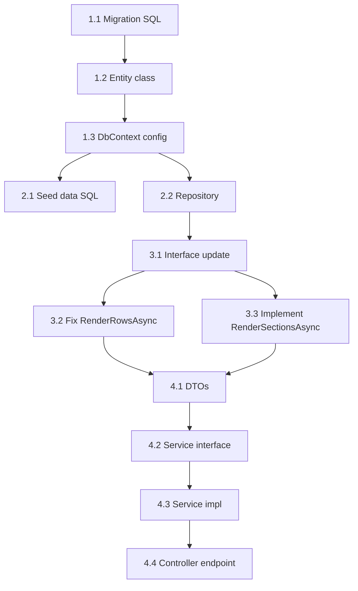

# Implementation Plan: API Sections/Rows Refactoring

> **Goal**: Tách API `GET /rows` thành 2 API (`/rows` + `/sections`), thêm `TemplateRowDefinitions` table, sửa rendering pipeline.
> **Estimated**: ~2-3 ngày dev
> **Pre-requisite**: Có thể reset DB (pre-release)

---

## Tổng Quan Thay Đổi

```
PHASE 1 — Database & Domain (nền tảng)
  └─ Migration + Entity + DbContext config

PHASE 2 — Repository & Seed Data
  └─ Repository interface/impl + seed TemplateRowDefinitions cho 6 templates

PHASE 3 — Rendering Engine (core fix)
  └─ Sửa BookRenderingService: tách RenderDataRows + RenderSections

PHASE 4 — API & DTO Layer
  └─ Thêm endpoint GET /sections, sửa GET /rows, DTOs mới
```

---

## Phase 1: Database & Domain Entity

### Task 1.1 — Migration: Tạo bảng `TemplateRowDefinitions`

> [!IMPORTANT]
> Đây là task nền tảng — tất cả task khác phụ thuộc vào bảng này.

#### [NEW] [079_create_template_row_definitions.sql](file:///d:/Semester-9/bizflow-project/BizFlow-BE-Service/database/migrations/079_create_template_row_definitions.sql)

```sql
CREATE TABLE TemplateRowDefinitions (
    RowDefId INT AUTO_INCREMENT PRIMARY KEY,
    TemplateVersionId INT NOT NULL,
    
    -- Row identity
    RowType VARCHAR(30) NOT NULL 
        COMMENT 'industry_header | data_placeholder | subtotal | tax_line | grand_total | section_header | balance_row | monthly_total | quarterly_total | profit_row',
    RowLabel VARCHAR(200) DEFAULT NULL 
        COMMENT 'Label template: "{groupIndex}. {businessTypeName}", "Tổng cộng ({groupIndex})"',
    
    -- Positioning
    Position VARCHAR(20) NOT NULL DEFAULT 'per_group'
        COMMENT 'per_group | per_section | end_of_book | start_of_book',
    SortOrder INT NOT NULL DEFAULT 0 
        COMMENT 'Thứ tự trong group/section',
    
    -- Grouping
    GroupByField VARCHAR(50) DEFAULT NULL
        COMMENT 'Field dùng để group: BusinessTypeId | Section | ProductId',
    SectionType VARCHAR(30) DEFAULT NULL
        COMMENT 'industry_group | revenue_cost | cash_bank | per_product',
    
    -- Data binding
    VisibleFieldCodes JSON DEFAULT NULL
        COMMENT 'Cột hiển thị: ["dien_giai","so_tien"]. NULL = all columns',
    FormulaId BIGINT DEFAULT NULL,
    
    -- Tax metadata
    TaxType VARCHAR(10) DEFAULT NULL COMMENT 'VAT | PIT | NULL',
    
    -- Audit
    CreatedAt DATETIME NOT NULL DEFAULT CURRENT_TIMESTAMP,
    
    CONSTRAINT fk_rowdef_version FOREIGN KEY (TemplateVersionId) 
        REFERENCES AccountingTemplateVersions(TemplateVersionId) ON DELETE CASCADE,
    CONSTRAINT fk_rowdef_formula FOREIGN KEY (FormulaId)
        REFERENCES FormulaDefinitions(FormulaId) ON DELETE SET NULL,
    INDEX idx_rowdef_version_sort (TemplateVersionId, Position, SortOrder)
) ENGINE=InnoDB DEFAULT CHARSET=utf8mb4 COLLATE=utf8mb4_unicode_ci;
```

---

### Task 1.2 — Domain Entity: `TemplateRowDefinition`

#### [NEW] [TemplateRowDefinition.cs](file:///d:/Semester-9/bizflow-project/BizFlow-BE-Service/bizflow-platform/BizFlow.Domain/Entities/TemplateRowDefinition.cs)

```csharp
namespace BizFlow.Domain.Entities;

public class TemplateRowDefinition
{
    public int RowDefId { get; set; }
    public int TemplateVersionId { get; set; }
    
    // Row identity
    public string RowType { get; set; } = null!;       // industry_header | data_placeholder | subtotal | tax_line | grand_total | ...
    public string? RowLabel { get; set; }               // "{groupIndex}. {businessTypeName}"
    
    // Positioning
    public string Position { get; set; } = "per_group"; // per_group | per_section | end_of_book | start_of_book
    public int SortOrder { get; set; }
    
    // Grouping
    public string? GroupByField { get; set; }            // BusinessTypeId | Section | ProductId
    public string? SectionType { get; set; }             // industry_group | revenue_cost | cash_bank | per_product
    
    // Data binding
    public string? VisibleFieldCodes { get; set; }       // JSON: ["dien_giai","so_tien"]
    public long? FormulaId { get; set; }
    
    // Tax metadata
    public string? TaxType { get; set; }                 // VAT | PIT | null
    
    public DateTime CreatedAt { get; set; }
    
    // Navigation
    public virtual AccountingTemplateVersion TemplateVersion { get; set; } = null!;
    public virtual FormulaDefinition? Formula { get; set; }
}
```

---

### Task 1.3 — EF Configuration: DbContext + Navigation

#### [MODIFY] `AccountingTemplateVersion.cs` — Thêm navigation property

```csharp
// Thêm vào class AccountingTemplateVersion:
public virtual ICollection<TemplateRowDefinition> RowDefinitions { get; set; } = new List<TemplateRowDefinition>();
```

#### [MODIFY] `BizFlowDbContext` (hoặc OnModelCreating) — Đăng ký entity

```csharp
modelBuilder.Entity<TemplateRowDefinition>(e =>
{
    e.ToTable("TemplateRowDefinitions");
    e.HasKey(x => x.RowDefId);
    e.HasOne(x => x.TemplateVersion)
        .WithMany(v => v.RowDefinitions)
        .HasForeignKey(x => x.TemplateVersionId);
    e.HasOne(x => x.Formula)
        .WithMany()
        .HasForeignKey(x => x.FormulaId);
});
```

---

## Phase 2: Repository & Seed Data

### Task 2.1 — Seed `TemplateRowDefinitions` cho 6 templates

#### [NEW] [080_seed_template_row_definitions.sql](file:///d:/Semester-9/bizflow-project/BizFlow-BE-Service/database/migrations/080_seed_template_row_definitions.sql)

Seed row definitions cho tất cả 6 templates. Dưới đây là outline:

```sql
-- ═══ S1a (TemplateVersionId = 1) — Sổ chi tiết bán hàng ═══
-- Không group theo ngành, chỉ có data + monthly/quarterly total
(1, 'data_placeholder', NULL,                    'per_group', 1, NULL, NULL, NULL, NULL, NULL),
(1, 'monthly_total',    'Cộng tháng {monthName}','end_of_book', 1, NULL, NULL, '["dien_giai","revenue"]', NULL, NULL),
(1, 'quarterly_total',  'Cộng quý {quarterName}','end_of_book', 2, NULL, NULL, '["dien_giai","revenue"]', NULL, NULL),

-- ═══ S2a (TemplateVersionId = 2) — Sổ doanh thu Cách 1 ═══
-- Group theo ngành: header + data + subtotal + VAT + PIT per group, grand total cuối
(2, 'industry_header',  '{groupIndex}. {businessTypeName}', 'per_group', 1, 'BusinessTypeId', 'industry_group', '["dien_giai"]', NULL, NULL),
(2, 'data_placeholder', NULL,                                'per_group', 2, 'BusinessTypeId', 'industry_group', NULL, NULL, NULL),
(2, 'subtotal',         'Tổng cộng ({groupIndex})',          'per_group', 3, 'BusinessTypeId', 'industry_group', '["dien_giai","so_tien"]', NULL, NULL),
(2, 'tax_line',         'Thuế GTGT',                         'per_group', 4, 'BusinessTypeId', 'industry_group', '["dien_giai","so_tien"]', NULL, 'VAT'),
(2, 'tax_line',         'Thuế TNCN',                         'per_group', 5, 'BusinessTypeId', 'industry_group', '["dien_giai","so_tien"]', NULL, 'PIT'),
(2, 'grand_total',      'Tổng số thuế GTGT phải nộp',       'end_of_book', 1, NULL, NULL, '["dien_giai","so_tien"]', NULL, 'VAT'),
(2, 'grand_total',      'Tổng số thuế TNCN phải nộp',       'end_of_book', 2, NULL, NULL, '["dien_giai","so_tien"]', NULL, 'PIT'),

-- ═══ S2b (TemplateVersionId = 3) — Sổ doanh thu Cách 2 ═══
-- Giống S2a nhưng không có PIT per group, không có grand_total PIT
(3, 'industry_header',  '{groupIndex}. {businessTypeName}', 'per_group', 1, 'BusinessTypeId', 'industry_group', ...),
(3, 'data_placeholder', NULL,                                'per_group', 2, 'BusinessTypeId', 'industry_group', ...),
(3, 'subtotal',         'Tổng cộng ({groupIndex})',          'per_group', 3, 'BusinessTypeId', 'industry_group', ...),
(3, 'tax_line',         'Thuế GTGT',                         'per_group', 4, 'BusinessTypeId', 'industry_group', ..., 'VAT'),
(3, 'grand_total',      'Tổng số thuế GTGT phải nộp',       'end_of_book', 1, NULL, NULL, ..., 'VAT'),

-- ═══ S2c (TemplateVersionId = 4) — Sổ chi tiết DT, CP ═══
-- 2 sections (revenue, cost) + profit + PIT cuối
(4, 'section_header',   'I. DOANH THU',                      'per_section', 1, 'Section', 'revenue_cost', ...),
(4, 'data_placeholder', NULL,                                 'per_section', 2, 'Section', 'revenue_cost', ...),
(4, 'section_subtotal', 'Tổng doanh thu',                    'per_section', 3, 'Section', 'revenue_cost', ...),
(4, 'section_header',   'II. CHI PHÍ HỢP LÝ',              'per_section', 4, 'Section', 'revenue_cost', ...),
(4, 'data_placeholder', NULL,                                 'per_section', 5, 'Section', 'revenue_cost', ...),
(4, 'section_subtotal', 'Tổng chi phí hợp lý',              'per_section', 6, 'Section', 'revenue_cost', ...),
(4, 'profit_row',       'III. CHÊNH LỆCH (DT - CP)',        'end_of_book', 1, NULL, NULL, ...),
(4, 'tax_line',         'Thuế TNCN phải nộp',               'end_of_book', 2, NULL, NULL, ..., 'PIT'),

-- ═══ S2d (TemplateVersionId = 5) — Sổ kho XNT ═══
-- Per product: opening + data + closing
(5, 'balance_row',      'Tồn đầu kỳ',                       'start_of_book', 1, 'ProductId', 'per_product', ...),
(5, 'data_placeholder', NULL,                                 'per_group',     2, 'ProductId', 'per_product', ...),
(5, 'balance_row',      'Tồn cuối kỳ',                      'end_of_book',   1, 'ProductId', 'per_product', ...),

-- ═══ S2e (TemplateVersionId = 6) — Sổ chi tiết tiền ═══
-- 2 sections (cash, bank): opening + data + closing
(6, 'section_header',   'I. TIỀN MẶT',                      'per_section', 1, 'Section', 'cash_bank', ...),
(6, 'balance_row',      'Tồn đầu kỳ',                       'per_section', 2, 'Section', 'cash_bank', ...),
(6, 'data_placeholder', NULL,                                 'per_section', 3, 'Section', 'cash_bank', ...),
(6, 'balance_row',      'Tồn cuối kỳ',                      'per_section', 4, 'Section', 'cash_bank', ...),
(6, 'section_header',   'II. TIỀN GỬI NGÂN HÀNG',           'per_section', 5, 'Section', 'cash_bank', ...),
(6, 'balance_row',      'Tồn đầu kỳ',                       'per_section', 6, 'Section', 'cash_bank', ...),
(6, 'data_placeholder', NULL,                                 'per_section', 7, 'Section', 'cash_bank', ...),
(6, 'balance_row',      'Dư cuối kỳ',                       'per_section', 8, 'Section', 'cash_bank', ...),
```

---

### Task 2.2 — Repository: Load RowDefinitions

#### [MODIFY] [IAccountingTemplateRepository.cs](file:///d:/Semester-9/bizflow-project/BizFlow-BE-Service/bizflow-platform/BizFlow.Application/Interfaces/Repositories/IAccountingTemplateRepository.cs)

Thêm method:

```csharp
Task<List<TemplateRowDefinition>> GetRowDefinitionsAsync(int templateVersionId);
```

#### [MODIFY] [AccountingTemplateRepository.cs](file:///d:/Semester-9/bizflow-project/BizFlow-BE-Service/bizflow-platform/BizFlow.Infrastructure/Repositories/AccountingTemplateRepository.cs)

Implement:

```csharp
public async Task<List<TemplateRowDefinition>> GetRowDefinitionsAsync(int templateVersionId)
{
    return await _context.Set<TemplateRowDefinition>()
        .Where(x => x.TemplateVersionId == templateVersionId)
        .OrderBy(x => x.Position)
        .ThenBy(x => x.SortOrder)
        .ToListAsync();
}
```

Cũng cần update `GetVersionWithMappingsAsync()` để Include RowDefinitions:

```csharp
.Include(x => x.RowDefinitions.OrderBy(r => r.SortOrder))
```

---

## Phase 3: Rendering Engine Refactor

> [!IMPORTANT]
> Đây là phase quan trọng nhất — core fix cho rendering pipeline.

### Task 3.1 — Interface: Thêm `RenderSectionsAsync()`

#### [MODIFY] [IBookRenderingService.cs](file:///d:/Semester-9/bizflow-project/BizFlow-BE-Service/bizflow-platform/BizFlow.Application/Interfaces/Services/IBookRenderingService.cs)

Thêm:

```csharp
/// <summary>
/// Render book sections structure with formula values (headers, subtotals, tax lines, grand totals).
/// </summary>
Task<BookSectionsRenderResult> RenderSectionsAsync(BookRenderContext context);
```

Thêm result class:

```csharp
public class BookSectionsRenderResult
{
    public List<BookColumnDto> Columns { get; set; } = new();
    public List<BookSectionDto> Sections { get; set; } = new();
    public List<Dictionary<string, object?>> FooterRows { get; set; } = new();
}

public class BookSectionDto
{
    public string SectionType { get; set; } = null!;    // industry_group | revenue_cost | cash_bank
    public string? GroupKey { get; set; }                // businessTypeId | "revenue" | "cash"
    public string? GroupName { get; set; }               // "Bán lẻ vật liệu" | "DOANH THU" | "TIỀN MẶT"
    public int GroupIndex { get; set; }
    public List<Dictionary<string, object?>> Rows { get; set; } = new();
}
```

---

### Task 3.2 — Sửa `RenderRowsAsync()`: Chỉ trả data rows

#### [MODIFY] [BookRenderingService.cs](file:///d:/Semester-9/bizflow-project/BizFlow-BE-Service/bizflow-platform/BizFlow.Infrastructure/Services/BookRendering/BookRenderingService.cs)

**Thay đổi chính (L58-75)**: Chỉ iterate `query` + `auto` mappings, bỏ `formula` + `static` ra khỏi per-row loop. Thêm `businessTypeId` vào mỗi row:

```csharp
// TRƯỚC (LỖI):
foreach (var mapping in version.FieldMappings.OrderBy(m => m.SortOrder))
{
    row[mapping.FieldCode] = mapping.SourceType switch { ... }; // INCLUDES formula
}

// SAU (FIX):
var dataMappings = version.FieldMappings
    .Where(m => m.SourceType == "query" || m.SourceType == "auto")
    .OrderBy(m => m.SortOrder)
    .ToList();

foreach (var sourceRow in sourceRows.Items)
{
    var row = new Dictionary<string, object?>();
    row["lineType"] = "data";
    
    foreach (var mapping in dataMappings)
    {
        row[mapping.FieldCode] = mapping.SourceType switch
        {
            "auto" => sttOffset + (++rowIndex),
            "query" => ExtractFieldValue(sourceRow, mapping),
            _ => null
        };
    }
    
    // Attach businessTypeId for client grouping
    row["businessTypeId"] = sourceRow.Values.GetValueOrDefault("BusinessTypeId");
    
    rows.Add(row);
}
```

---

### Task 3.3 — Implement `RenderSectionsAsync()`: Build sections structure

#### [MODIFY] [BookRenderingService.cs](file:///d:/Semester-9/bizflow-project/BizFlow-BE-Service/bizflow-platform/BizFlow.Infrastructure/Services/BookRendering/BookRenderingService.cs)

Thêm method mới — logic chính:

```
1. Load RowDefinitions cho template version
2. Load formula values (reuse EvaluateTemplateFormulasAsync)
3. Load business types / sections cần group
4. Per-group RowDefinitions:
   - Iterate RowDefinitions where Position = "per_group" / "per_section"
   - Per group (businessType / section):
     a. Resolve label placeholders ({groupIndex}, {businessTypeName})
     b. data_placeholder → emit with dataFilter
     c. subtotal → emit with computed formula value
     d. tax_line → emit with tax rate + computed amount
5. Footer RowDefinitions:
   - Iterate where Position = "end_of_book"
   - Emit grand_total rows with computed values
6. Return BookSectionsRenderResult
```

**Chi tiết quan trọng**: Cần tính subtotal **per business type** — query revenues grouped by businessTypeId, SUM amount. Tax lines = subtotal × rate from IndustryTaxRates (or override).

---

## Phase 4: API & DTO Layer

### Task 4.1 — DTOs cho `/sections` response

#### [MODIFY] [AccountingBookDtos.cs](file:///d:/Semester-9/bizflow-project/BizFlow-BE-Service/bizflow-platform/BizFlow.Application/DTOs/AccountingBook/AccountingBookDtos.cs)

Thêm:

```csharp
// ── GET /sections Response ──
public class BookSectionsResponse
{
    public long BookId { get; set; }
    public string TemplateCode { get; set; } = null!;
    public string TemplateName { get; set; } = null!;
    public List<BookColumnDto> Columns { get; set; } = new();
    public List<BookSectionResponseDto> Sections { get; set; } = new();
    public List<SectionRowDto> FooterRows { get; set; } = new();
}

public class BookSectionResponseDto
{
    public string SectionType { get; set; } = null!;
    public string? BusinessTypeId { get; set; }
    public string? BusinessTypeName { get; set; }
    public int GroupIndex { get; set; }
    public List<SectionRowDto> Rows { get; set; } = new();
}

public class SectionRowDto
{
    public string LineType { get; set; } = null!;       // industry_header | data_placeholder | subtotal | tax_line | grand_total
    public Dictionary<string, object?> Values { get; set; } = new();  // { "dien_giai": "...", "so_tien": 123 }
    public DataFilterDto? DataFilter { get; set; }      // Cho data_placeholder: { businessTypeId, section }
    public TaxMetadataDto? TaxMetadata { get; set; }    // Cho tax_line: { taxType, rate, source }
}

public class DataFilterDto
{
    public string? BusinessTypeId { get; set; }
    public string? Section { get; set; }
}

public class TaxMetadataDto
{
    public string TaxType { get; set; } = null!;
    public decimal Rate { get; set; }
    public string Source { get; set; } = "DEFAULT";     // DEFAULT | OVERRIDE
}
```

---

### Task 4.2 — Service interface: Thêm `GetBookSectionsAsync()`

#### [MODIFY] [IAccountingBookService.cs](file:///d:/Semester-9/bizflow-project/BizFlow-BE-Service/bizflow-platform/BizFlow.Application/Interfaces/Services/IAccountingBookService.cs)

```csharp
Task<BookSectionsResponse> GetBookSectionsAsync(int locationId, Guid userId, long bookId);
```

---

### Task 4.3 — Service implementation

#### [MODIFY] [AccountingBookService.cs](file:///d:/Semester-9/bizflow-project/BizFlow-BE-Service/bizflow-platform/BizFlow.Application/Services/AccountingBookService.cs)

Thêm method `GetBookSectionsAsync()`:

```csharp
public async Task<BookSectionsResponse> GetBookSectionsAsync(int locationId, Guid userId, long bookId)
{
    await _locationService.ValidateOwnerAsync(userId, locationId);

    var book = await _uow.AccountingBooks.GetByIdWithBusinessTypesAsync(bookId)
        ?? throw new NotFoundException("BOOK_NOT_FOUND");
    if (book.BusinessLocationId != locationId)
        throw new ForbiddenException("COMMON_FORBIDDEN");

    var period = await _uow.AccountingPeriods.GetByLocationAndIdAsync(locationId, book.PeriodId);
    var businessTypeIds = await GetBusinessTypeIdsForLocation(locationId);
    var renderCtx = BuildRenderContext(book, period, businessTypeIds);

    // Delegate to rendering engine
    var renderResult = await _renderingService.RenderSectionsAsync(renderCtx);
    var template = book.TemplateVersion?.Template;

    return new BookSectionsResponse
    {
        BookId = book.BookId,
        TemplateCode = template?.TemplateCode ?? "",
        TemplateName = template?.Name ?? "",
        Columns = renderResult.Columns,
        Sections = renderResult.Sections.Select(s => new BookSectionResponseDto { ... }).ToList(),
        FooterRows = renderResult.FooterRows.Select(r => new SectionRowDto { ... }).ToList()
    };
}
```

---

### Task 4.4 — Controller: Thêm endpoint `GET /sections`

#### [MODIFY] [AccountingBookController.cs](file:///d:/Semester-9/bizflow-project/BizFlow-BE-Service/bizflow-platform/BizFlow.Api/Controllers/Accounting/AccountingBookController.cs)

Thêm endpoint:

```csharp
[HttpGet("{bookId:long}/sections")]
[SwaggerOperation(Summary = "Get book sections", Description = "Get book structure with sections, formula values, and data placeholders")]
[ProducesResponseType(StatusCodes.Status200OK)]
[ProducesResponseType(StatusCodes.Status403Forbidden)]
[ProducesResponseType(StatusCodes.Status404NotFound)]
public async Task<IActionResult> GetBookSections(int locationId, long bookId)
{
    var result = await _accountingBookService.GetBookSectionsAsync(locationId, GetCurrentUserId(), bookId);
    return Ok(result, MessageKeys.DataRetrievedSuccessfully);
}
```

---

## Tổng Hợp Files

### Files MỚI (3)

| # | File | Layer | Mô tả |
|---|------|-------|-------|
| 1 | `database/migrations/079_create_template_row_definitions.sql` | DB | Tạo bảng |
| 2 | `database/migrations/080_seed_template_row_definitions.sql` | DB | Seed data 6 templates |
| 3 | `BizFlow.Domain/Entities/TemplateRowDefinition.cs` | Domain | Entity class |

### Files SỬA (8)

| # | File | Layer | Thay đổi |
|---|------|-------|----------|
| 4 | `BizFlow.Domain/Entities/AccountingTemplateVersion.cs` | Domain | Thêm navigation `RowDefinitions` |
| 5 | `BizFlow.Infrastructure/DataContext/BizFlowDbContext.cs` | Infra | Đăng ký entity config |
| 6 | `BizFlow.Application/Interfaces/Repositories/IAccountingTemplateRepository.cs` | App | Thêm `GetRowDefinitionsAsync()` |
| 7 | `BizFlow.Infrastructure/Repositories/AccountingTemplateRepository.cs` | Infra | Implement + update Include |
| 8 | `BizFlow.Application/Interfaces/Services/IBookRenderingService.cs` | App | Thêm `RenderSectionsAsync()` + DTOs |
| 9 | `BizFlow.Infrastructure/Services/BookRendering/BookRenderingService.cs` | Infra | **Core fix** — sửa RenderRows + thêm RenderSections |
| 10 | `BizFlow.Application/DTOs/AccountingBook/AccountingBookDtos.cs` | App | Thêm sections DTOs |
| 11 | `BizFlow.Application/Interfaces/Services/IAccountingBookService.cs` | App | Thêm `GetBookSectionsAsync()` |
| 12 | `BizFlow.Application/Services/AccountingBookService.cs` | App | Implement GetBookSectionsAsync |
| 13 | `BizFlow.Api/Controllers/Accounting/AccountingBookController.cs` | API | Thêm `GET /sections` endpoint |

### Files KHÔNG đổi

- Migration 059-062 (seed data đúng)
- `IFormulaEngine` / `FormulaEngine` (formula eval không đổi)
- `IUnitOfWork` (không cần thêm repo mới — dùng lại `IAccountingTemplateRepository`)
- `AdminAccountingController` / `AdminAccountingService`

---

## Task Dependencies



---

## Verification Plan

### Build
```bash
cd bizflow-platform
dotnet build
```

### Automated Tests
- Unit test `BookRenderingService.RenderRowsAsync()` — verify NO formula fields in output rows
- Unit test `BookRenderingService.RenderSectionsAsync()` — verify sections structure for S2a
- Integration test: call GET /sections → verify S2a sections have industry_header + data_placeholder + subtotal + tax_line + grand_total

### Manual Verification
1. DB: Run migrations 079 + 080, verify table + data created
2. API: Call `GET /books/{id}/sections` → verify JSON structure matches spec
3. API: Call `GET /books/{id}/rows` → verify NO `thue_gtgt`/`thue_tncn` in data rows
4. API: Verify `businessTypeId` present on each data row

---

## Open Questions

> [!NOTE]
> Không có câu hỏi mở — tất cả decisions đã được chốt trong discussion phase.

Các quyết định đã chốt:
- ✅ 1 book chứa tất cả ngành → group trong rendering
- ✅ Tách 2 API: `/rows` (data) + `/sections` (structure)
- ✅ Dùng `lineType` align revenue-centric plan
- ✅ `TemplateRowDefinitions` data-driven cho multi-template support
