    # Report & Accounting — Diagrams

> **Companion doc** cho [report-accounting-flow.md](report-accounting-flow.md) (index).
> State machines, activity diagrams, và sequence diagrams cho module Report & Accounting.
>
> **Sub-docs**: [cost-gl-flow](cost-gl-flow.md) · [accounting-period-flow](accounting-period-flow.md) · [rule-engine-flow](rule-engine-flow.md) · [accounting-book-flow](accounting-book-flow.md) · [dashboard-report-flow](dashboard-report-flow.md)

---

## Mục lục

1. [State Machine Diagrams](#1-state-machine-diagrams)
   - [1.1 Accounting Period Lifecycle](#11-accounting-period-lifecycle)
   - [1.2 Accounting Book Lifecycle](#12-accounting-book-lifecycle)
   - [1.3 Cost Lifecycle](#13-cost-lifecycle)
   - [1.4 Tax Ruleset Lifecycle](#14-tax-ruleset-lifecycle)
2. [Activity Diagrams](#2-activity-diagrams)
   - [2.1 GL Entry Generation (Order Completed)](#21-gl-entry-generation-order-completed)
   - [2.2 Group Evaluation & Book Creation](#22-group-evaluation--book-creation)
   - [2.3 Book Export](#23-book-export)
   - [2.4 Cost Auto-Generation (Import Confirmed)](#24-cost-auto-generation-import-confirmed)
   - [2.5 Period Finalize](#25-period-finalize)
3. [Sequence Diagrams](#3-sequence-diagrams)
   - [3.1 Order Completed → GL + Side Effects](#31-order-completed--gl--side-effects)
   - [3.2 Owner Views Group Suggestion → Creates Book](#32-owner-views-group-suggestion--creates-book)
   - [3.3 Owner Exports Accounting Book](#33-owner-exports-accounting-book)
   - [3.4 Import Confirmed → Cost + GL](#34-import-confirmed--cost--gl)
   - [3.5 Order Cancelled → GL Reversal](#35-order-cancelled--gl-reversal)
   - [3.6 Debt Payment → GL Entry](#36-debt-payment--gl-entry)
   - [3.7 Period Reopen Flow](#37-period-reopen-flow)

---

## 1. State Machine Diagrams

### 1.1 Accounting Period Lifecycle

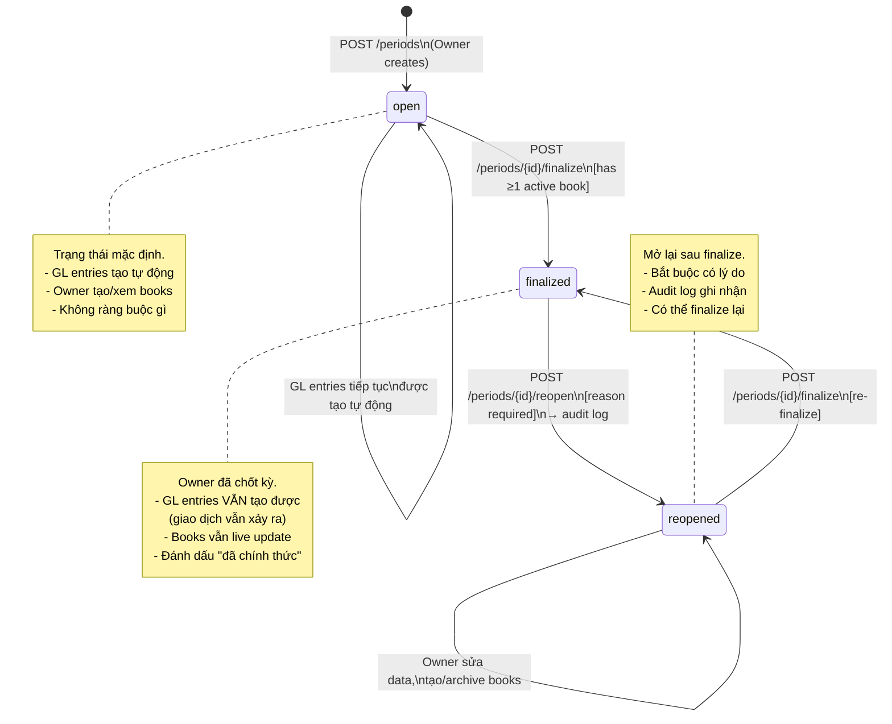

**Transition rules:**

| From | To | Guard | Side Effect |
|------|----|-------|-------------|
| `[*]` | `open` | — | Audit log: `period_created` |
| `open` | `finalized` | `books.count(active) >= 1` | Set `FinalizedAt`, `FinalizedByUserId`. Audit log: `period_finalized` |
| `finalized` | `reopened` | `reason != null` | Audit log: `period_reopened` (OldValue, NewValue, Reason) |
| `reopened` | `finalized` | `books.count(active) >= 1` | Update `FinalizedAt`. Audit log: `period_finalized` |

---

### 1.2 Accounting Book Lifecycle

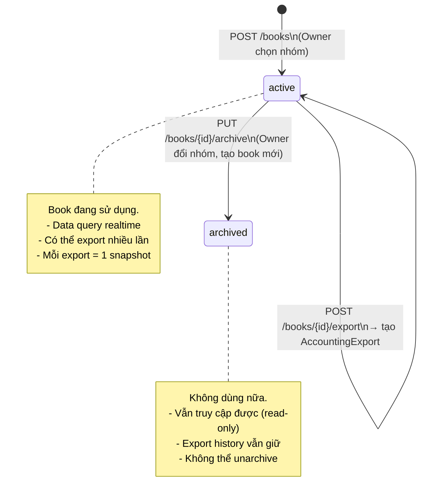

**Lưu ý**:
- Không có trạng thái `deleted` — books chỉ archive, không xóa
- Owner có thể tạo nhiều books cho cùng 1 period (so sánh nhóm khác nhau)
- Export không thay đổi trạng thái book — book vẫn `active` sau export

---

### 1.3 Cost Lifecycle

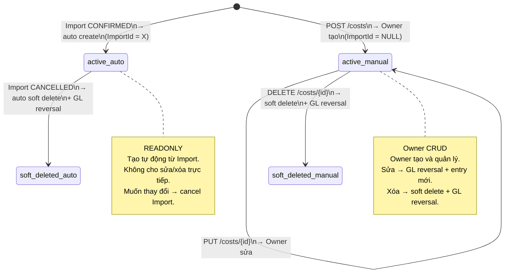

**Cost type rules:**

| ImportId | Editable? | Deletable? | How to modify? |
|:--------:|:---------:|:----------:|----------------|
| NOT NULL | ❌ | ❌ | Cancel Import gốc → auto soft delete + reversal |
| NULL | ✅ Owner | ✅ Owner | PUT/DELETE trực tiếp |

---

### 1.4 Tax Ruleset Lifecycle

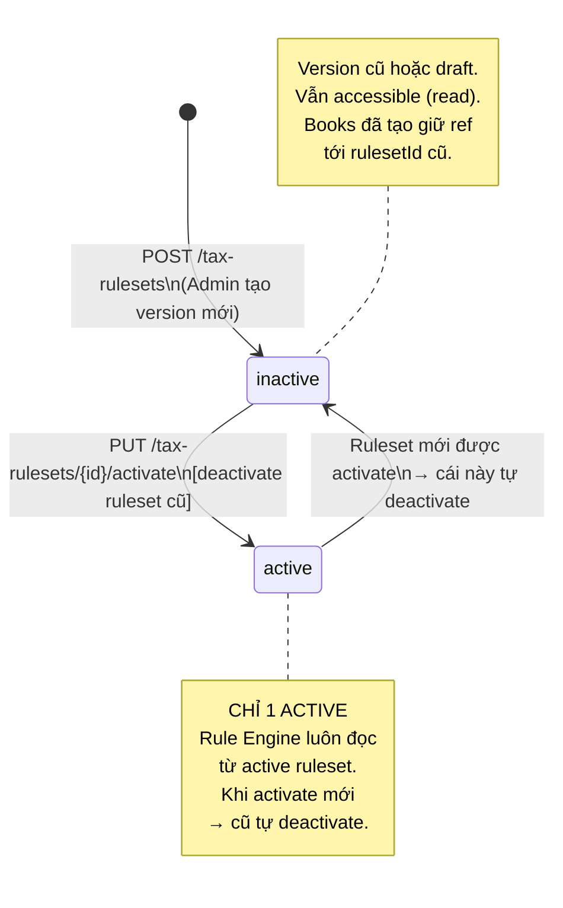

---

## 2. Activity Diagrams

### 2.1 GL Entry Generation (Order Completed)

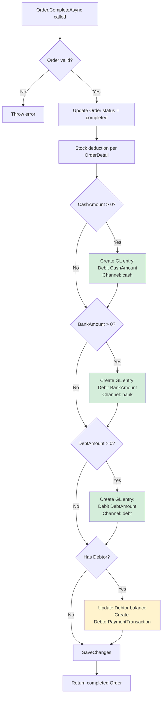

### 2.2 Group Evaluation & Book Creation

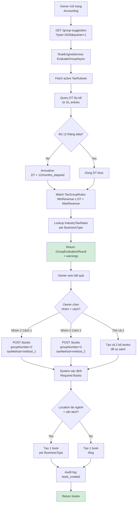

### 2.3 Book Export

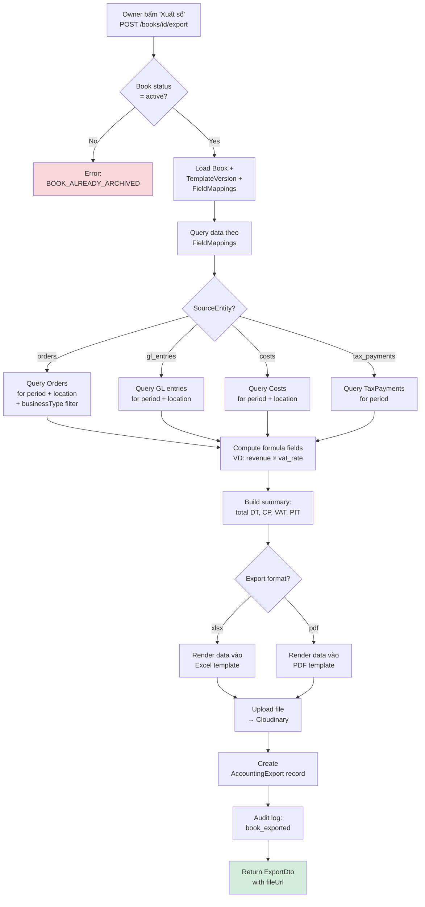

### 2.4 Cost Auto-Generation (Import Confirmed)

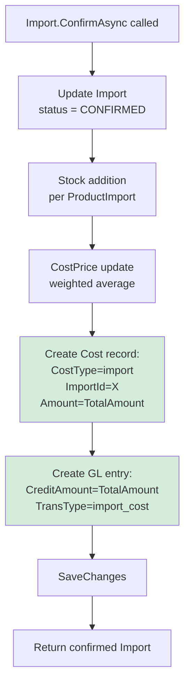

**Ngược lại — Import Cancelled:**

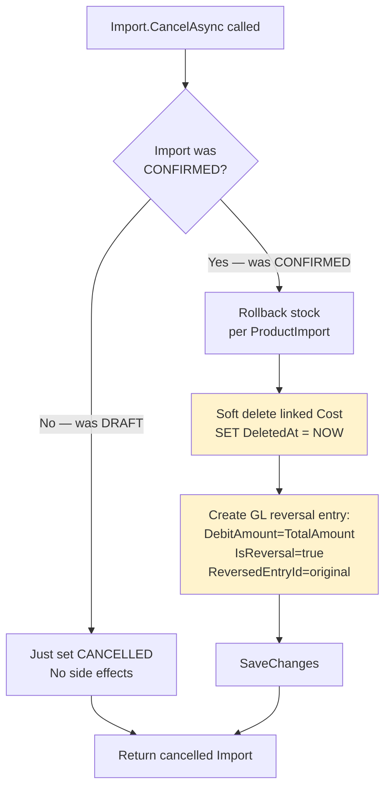

### 2.5 Period Finalize

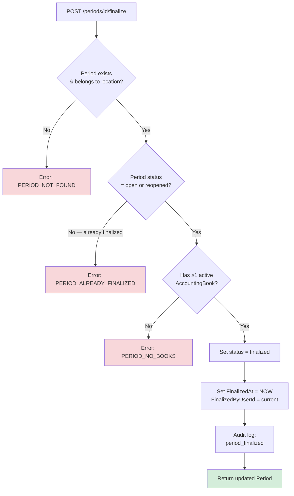

---

## 3. Sequence Diagrams

### 3.1 Order Completed → GL + Side Effects

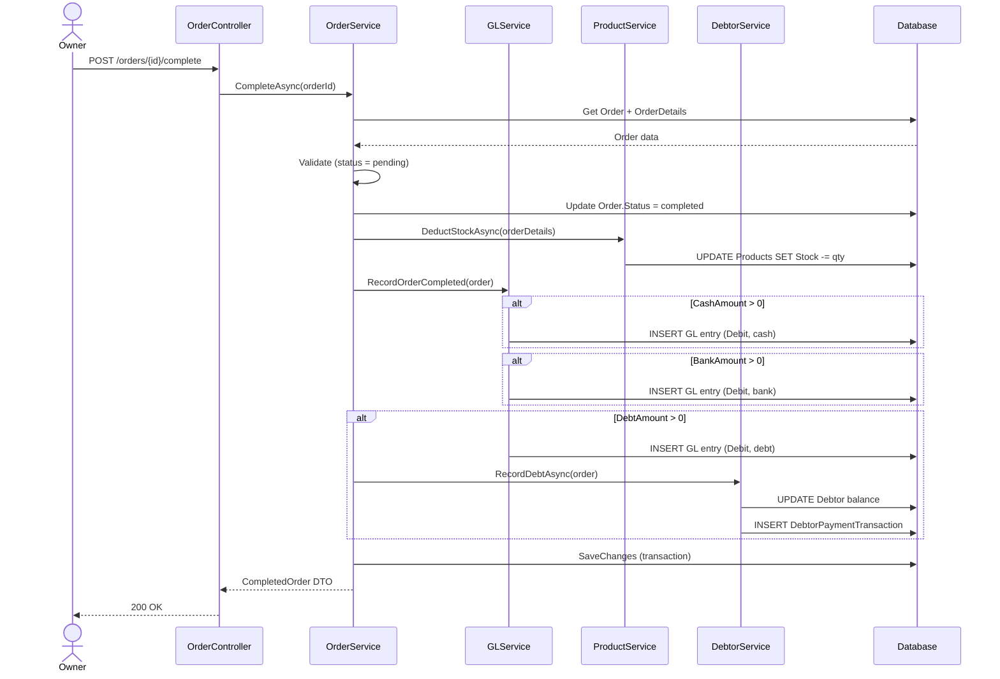

### 3.2 Owner Views Group Suggestion → Creates Book

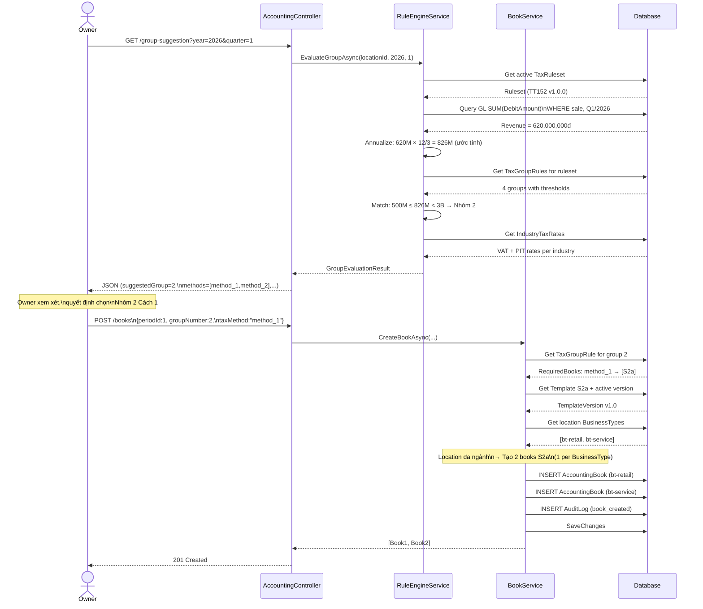

### 3.3 Owner Exports Accounting Book

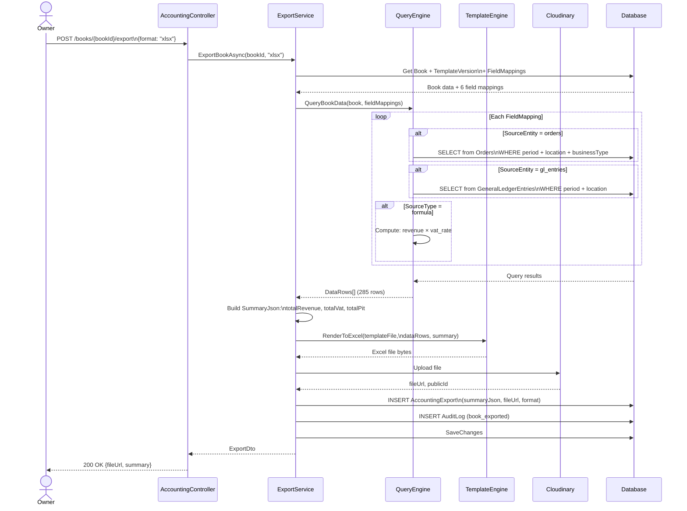

### 3.4 Import Confirmed → Cost + GL

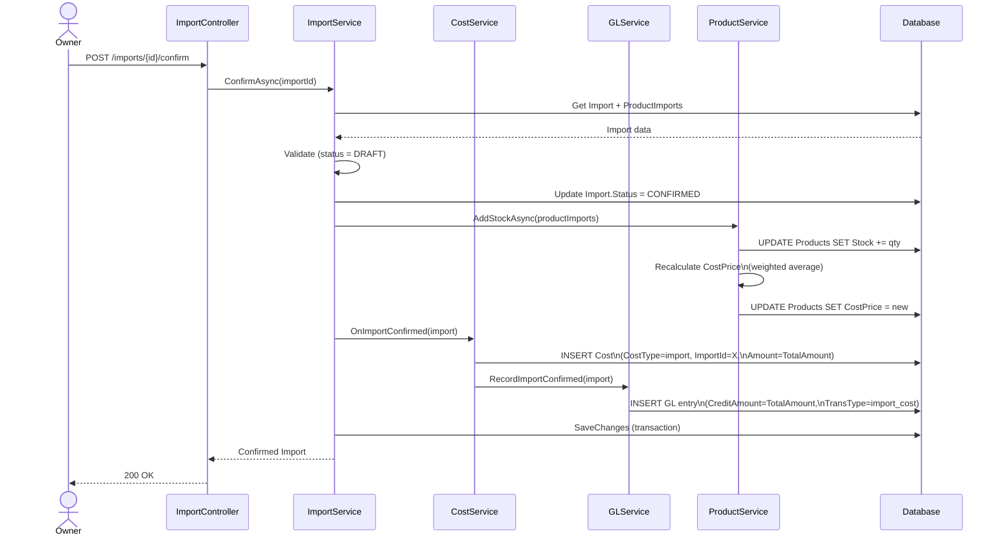

### 3.5 Order Cancelled → GL Reversal

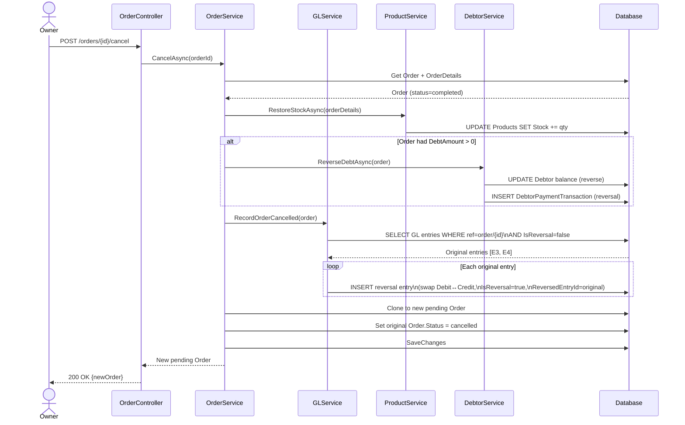

### 3.6 Debt Payment → GL Entry

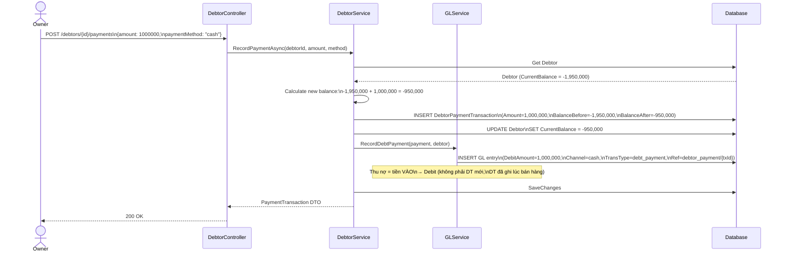

### 3.7 Period Reopen Flow

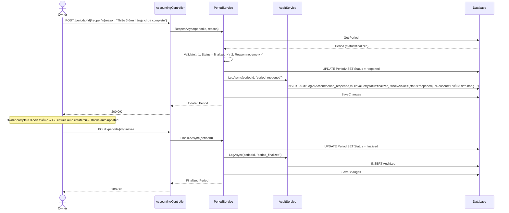

---

## Appendix: Diagram Summary

| Diagram | Type | Mô tả | Section |
|---------|------|-------|---------|
| Accounting Period | State Machine | open → finalized → reopened | [1.1](#11-accounting-period-lifecycle) |
| Accounting Book | State Machine | active → archived | [1.2](#12-accounting-book-lifecycle) |
| Cost | State Machine | auto vs manual lifecycle | [1.3](#13-cost-lifecycle) |
| Tax Ruleset | State Machine | inactive ↔ active (chỉ 1) | [1.4](#14-tax-ruleset-lifecycle) |
| GL Generation (Order) | Activity | Order complete → split GL entries | [2.1](#21-gl-entry-generation-order-completed) |
| Group Eval + Book | Activity | Rule Engine → Owner chọn → tạo books | [2.2](#22-group-evaluation--book-creation) |
| Export Book | Activity | Query data → render → upload → snapshot | [2.3](#23-book-export) |
| Cost Auto-Gen | Activity | Import confirmed → Cost + GL | [2.4](#24-cost-auto-generation-import-confirmed) |
| Period Finalize | Activity | Validate → finalize → audit | [2.5](#25-period-finalize) |
| Order → GL | Sequence | Full side effects on complete | [3.1](#31-order-completed--gl--side-effects) |
| Group → Books | Sequence | Evaluation → suggestion → create books | [3.2](#32-owner-views-group-suggestion--creates-book) |
| Export | Sequence | Query → render → Cloudinary → snapshot | [3.3](#33-owner-exports-accounting-book) |
| Import → Cost + GL | Sequence | Confirm → stock + cost + GL | [3.4](#34-import-confirmed--cost--gl) |
| Order Cancel → Reversal | Sequence | Cancel → reverse stock, debt, GL | [3.5](#35-order-cancelled--gl-reversal) |
| Debt Payment → GL | Sequence | Pay debt → update balance → GL | [3.6](#36-debt-payment--gl-entry) |
| Period Reopen | Sequence | Reopen → fix → re-finalize | [3.7](#37-period-reopen-flow) |
