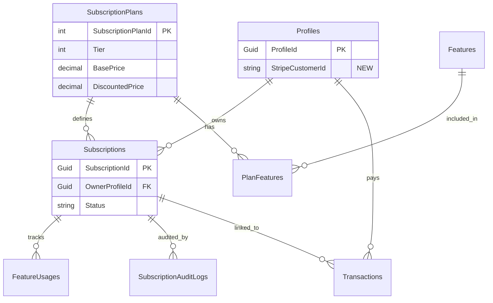
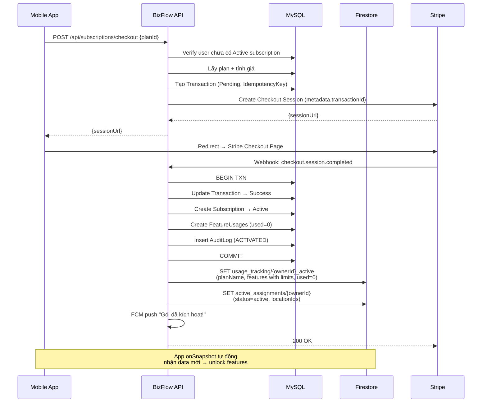
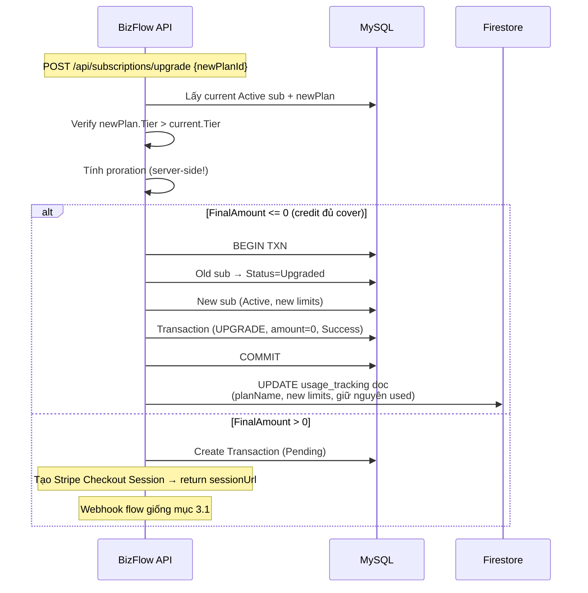
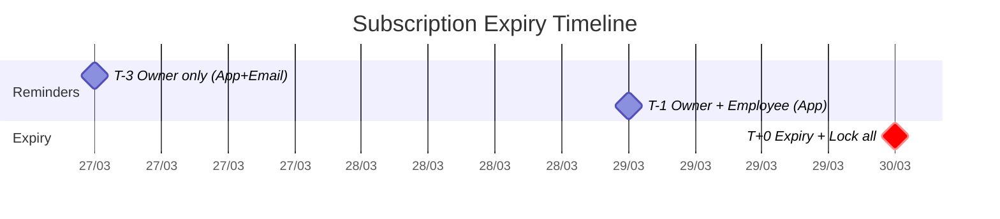
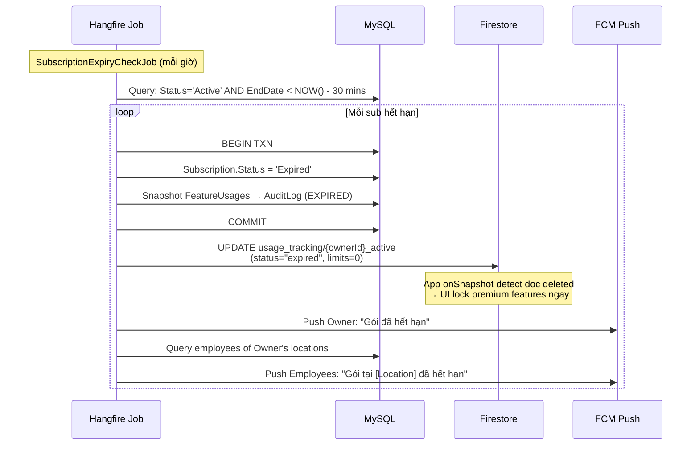
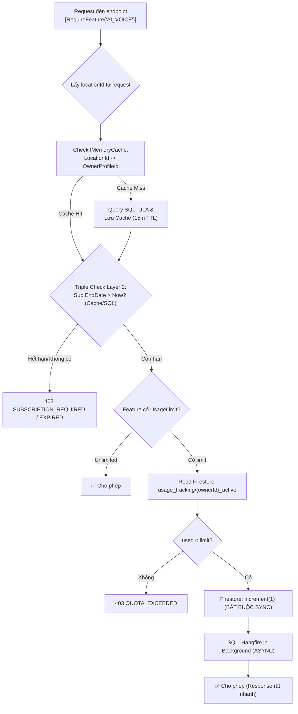
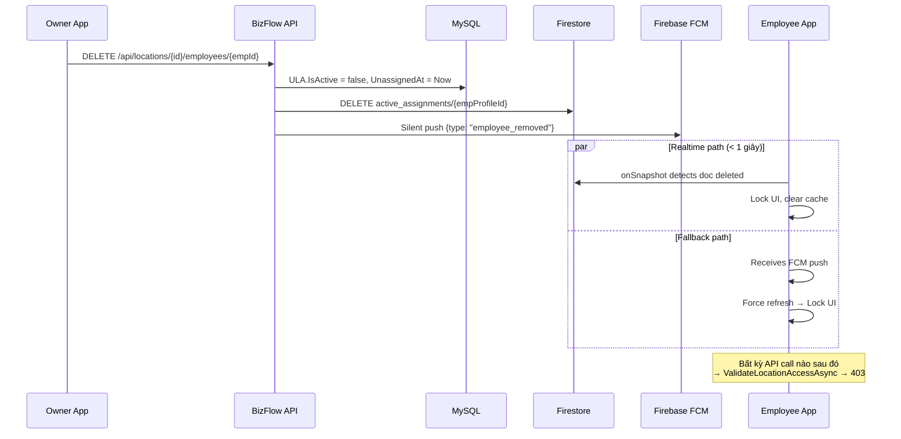
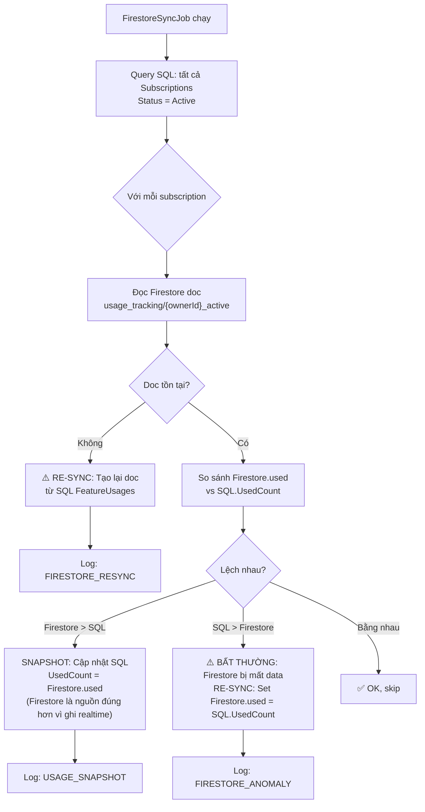

# Technical Specification: BizFlow Subscription & Payment System

> **Phiên bản**: 4.3 — Final Polish (Cache Invalidation & Mobile UX)
> **Ngày cập nhật**: 2026-03-23

---

## 1. Tổng quan Kiến trúc

```
┌─────────────┐     ┌──────────────────┐     ┌───────────────┐
│  Mobile App  │────▶│  BizFlow Backend │◀───▶│  MySQL (SQL)  │
│  (Flutter)   │     │  (.NET 8 API)    │     │  Source of    │
└──────┬──────┘     └────────┬─────────┘     │  Truth        │
       │ onSnapshot          │               └───────────────┘
       │ (realtime)          │
┌──────▼──────┐     ┌───────▼────────┐
│  Firestore  │◀────│  Backend Sync  │
│  Hot-store  │     │  (Write-only)  │
└─────────────┘     └───────┬────────┘
                            │
                    ┌───────▼────────┐     ┌──────────────┐
                    │  Stripe        │     │  Firebase    │
                    │  Checkout      │     │  FCM Push    │
                    └────────────────┘     │  (Existing)  │
                                           └──────────────┘
```

### Nguyên tắc thiết kế

| Thành phần | Vai trò | Dữ liệu |
|---|---|---|
| **MySQL** | Source of Truth | Cấu hình gói, subscription, giao dịch, audit log |
| **Firestore** | Real-time Hot-store | Quota usage (read/write nhanh), entitlement status (kill-switch) |
| **Stripe Checkout** | Payment Engine | One-off payment. Client chỉ nhận `sessionUrl` → redirect |
| **Stripe Webhook** | State Machine | `checkout.session.completed` → cập nhật SQL → sync Firestore |
| **Firebase FCM** | Push Notification | Tận dụng `FirebaseNotificationService` đã có |
| **Hangfire** | Background Jobs | Expiry check, usage snapshot SQL ↔ Firestore, nhắc nhở |

### Tại sao Hybrid?

| Tiêu chí | SQL-only | SQL + Firestore |
|---|---|---|
| Quota check latency | ~50-100ms (DB query) | **~5-10ms** (Firestore doc read) |
| Real-time UI update | Polling mỗi X giây | **onSnapshot** — cập nhật tức thì |
| Kill-switch speed | Chờ API call tiếp theo bị 403 | **< 1 giây** — listener detect doc deleted |
| Chi phí | $0 | **$0** (Free tier: 50K reads/20K writes/ngày) |
| Complexity | Đơn giản | Trung bình (thêm sync logic) |

> [!IMPORTANT]
> **Quy tắc vàng**: SQL là nguồn sự thật duy nhất. Firestore là **cache thời gian thực** được Backend đồng bộ. App **CHỈ ĐỌC** từ Firestore. Mọi lệnh **WRITE** vào Firestore phải thông qua Backend.

---

## 1.1 Chính sách Kinh doanh cốt lõi (Business Rules)

> [!CAUTION]
> **No-Refund Policy (Không hoàn tiền)**: Hệ thống KHÔNG cung cấp chức năng người dùng tự hủy gói và hoàn tiền. Giao dịch `Refunded` chỉ dùng cho Exception (Admin xử lý thủ công qua Stripe Dashboard khi có sự cố hệ thống).

> **Upgrade Policy (Chỉ nâng cấp lên Tier cao hơn)**: Để tránh phức tạp hóa dòng tiền và dư thừa data, hệ thống CHỈ cho phép user mua gói mới có `Tier > Tier hiện tại`. Số tiền gói cũ chưa dùng hết sẽ được khấu trừ (Proration) vào gói mới. Gói mới có hiệu lực **ngay lập tức** và bắt đầu chu kỳ 30 ngày mới.

---

## 2. Thiết kế Cơ sở dữ liệu

### 2.1 Entities hiện tại (KHÔNG đổi)

| Entity | Trường quan trọng | Ghi chú |
|---|---|---|
| `Accounts` | `AccountId (Guid PK)`, `RoleId (Guid FK)` | Auth identity |
| `Profiles` | `ProfileId (Guid PK)`, `AccountId (Guid FK)` | **userId trong nghiệp vụ** |
| `Roles` | `RoleId (Guid PK)`, `Name` | `user`, `admin` |
| `BusinessLocations` | `BusinessLocationId (int PK)` | Chi nhánh |
| `UserLocationAssignments` | `UserId (Guid → ProfileId)`, `IsOwner`, `IsActive` | Quyền sở hữu |
| `DeviceTokens` | `ProfileId`, `Token (FCM)` | Push targets |

### 2.2 Bảng SQL mới (Migration)

> [!WARNING]
> **Quy ước**: PK là `{TableName}Id`. DateTime dùng UTC. Soft delete bằng `DeletedAt`.  
> ID type: `SubscriptionPlanId`, `FeatureId` → `int` auto-increment. `SubscriptionId`, `TransactionId` → `Guid`.

```sql
-- ============================================================
-- 1. FEATURES
-- ============================================================
CREATE TABLE Features (
    FeatureId       INT             AUTO_INCREMENT PRIMARY KEY,
    FeatureCode     VARCHAR(50)     NOT NULL UNIQUE,   -- 'AI_VOICE', 'REPORT_EXPORT', 'LOCATION_LIMIT'
    Name            NVARCHAR(200)   NOT NULL,
    Description     NVARCHAR(500)   NULL,
    CreatedAt       DATETIME        NOT NULL DEFAULT (UTC_TIMESTAMP()),
    UpdatedAt       DATETIME        NOT NULL DEFAULT (UTC_TIMESTAMP())
);

-- ============================================================
-- 2. SUBSCRIPTION PLANS
-- ============================================================
CREATE TABLE SubscriptionPlans (
    SubscriptionPlanId  INT             AUTO_INCREMENT PRIMARY KEY,
    Name                VARCHAR(100)    NOT NULL,           -- 'Free', 'Basic', 'Pro'
    Tier                INT             NOT NULL DEFAULT 0, -- So sánh upgrade/downgrade
    BasePrice           DECIMAL(15,2)   NOT NULL DEFAULT 0, -- VND
    DiscountedPrice     DECIMAL(15,2)   NULL,               -- NULL = không giảm giá
    DurationDays        INT             NOT NULL DEFAULT 30,
    StripePriceId       VARCHAR(255)    NULL UNIQUE,
    IsActive            TINYINT(1)      NOT NULL DEFAULT 1,
    CreatedAt           DATETIME        NOT NULL DEFAULT (UTC_TIMESTAMP()),
    UpdatedAt           DATETIME        NOT NULL DEFAULT (UTC_TIMESTAMP()),
    DeletedAt           DATETIME        NULL
);

-- ============================================================
-- 3. PLAN FEATURES (Ma trận tính năng × gói)
-- ============================================================
CREATE TABLE PlanFeatures (
    PlanFeatureId       INT     AUTO_INCREMENT PRIMARY KEY,
    SubscriptionPlanId  INT     NOT NULL,
    FeatureId           INT     NOT NULL,
    UsageLimit          INT     NOT NULL DEFAULT -1,  -- -1=Unlimited, 0=Không có, >0=Limit/tháng
    FOREIGN KEY (SubscriptionPlanId) REFERENCES SubscriptionPlans(SubscriptionPlanId),
    FOREIGN KEY (FeatureId)          REFERENCES Features(FeatureId),
    UNIQUE (SubscriptionPlanId, FeatureId)
);

-- ============================================================
-- 4. SUBSCRIPTIONS
-- ============================================================
CREATE TABLE Subscriptions (
    SubscriptionId      CHAR(36)        PRIMARY KEY,
    OwnerProfileId      CHAR(36)        NOT NULL,
    SubscriptionPlanId  INT             NOT NULL,
    StripeSessionId     VARCHAR(255)    NULL,
    StartDate           DATETIME        NOT NULL,
    EndDate             DATETIME        NOT NULL,
    LastAmountPaid      DECIMAL(15,2)   NOT NULL DEFAULT 0,
    Status              VARCHAR(20)     NOT NULL DEFAULT 'Pending',
    -- Status: Pending | Active | Expired | Upgraded | Cancelled
    IsAutoRenew         TINYINT(1)      NOT NULL DEFAULT 0,
    LastReminderSentAt  DATETIME        NULL,   -- Chống gửi nhắc nhở trùng lặp trong cùng 1 ngày
    CreatedAt           DATETIME        NOT NULL DEFAULT (UTC_TIMESTAMP()),
    UpdatedAt           DATETIME        NOT NULL DEFAULT (UTC_TIMESTAMP()),
    FOREIGN KEY (OwnerProfileId)     REFERENCES Profiles(ProfileId),
    FOREIGN KEY (SubscriptionPlanId) REFERENCES SubscriptionPlans(SubscriptionPlanId)
);
CREATE INDEX IX_Sub_Owner_Status ON Subscriptions (OwnerProfileId, Status);
CREATE INDEX IX_Sub_EndDate_Status ON Subscriptions (EndDate, Status); -- Cho reminder/expiry jobs
-- [Tối ưu v4.2] Thêm index cho ULA để tối ưu khi query nếu bị miss cache
-- CREATE INDEX IX_ULA_Location_Owner ON UserLocationAssignments (BusinessLocationId, IsOwner, IsActive);

-- ============================================================
-- 5. TRANSACTIONS (KHÔNG BAO GIỜ XÓA)
-- ============================================================
CREATE TABLE Transactions (
    TransactionId           CHAR(36)        PRIMARY KEY,
    ProfileId               CHAR(36)        NOT NULL,
    SubscriptionPlanId      INT             NOT NULL,
    SubscriptionId          CHAR(36)        NULL,
    StripeCheckoutSessionId VARCHAR(255)    NULL,
    StripePaymentIntentId   VARCHAR(255)    NULL,
    IdempotencyKey          VARCHAR(100)    NOT NULL UNIQUE,
    TransactionType         VARCHAR(20)     NOT NULL, -- PURCHASE | RENEW | UPGRADE
    PlanPrice               DECIMAL(15,2)   NOT NULL,
    ProrationCredit         DECIMAL(15,2)   NOT NULL DEFAULT 0,
    FinalAmount             DECIMAL(15,2)   NOT NULL,
    Currency                VARCHAR(3)      NOT NULL DEFAULT 'VND',
    Status                  VARCHAR(20)     NOT NULL DEFAULT 'Pending',
    -- Status: Pending | Success | Failed | Refunded
    PaidAt                  DATETIME        NULL,
    CreatedAt               DATETIME        NOT NULL DEFAULT (UTC_TIMESTAMP()),
    UpdatedAt               DATETIME        NOT NULL DEFAULT (UTC_TIMESTAMP()),
    FOREIGN KEY (ProfileId)          REFERENCES Profiles(ProfileId),
    FOREIGN KEY (SubscriptionPlanId) REFERENCES SubscriptionPlans(SubscriptionPlanId),
    FOREIGN KEY (SubscriptionId)     REFERENCES Subscriptions(SubscriptionId)
);

-- ============================================================
-- 6. FEATURE USAGES (SQL source of truth cho quota)
-- ============================================================
CREATE TABLE FeatureUsages (
    FeatureUsageId      INT         AUTO_INCREMENT PRIMARY KEY,
    SubscriptionId      CHAR(36)    NOT NULL,
    FeatureId           INT         NOT NULL,
    UsedCount           INT         NOT NULL DEFAULT 0,
    PeriodStart         DATETIME    NOT NULL,
    PeriodEnd           DATETIME    NOT NULL,
    UpdatedAt           DATETIME    NOT NULL DEFAULT (UTC_TIMESTAMP()),
    FOREIGN KEY (SubscriptionId) REFERENCES Subscriptions(SubscriptionId),
    FOREIGN KEY (FeatureId)      REFERENCES Features(FeatureId),
    UNIQUE (SubscriptionId, FeatureId)
);

-- ============================================================
-- 7. SUBSCRIPTION AUDIT LOGS
-- ============================================================
CREATE TABLE SubscriptionAuditLogs (
    AuditLogId      INT         AUTO_INCREMENT PRIMARY KEY,
    SubscriptionId  CHAR(36)    NOT NULL,
    Action          VARCHAR(50) NOT NULL,  -- ACTIVATED, EXPIRED, UPGRADED, USAGE_SNAPSHOT
    Details         JSON        NULL,
    PerformedBy     CHAR(36)    NULL,
    CreatedAt       DATETIME    NOT NULL DEFAULT (UTC_TIMESTAMP()),
    FOREIGN KEY (SubscriptionId) REFERENCES Subscriptions(SubscriptionId)
);
```

> [!NOTE]
> **Thêm cột vào `Profiles`:**
> ```sql
> ALTER TABLE Profiles ADD COLUMN StripeCustomerId VARCHAR(255) NULL AFTER AccountId;
> ```

### 2.3 Firestore Collections

> [!IMPORTANT]
> **Nguyên tắc**: Firestore chỉ có 2 collections. Truy cập bằng Document ID trực tiếp (1 read/operation). Backend là nguồn ghi duy nhất.

#### Collection 1: `usage_tracking`

**Document ID**: `{ownerProfileId}_active` (ví dụ: `a1b2c3d4_active`)

> [!TIP]
> **Tối ưu v4.2**: Dùng ID `_active` thay vì `_YYYYMM` giúp App client chỉ cần lắng nghe 1 document duy nhất, tránh lỗi sai lệch hiển thị nếu đồng hồ điện thoại bị sai giờ (Clock drift). Backend tự động xoay vòng/cập nhật số liệu mỗi khi sang tháng mới hoặc upgrade.

```json
// Firestore: usage_tracking/a1b2c3d4-xxxx_active
{
  "ownerProfileId": "a1b2c3d4-xxxx",
  "planName": "Pro",
  "planTier": 2,
  "subscriptionId": "xxxx-yyyy",
  "startDate": "2026-03-01T00:00:00Z",
  "endDate": "2026-03-31T00:00:00Z",
  "features": {
    "AI_VOICE":      { "used": 42,  "limit": 100 },
    "REPORT_EXPORT": { "used": 5,   "limit": -1  },
    "LOCATION_LIMIT":{ "used": 3,   "limit": 5   }
  },
  "updatedAt": "2026-03-23T07:30:00Z"
}
```

**Khi nào Backend ghi?**
| Sự kiện | Hành động |
|---|---|
| Subscription activated | Tạo doc mới, `status: 'active'`, `features.*.used = 0` |
| Feature consumed | `FieldValue.increment(1)` trên `features.{code}.used` |
| Subscription upgraded | Cập nhật `planName`, `limit` mới, giữ nguyên `used` |
| Subscription expired | Cập nhật **`status: 'expired'`**, `features.*.limit = 0` |

> [!TIP]
> **[Tối ưu v4.2] Không xóa Document khi hết hạn**: Hết hạn thì chỉ đổi `status` thành `expired`. Điều này giúp Mobile App phân biệt được việc "Gói đã hết hạn thật sự" so với "Lỗi do mất mạng / Server dọn dẹp chưa xong".

**App đọc thế nào?**
```dart
// Flutter: Lắng nghe quota real-time (Layer 3: Bất chấp delay job, UI tự lock)
final docRef = FirebaseFirestore.instance
    .collection('usage_tracking')
    .doc('${ownerProfileId}_active');

docRef.snapshots().listen((snapshot) {
  if (!snapshot.exists) {
    return;
  }
  
  final data = snapshot.data()!;
  
  // [Tối ưu v4.2] Mobile UX: Phân biệt "Hết hạn thật" vs "Mất kết nối"
  if (data['status'] == 'expired') {
      setState(() => _isSubscriptionExpired = true);
      return;
  }

  final endDate = DateTime.parse(data['endDate']);
  
  // Triple Check - Layer 3: Safety net phòng hờ Job backend bị delay
  if (DateTime.now().isAfter(endDate)) {
      setState(() => _isSubscriptionExpired = true);
      return;
  }

  final features = data['features'] as Map;
  // Cập nhật UI: hiện quota remaining cho từng feature
});
```

#### Collection 2: `active_assignments`

**Document ID**: `{profileId}` (của employee)

```json
// Firestore: active_assignments/e5f6g7h8-xxxx
{
  "profileId": "e5f6g7h8-xxxx",
  "ownerProfileId": "a1b2c3d4-xxxx",
  "locationIds": [1, 3, 7],
  "status": "active",
  "updatedAt": "2026-03-20T10:00:00Z"
}
```

**Mục đích**: Kill-switch. Khi nhân viên bị xóa → Backend xóa doc này → App listener detect ngay → lock UI.

### 2.4 Entity Relationship Diagram



---

## 3. Luồng Nghiệp vụ Chi tiết

### 3.1 Luồng Mua gói mới (First Purchase)



> [!CAUTION]
> **Subscription chỉ tạo khi nhận Webhook**, không tạo khi client gọi checkout. Firestore doc cũng chỉ được tạo sau khi SQL transaction COMMIT thành công.

### 3.2 Luồng Nâng cấp (Upgrade with Proration)

**Chỉ cho phép nâng lên tier cao hơn.** Không hỗ trợ downgrade.

```
Proration Credit = (LastAmountPaid / DurationDays) × RemainingDays
FinalAmount      = NewPlan.EffectivePrice - Credit
EffectivePrice   = DiscountedPrice ?? BasePrice
```



### 3.3 Gia hạn & Hệ thống Nhắc nhở (Renewal & Notification Engine)

Mặc định `IsAutoRenew = false`. Owner **phải chủ động** gia hạn qua `POST /api/subscriptions/renew`. Flow giống Purchase (mục 3.1), chỉ khác `TransactionType = 'RENEW'`.

#### Chiến lược "Proactive over Reactive"

Hệ thống dùng lộ trình **leo thang** nhắc nhở để đảm bảo Owner hành động kịp thời, đồng thời thông báo cho Employee để tạo áp lực xã hội. Mặc dù `EndDate` là cột mốc khóa dịch vụ, Backend sẽ có một **"Thời gian ân hạn ngầm" (Grace Period)** khoảng 30 phút để bù trễ do lệch múi giờ hoặc network delay của Stripe Webhook.

#### Phân vai thông báo (Target Audience)

| Đối tượng | Nhận gì | Không nhận gì | Lý do |
|---|---|---|---|
| **Owner** | Tên gói, giá tiền, link Stripe Checkout, ngày hết hạn | Khuyến nghị dùng Push Notification thay vì Email (phù hợp Đồ án) | Người quyết định & trả tiền |
| **Employee** | Tên location, tính năng sắp bị khóa, lời nhắn "hãy nhắc chủ hộ" | **Giá tiền** (thông tin nhạy cảm) | Người dùng trực tiếp, tạo áp lực xã hội |

> [!TIP]
> **Insight Đồ án (Tại sao notify Employee?)**: Trong mô hình HKD Việt Nam, chủ hộ bận rộn và hay phớt lờ thông báo. Nhân viên là người cần tính năng để làm việc, nên họ sẽ là người "hối thúc" chủ nạp tiền hiệu quả nhất. Đây là điểm nhấn tính tế ứng dụng thực tế để trình bày cho hội đồng. Kênh Push Notification qua Mobile App là quá đủ và thực tế, không cần phức tạp hóa việc tích hợp Email SMTP/SendGrid cho Đồ án.

#### Lộ trình Leo thang (Escalation Timeline)



| Thời điểm | Đối tượng | Kênh | Nội dung |
|---|---|---|---|
| **T-3 ngày** | Chỉ Owner | App Push | *"Gói Pro sẽ hết hạn sau 3 ngày. [Gia hạn ngay →]"* (link Checkout) |
| **T-1 ngày** | Owner + Employee | App Push | Owner: *"KHẨN: Gói hết hạn ngày mai. Gia hạn 900,000đ →"* |
| | | | Employee: *"Gói tại [Location] sắp hết hạn. Tính năng AI Voice sẽ tạm dừng. Nhắc chủ hộ gia hạn nhé!"* |
| **T+0 (Hết hạn)** | Owner + Employee | App Push | Owner: *"Gói đã hết hạn. [Mua gói mới →]"* |
| | | | Employee: *"Gói tại [Location] đã hết hạn. Các tính năng premium tạm dừng."* |

#### Luồng xử lý hết hạn (Expiry Job)



### 3.4 Kiểm soát Quyền hạn (Entitlement Check)

**Nguyên tắc: Chủ mua → Chi nhánh hưởng → Nhân viên dùng.**

#### Backend: `RequireFeatureAttribute` (Action Filter)



```csharp
```csharp
// Pseudocode triển khai sau khi tối ưu v4.2
[AttributeUsage(AttributeTargets.Method)]
public class RequireFeatureAttribute : Attribute, IAsyncActionFilter
{
    public string FeatureCode { get; }
    
    public async Task OnActionExecutionAsync(ActionExecutingContext ctx, ActionExecutionDelegate next)
    {
        // 1. Lấy thông tin cơ bản
        var profileId = User.GetRequiredUserId();
        var locationId = GetLocationIdFromContext(ctx);
        
        // 2. [Tối ưu API] Hot Mapping với IMemoryCache (SlidingExp 15 phút) -> cắt đứt SQL query
        var ownerProfileId = await _cache.GetOrCreateAsync($"owner_of_{locationId}", async entry => {
            entry.SlidingExpiration = TimeSpan.FromMinutes(15);
            return await _db.ULA.Where(u => u.LocationId == locationId && u.IsOwner).Select(u => u.ProfileId).FirstAsync();
        });

        // 3. Triple Check Layer 2: API Middleware check Expiry từ SQL (hoặc Cache)
        var activeSub = await _db.Subscriptions.FirstOrDefaultAsync(s => s.OwnerProfileId == ownerProfileId && s.Status == SubscriptionStatus.Active);
        if (activeSub == null || DateTime.UtcNow > activeSub.EndDate) {
            ctx.Result = new ForbidResult("SUBSCRIPTION_EXPIRED"); return;
        }

        // 4. Nếu Feature có limit > 0
        var doc = await _firestoreService.GetUsageDocAsync($"{ownerProfileId}_active");
        if (doc != null && doc.Features[FeatureCode].Used >= doc.Features[FeatureCode].Limit) {
            ctx.Result = new ForbidResult("QUOTA_EXCEEDED"); return;
        }

        // 5. [Tối ưu] Atomic Usage Write: Firestore = Đồng bộ / SQL = Bất đồng bộ (Fire-and-Forget)
        await _firestoreService.IncrementFeatureUsageAsync(ownerProfileId, FeatureCode); // Blocking call (~10ms) để bảo vệ Quota
        
        // Không sử dụng await ở đây vì đẩy vô Hangfire Queue mất thêm vài mili-giây, để API return ngay lập tức.
        BackgroundJob.Enqueue<ISubscriptionService>(x => x.IncrementUsageSqlBackgroundAsync(activeSub.Id, FeatureCode)); // Non-blocking
        
        await next();
    }
}
```

> [!TIP]
> **Tại sao check Firestore thay vì SQL cho quota?** Vì `FieldValue.increment()` của Firestore là **atomic** — khi 2 request đồng thời cùng increment, Firestore đảm bảo không bị race condition. Với SQL ta phải dùng `SELECT ... FOR UPDATE` + transaction, tốn latency hơn.

#### Client: Real-time Quota UI

```dart
// Flutter: Lắng nghe quota real-time (chỉ mở khi cần)
StreamSubscription? _quotaSub;

void startListening(String ownerId) {
  final month = DateFormat('yyyyMM').format(DateTime.now());
  _quotaSub = FirebaseFirestore.instance
      .collection('usage_tracking')
      .doc('${ownerId}_$month')
      .snapshots()
      .listen((snap) {
        if (!snap.exists) {
          setState(() => _hasSubscription = false);
          return;
        }
        final features = snap.data()!['features'] as Map;
        setState(() {
          _aiVoiceUsed  = features['AI_VOICE']['used'];
          _aiVoiceLimit = features['AI_VOICE']['limit'];
          // ... cập nhật UI
        });
      });
}

@override
void dispose() {
  _quotaSub?.cancel(); // QUAN TRỌNG: unsubscribe khi rời màn hình!
  super.dispose();
}
```

### 3.5 Kill-switch: Thu hồi quyền nhân viên



**Tích hợp vào code hiện tại** — trong `BusinessLocationService.RemoveEmployeeFromLocationAsync`:

```csharp
// Sau dòng hiện tại:
await _unitOfWork.BusinessLocations.RemoveEmployeeFromLocationAsync(locationId, employeeId);
await _unitOfWork.SaveChangesAsync();

// [Tối ưu v4.3] Thắt chặt bảo mật - Invalidation Cache lập tức (Tuyệt đối không đợi hết 15m)
_cache.Remove($"owner_of_{locationId}");

// Thêm:
await _firestoreService.DeleteActiveAssignmentAsync(employeeId);
// FCM đã có: _notificationService.NotifyEmployeeRemovedAsync(...)
```

---

## 4. Đồng bộ SQL ↔ Firestore: Triết lý "Guard vs Ledger"

### 4.1 Phân vai rõ ràng

> [!IMPORTANT]
> Đây là nguyên tắc nền tảng mà **toàn bộ Developer phải hiểu** trước khi viết bất kỳ dòng code nào liên quan đến subscription:

```
┌──────────────────────────────────────────────────────────────┐
│  FIRESTORE = THE GUARD (Người gác cổng)                     │
│  ─────────────────────────────────────                       │
│  • Vai trò: Quyết định nhanh "Cho qua" hay "Chặn"           │
│  • Ưu tiên: Tốc độ (~5ms). Độ chính xác 99% là đủ          │
│  • Data: used count, limit, plan status                     │
│  • Ai đọc: App (onSnapshot) + Backend (entitlement check)   │
│  • Ai ghi: CHỈ Backend (Admin SDK)                          │
└──────────────────────────────────────────────────────────────┘

┌──────────────────────────────────────────────────────────────┐
│  SQL = THE LEDGER (Sổ cái kế toán)                          │
│  ─────────────────────────────────                           │
│  • Vai trò: Lưu bằng chứng pháp lý, tính tiền, xuất hóa đơn│
│  • Ưu tiên: Chính xác tuyệt đối 100%                       │
│  • Data: Transactions, audit logs, official usage count      │
│  • Dùng cho: Báo cáo thuế, đối soát, hạch toán              │
│  • Có thể lệch nhẹ so với Firestore → KHÔNG SAO             │
└──────────────────────────────────────────────────────────────┘
```

**Hệ quả thực tế**: Khi một request dùng feature có giới hạn:
1. **Chặn/Cho qua** → Dựa vào Firestore `used` vs `limit` (nhanh)
2. **Ghi nhận** → Firestore `increment(1)` ngay lập tức (atomic, không race condition)
3. **Lưu sổ** → SQL `FeatureUsages.UsedCount++` (có thể async/debounce, không cần realtime)
4. Nếu SQL lệch 1-2 so với Firestore trong vài phút → **hoàn toàn chấp nhận được**

### 4.2 Quy tắc Write-through

| Sự kiện | SQL (Ledger) | Firestore (Guard) | Thứ tự |
|---|---|---|---|
| Sub activated | Insert Subscription + FeatureUsages | **SET** `usage_tracking/{id}_active` | SQL trước → FS sau |
| Feature used | `Hangfire Enqueue` (async) | **INCREMENT** `features.{code}.used` | FS trước (block) → SQL sau (async) |
| Sub upgraded | Old→Upgraded, New→Active | **UPDATE** doc (new limits, giữ used) | SQL trước → FS sau |
| Sub expired | Status→Expired | **UPDATE** `usage_tracking/{id}_active` (status="expired")| SQL trước → FS sau |
| Employee removed | ULA.IsActive=false | **DELETE** `active_assignments/{id}` | SQL trước → FS sau |
| Employee assigned | Insert ULA | **SET/UPDATE** `active_assignments/{id}` | SQL trước → FS sau |

> [!NOTE]
> **Ngoại lệ duy nhất**: "Feature used" ghi Firestore trước (để chặn request tiếp theo ngay), rồi ghi SQL sau. Nếu SQL ghi lỗi → lần sync tiếp theo sẽ sửa.

### 4.3 `FirestoreSyncJob` — Đối soát 2 chiều

**Chạy mỗi 6 giờ.** Đây là "vị cứu tinh" dọn dẹp mọi sai lệch.



**Logic chi tiết**:

```csharp
// Pseudocode: FirestoreSyncJob.ExecuteAsync()
var activeSubs = await _db.Subscriptions
    .Where(s => s.Status == "Active")
    .Include(s => s.FeatureUsages)
    .ToListAsync();

foreach (var sub in activeSubs)
{
    var docId = $"{sub.OwnerProfileId}_active";
    var firestoreDoc = await _firestoreService.GetUsageDocAsync(docId);
    
    if (firestoreDoc == null)
    {
        // Firestore bị mất doc (ai đó xóa nhầm, hoặc sync lỗi trước đó)
        // → Tái lập từ SQL
        await _firestoreService.SetUsageTrackingAsync(sub.OwnerProfileId, sub, planFeatures);
        await LogAudit(sub.SubscriptionId, "FIRESTORE_RESYNC", "Doc missing, re-created from SQL");
        continue;
    }
    
    foreach (var usage in sub.FeatureUsages)
    {
        var firestoreUsed = firestoreDoc.Features[usage.Feature.FeatureCode].Used;
        var sqlUsed = usage.UsedCount;
        
        if (firestoreUsed > sqlUsed)
        {
            // Bình thường: Firestore ghi realtime nhanh hơn SQL
            // → Snapshot: cập nhật SQL cho khớp
            usage.UsedCount = firestoreUsed;
            usage.UpdatedAt = DateTime.UtcNow;
        }
        else if (sqlUsed > firestoreUsed)
        {
            // Bất thường: Firestore bị mất increment (rất hiếm)
            // → Re-sync: đẩy số từ SQL lên Firestore
            await _firestoreService.SetFeatureUsedCountAsync(docId, usage.Feature.FeatureCode, sqlUsed);
            await LogAudit(sub.SubscriptionId, "FIRESTORE_ANOMALY", 
                $"{usage.Feature.FeatureCode}: FS={firestoreUsed}, SQL={sqlUsed}");
        }
        // Bằng nhau → skip
    }
}
await _db.SaveChangesAsync();
```

### 4.4 Firestore Service Interface

```csharp
public interface IFirestoreService
{
    // Usage tracking
    Task SetUsageTrackingAsync(Guid ownerProfileId, Subscription sub, List<PlanFeature> features);
    Task IncrementFeatureUsageAsync(Guid ownerProfileId, string featureCode);
    Task SetFeatureUsedCountAsync(string docId, string featureCode, int count); // For sync job
    Task UpdatePlanLimitsAsync(Guid ownerProfileId, List<PlanFeature> newFeatures);
    Task DeleteUsageTrackingAsync(Guid ownerProfileId, string periodMonth); // Period ko còn dùng, thay bang fallback active
    Task<UsageTrackingDoc?> GetUsageDocAsync(string docId); // Full doc for sync
    Task<FeatureUsageSnapshot?> GetUsageSnapshotAsync(Guid ownerProfileId, string featureCode);
    
    // Active assignments (kill-switch)
    Task SetActiveAssignmentAsync(Guid employeeProfileId, Guid ownerProfileId, List<int> locationIds);
    Task DeleteActiveAssignmentAsync(Guid employeeProfileId);
}
```

---

## 5. Tích hợp Stripe

### 5.1 Stripe Checkout Session

```csharp
// Pseudocode
var session = await _stripeClient.Checkout.Sessions.CreateAsync(
    new SessionCreateOptions
    {
        Mode = "payment",  // One-off, không recurring
        Customer = stripeCustomerId,
        CustomerCreation = stripeCustomerId == null ? "always" : null,
        LineItems = new() { new() { Price = plan.StripePriceId, Quantity = 1 } },
        Metadata = new Dictionary<string, string>
        {
            ["transactionId"] = txn.TransactionId.ToString(),
            ["profileId"] = profileId.ToString()
        },
        SuccessUrl = "bizflow://payment/success?session_id={CHECKOUT_SESSION_ID}",
        CancelUrl = "bizflow://payment/cancel",
    },
    new RequestOptions { IdempotencyKey = txn.IdempotencyKey }
);
```

### 5.2 Webhook Handler — BẮT BUỘC Verify Stripe-Signature

> [!CAUTION]
> **Đây là lỗ hổng bảo mật nghiêm trọng nhất nếu bỏ qua.** Kẻ xấu có thể giả mạo POST request tới `/api/webhooks/stripe` với payload `checkout.session.completed` để tự kích hoạt gói Pro miễn phí. **AllowAnonymous + không verify = BỐC PHỐT.**

```
POST /api/webhooks/stripe  (AllowAnonymous — nhưng verify bằng Stripe-Signature)
```

**Code triển khai (BẮT BUỘC):**

```csharp
[ApiController]
[Route("api/webhooks")]
public class StripeWebhookController : ControllerBase
{
    private readonly ISubscriptionService _subscriptionService;
    private readonly ILogger<StripeWebhookController> _logger;
    private readonly string _webhookSecret; // Từ appsettings: StripeSettings:WebhookSecret

    [HttpPost("stripe")]
    [AllowAnonymous]
    public async Task<IActionResult> HandleStripeWebhook()
    {
        // 1. ĐỌC RAW BODY — Stripe cần body nguyên bản để verify signature
        var json = await new StreamReader(HttpContext.Request.Body).ReadToEndAsync();
        
        // 2. VERIFY STRIPE-SIGNATURE — Bước này KHÔNG ĐƯỢC BỎ QUA
        Event stripeEvent;
        try
        {
            stripeEvent = EventUtility.ConstructEvent(
                json,
                Request.Headers["Stripe-Signature"],  // Header từ Stripe
                _webhookSecret                         // Secret từ Stripe Dashboard
            );
        }
        catch (StripeException ex)
        {
            // Signature không khớp → Request giả mạo hoặc sai webhook secret
            _logger.LogWarning(ex, "Stripe webhook signature verification FAILED");
            return BadRequest("Invalid signature");
        }
        
        // 3. XỬ LÝ EVENT — Chỉ chạy tới đây nếu signature hợp lệ
        switch (stripeEvent.Type)
        {
            case Events.CheckoutSessionCompleted:
                var session = stripeEvent.Data.Object as Stripe.Checkout.Session;
                // [Tối ưu v4.2] Stripe Idempotency Gate (Chống thanh toán trùng)
                var currentTxn = await _db.Transactions.FirstOrDefaultAsync(t => t.StripeCheckoutSessionId == session.Id);
                if (currentTxn != null && currentTxn.Status == TransactionStatus.Success) {
                    return Ok(); // Fallback an toàn tuyệt đối chặn duplicate payment
                }

                await _subscriptionService.HandleCheckoutCompletedAsync(session!);
                break;
                
            case Events.CheckoutSessionExpired:
                var expiredSession = stripeEvent.Data.Object as Stripe.Checkout.Session;
                await _subscriptionService.HandleCheckoutExpiredAsync(expiredSession!);
                break;
                
            case Events.PaymentIntentPaymentFailed:
                var failedIntent = stripeEvent.Data.Object as PaymentIntent;
                await _subscriptionService.HandlePaymentFailedAsync(failedIntent!);
                break;
                
            default:
                _logger.LogInformation("Unhandled Stripe event type: {Type}", stripeEvent.Type);
                break;
        }
        
        return Ok(); // Luôn return 200 để Stripe không retry
    }
}
```

**Giải thích bảo mật:**
- `EventUtility.ConstructEvent()` là **built-in function** của thư viện `Stripe.net`
- Nó dùng `WebhookSecret` (lấy từ Stripe Dashboard > Webhooks > Signing Secret) để verify HMAC SHA256 signature trong header `Stripe-Signature`
- Nếu body bị sửa đổi dù chỉ 1 byte → verify FAIL → return 400
- **Không bao giờ** tự parse JSON và tin tưởng nội dung mà không verify signature trước

| Event | Hành động |
|---|---|
| `checkout.session.completed` | SQL: activate subscription → Firestore: set usage doc |
| `checkout.session.expired` | SQL: transaction → Failed |
| `payment_intent.payment_failed` | SQL: transaction → Failed, FCM thông báo lỗi |

> [!WARNING]
> **Idempotency**: Stripe có thể gửi cùng 1 event nhiều lần. Webhook **phải** kiểm tra `Transaction.Status != 'Success'` trước khi xử lý (đã có ở Layer 1). Bạn có thể thắt chặt thêm 1 lớp bảo vệ Layer 2 bằng gán Unique Constraint trên bảng SQL cho `StripeCheckoutSessionId` hoặc sử dụng giá trị này làm Idempotency.

### 5.3 Config

```json
{
  "StripeSettings": {
    "SecretKey": "sk_test_...",
    "WebhookSecret": "whsec_...",
    "SuccessUrl": "bizflow://payment/success?session_id={CHECKOUT_SESSION_ID}",
    "CancelUrl": "bizflow://payment/cancel"
  }
}
```

---

## 6. API Endpoints

### User APIs

| Method | Endpoint | Mô tả |
|---|---|---|
| `GET` | `/api/subscription-plans` | Danh sách gói (public) |
| `GET` | `/api/subscriptions/current` | Sub hiện tại + quota |
| `POST` | `/api/subscriptions/checkout` | Tạo checkout session |
| `POST` | `/api/subscriptions/upgrade` | Upgrade + proration |
| `POST` | `/api/subscriptions/renew` | Gia hạn |
| `GET` | `/api/subscriptions/transactions` | Lịch sử thanh toán |

### Admin APIs

| Method | Endpoint | Mô tả |
|---|---|---|
| `GET/POST/PUT/DELETE` | `/api/admin/subscription-plans` | CRUD gói |
| `GET` | `/api/admin/subscriptions` | Xem tất cả subs |
| `GET` | `/api/admin/transactions` | Xem tất cả giao dịch |

### Webhook

| `POST` | `/api/webhooks/stripe` | Stripe webhook |

---

## 7. Hangfire Background Jobs

| Job | Schedule | Mô tả |
|---|---|---|
| `SubscriptionExpiryCheckJob` | Mỗi giờ | Expire subs quá hạn + xóa Firestore doc + notify |
| `SubscriptionReminderJob` | Mỗi ngày 08:00 | Nhắc nhở leo thang T-3, T-1 (Owner + Employee) |
| `UsageSnapshotJob` | Mỗi ngày 00:00 | Snapshot Firestore usage → SQL audit |
| `FirestoreSyncJob` | Mỗi 6 giờ | Đối soát 2 chiều SQL ↔ Firestore |
| `StaleTransactionCleanupJob` | Mỗi 6 giờ | Pending > 1h → Failed |

### 7.1 `SubscriptionReminderJob` — Chi tiết

**Chạy mỗi ngày lúc 08:00 (UTC+7 = 01:00 UTC)**. Scan subscriptions sắp hết hạn và gửi notification theo lộ trình leo thang.

```csharp
// Pseudocode: SubscriptionReminderJob.ExecuteAsync()
var now = DateTime.UtcNow;

// ── T-3: Nhắc nhở sớm → CHỈ Owner ──
var t3Subs = await _db.Subscriptions
    .Where(s => s.Status == SubscriptionStatus.Active
        && s.EndDate >= now.AddDays(2.5)   // >= 2.5 ngày
        && s.EndDate < now.AddDays(3.5)    // < 3.5 ngày → cửa sổ 1 ngày
        && (s.LastReminderSentAt == null || s.LastReminderSentAt < now.AddDays(-1)))
    .Include(s => s.SubscriptionPlan)
    .ToListAsync();

foreach (var sub in t3Subs)
{
    var price = sub.SubscriptionPlan.DiscountedPrice ?? sub.SubscriptionPlan.BasePrice;
    
    await _notificationService.SendToAllDevicesAsync(
        sub.OwnerProfileId,
        "Gói sắp hết hạn",
        $"Gói {sub.SubscriptionPlan.Name} sẽ hết hạn sau 3 ngày. " +
        $"Gia hạn ngay {price:N0}đ để không gián đoạn.");
    
    // Đã bỏ chức năng Email theo Tối ưu Đồ Án v4.3
    
    sub.LastReminderSentAt = now;
}

// ── T-1: Khẩn cấp → Owner + Employee ──
var t1Subs = await _db.Subscriptions
    .Where(s => s.Status == SubscriptionStatus.Active
        && s.EndDate >= now.AddHours(12)    // >= 12 giờ
        && s.EndDate < now.AddDays(1.5)     // < 1.5 ngày
        && (s.LastReminderSentAt == null || s.LastReminderSentAt < now.AddDays(-0.5)))
    .Include(s => s.SubscriptionPlan)
    .ToListAsync();

foreach (var sub in t1Subs)
{
    var price = sub.SubscriptionPlan.DiscountedPrice ?? sub.SubscriptionPlan.BasePrice;
    
    // Owner: đầy đủ thông tin tài chính + link gia hạn
    await _notificationService.SendToAllDevicesAsync(
        sub.OwnerProfileId,
        "⚠️ KHẨN: Gói hết hạn ngày mai",
        $"Gói {sub.SubscriptionPlan.Name} hết hạn ngày mai. " +
        $"Gia hạn {price:N0}đ để nhân viên tiếp tục sử dụng.");
    
    // Employee: cảnh báo trạng thái, KHÔNG có giá tiền
    var employeeIds = await GetAllEmployeeIdsOfOwner(sub.OwnerProfileId);
    foreach (var empId in employeeIds)
    {
        await _notificationService.SendToAllDevicesAsync(
            empId,
            "Gói dịch vụ sắp hết hạn",
            "Gói dịch vụ sẽ hết hạn vào ngày mai. " +
            "Tính năng AI Voice sẽ tạm dừng. Nhắc chủ hộ gia hạn nhé!");
    }
    
    sub.LastReminderSentAt = now;
}

await _db.SaveChangesAsync();

// ── Helper: Lấy tất cả employee của Owner ──
async Task<List<Guid>> GetAllEmployeeIdsOfOwner(Guid ownerProfileId)
{
    // 1. Tìm tất cả locations mà owner sở hữu
    // 2. Tìm tất cả employee (IsOwner=false, IsActive=true) trong các locations đó
    return await _db.UserLocationAssignments
        .Where(ownerUla => ownerUla.UserId == ownerProfileId && ownerUla.IsOwner)
        .SelectMany(ownerUla => _db.UserLocationAssignments
            .Where(empUla => empUla.BusinessLocationId == ownerUla.BusinessLocationId
                && !empUla.IsOwner && empUla.IsActive == true)
            .Select(empUla => empUla.UserId))
        .Distinct()
        .ToListAsync();
}
```

### 7.2 Đăng ký Jobs (Program.cs)

```csharp
// Thêm sau phần Hangfire hiện có trong Program.cs
RecurringJob.AddOrUpdate<SubscriptionExpiryCheckJob>(
    "subscription-expiry-check",
    job => job.ExecuteAsync(),
    "0 * * * *");  // Mỗi giờ

RecurringJob.AddOrUpdate<SubscriptionReminderJob>(
    "subscription-reminder",
    job => job.ExecuteAsync(),
    "0 1 * * *");  // 08:00 UTC+7 = 01:00 UTC

RecurringJob.AddOrUpdate<UsageSnapshotJob>(
    "usage-snapshot",
    job => job.ExecuteAsync(),
    "0 17 * * *"); // 00:00 UTC+7 = 17:00 UTC (ngày trước)

RecurringJob.AddOrUpdate<FirestoreSyncJob>(
    "firestore-sync",
    job => job.ExecuteAsync(),
    "0 */6 * * *"); // Mỗi 6 giờ

RecurringJob.AddOrUpdate<StaleTransactionCleanupJob>(
    "stale-txn-cleanup",
    job => job.ExecuteAsync(),
    "30 */6 * * *"); // Mỗi 6 giờ (offset 30 phút)
```

---

## 8. Firestore Security Rules

```javascript
rules_version = '2';
service cloud.firestore {
  match /databases/{database}/documents {
        function isSignedIn() {
            return request.auth != null;
        }

        function myProfileId() {
            return isSignedIn() && request.auth.token.profileId is string
                ? request.auth.token.profileId
                : "";
        }

        function isClientReadEnabled() {
            let gatePath = /databases/$(database)/documents/system_config/firestore_gate;
            // Fail-closed kill-switch: FE reads are allowed only when gate doc exists and is explicitly true.
            return exists(gatePath)
                && get(gatePath).data.allowClientRead is bool
                && get(gatePath).data.allowClientRead == true;
        }

        function canReadOwnerUsage(ownerProfileId) {
            let me = myProfileId();
            let memberPath = /databases/$(database)/documents/subscription_access/$(ownerProfileId)/members/$(me);
            // "Chủ mua, tớ dùng": owner đọc trực tiếp, member đọc khi owner cấp quyền.
            return me == ownerProfileId
                || (exists(memberPath)
                        && get(memberPath).data.isActive == true
                        && get(memberPath).data.canReadUsage == true);
        }

        // usage_tracking: FE chỉ đọc khi có quyền; FE tuyệt đối không ghi.
        match /usage_tracking/{docId} {
            allow get: if isSignedIn()
                                    && isClientReadEnabled()
                                    && resource.data.ownerProfileId is string
                                    && canReadOwnerUsage(resource.data.ownerProfileId);
            allow list: if false;
            allow create, update, delete: if false;
        }

        // active_assignments: FE chỉ đọc doc của chính mình; FE không ghi.
        match /active_assignments/{profileId} {
            allow get: if isSignedIn()
                                    && isClientReadEnabled()
                                    && myProfileId() == profileId;
            allow list: if false;
            allow create, update, delete: if false;
        }

        // Access grants + kill-switch đều do backend quản lý.
        match /subscription_access/{ownerProfileId}/members/{memberProfileId} {
            allow read, write: if false;
        }

        match /system_config/{docId} {
            allow read, write: if false;
        }

        match /{document=**} {
            allow read, write: if false;
    }
  }
}
```

> [!IMPORTANT]
> **Backend dùng Firebase Admin SDK** (service account) để ghi — bypass security rules. App client dùng Firebase Client SDK — bị rules kiểm soát. Điều này đảm bảo App không thể tự sửa quota.

---

## 9. Mã lỗi

| Code | HTTP | Mô tả |
|---|---|---|
| `SUBSCRIPTION_REQUIRED` | 403 | Chưa có gói active |
| `SUBSCRIPTION_EXPIRED` | 403 | Gói hết hạn |
| `QUOTA_EXCEEDED` | 403 | Hết hạn mức feature |
| `UPGRADE_NOT_ALLOWED` | 400 | Gói mới ≤ tier hiện tại |
| `ALREADY_SUBSCRIBED` | 409 | Đã có gói Active |
| `PLAN_NOT_FOUND` | 404 | Gói không tồn tại |
| `PAYMENT_PENDING` | 409 | Có transaction chưa thanh toán |
| `PRORATION_ERROR` | 500 | Lỗi tính credit |
| `INSUFFICIENT_PERMISSIONS` | 403 | Không phải Owner |

---

## 10. Lưu ý Triển khai

> [!CAUTION]
> ### 10.1 Stripe Webhook Security — KHÔNG ĐƯỢC BỎ QUA
> **Bắt buộc** verify `Stripe-Signature` header bằng `EventUtility.ConstructEvent()` (xem code mục 5.2). Đây là tuyến phòng thủ duy nhất chống giả mạo webhook. Nếu chỉ dùng `[AllowAnonymous]` mà không verify → kẻ xấu có thể tự kích hoạt gói Pro miễn phí bằng 1 cú POST.

> [!CAUTION]
> ### 10.2 Không xóa cứng dữ liệu Billing
> `Transactions`, `Subscriptions`, `SubscriptionAuditLogs` **tuyệt đối không DELETE**. Yêu cầu pháp lý Thông tư 78/2021/TT-BTC.

> [!IMPORTANT]
> ### 10.3 Trust Webhook, Not Client
> Client chỉ nhận `sessionUrl` → redirect → Stripe → Webhook → Backend activate. Client **không** gọi "activate". Chỉ polling `GET /current` hoặc lắng nghe Firestore `onSnapshot`.

> [!IMPORTANT]
> ### 10.4 Proration Server-side Only
> Client gửi `newPlanId`. Backend tự tính credit. Không nhận giá trị tiền từ client.

> [!WARNING]
> ### 10.5 Firestore = Guard, SQL = Ledger
> - **Firestore quyết định chặn/cho qua** (realtime, nhanh). Chấp nhận lệch ±1-2 so với SQL trong vài phút
> - **SQL là sổ cái chính xác** (báo cáo, thuế, hóa đơn). `FirestoreSyncJob` mỗi 6h sẽ đối soát 2 chiều
> - Flow ghi: SQL commit → rồi mới ghi Firestore. Ngoại lệ: "Feature used" ghi Firestore trước (vì cần chặn ngay)
> - Nếu Firestore ghi lỗi → log warning, `FirestoreSyncJob` sẽ sửa. **Không rollback SQL vì Firestore lỗi**

> [!WARNING]
> ### 10.6 Firestore Cost Control
> - **Luôn truy cập doc bằng ID** — 1 read/operation. Không dùng `Collection.where()`
> - **App unsubscribe listener** khi rời màn hình (`dispose` → `cancel`). Không lắng nghe toàn bộ collection
> - **Backend debounce writes** nếu cần: gom nhiều increment → batch write mỗi vài giây (chỉ cần khi scale lớn)
> - Xem thêm phân tích chi phí: Free tier đủ dùng cho hàng chục khách hàng (50K reads + 20K writes/ngày)

> [!NOTE]
> ### 10.7 Thứ tự triển khai
> 1. **SQL Migration** — tạo bảng mới + `StripeCustomerId` trên `Profiles`
> 2. **Enum Classes** — tạo 4 enum classes trong `BizFlow.Domain.Enums` (xem mục 11)
> 3. **Entities & DbContext** — Fluent API config, dùng enum constants thay magic strings
> 4. **Notification Methods** — thêm methods mới vào `INotificationService` (xem mục 12)
> 5. **Firestore Setup** — cài `Google.Cloud.Firestore` NuGet, tạo `FirestoreService`
> 6. **Stripe Setup** — cài `Stripe.net`, config `StripeSettings`
> 7. **Repository & Service** — `SubscriptionService`, `StripeCheckoutService`
> 8. **Webhook Controller** — `StripeWebhookController` (**bắt buộc verify Stripe-Signature**)
> 9. **User APIs** — `SubscriptionController`
> 10. **Admin APIs** — `AdminSubscriptionPlanController`
> 11. **Reference API** — thêm endpoints vào `ReferenceController` (xem mục 11.3)
> 12. **Entitlement Filter** — `RequireFeatureAttribute`
> 13. **Hangfire Jobs** — 5 recurring jobs (đặc biệt `FirestoreSyncJob` đối soát 2 chiều)
> 14. **Firestore Security Rules** — deploy lên Firebase console
> 15. **FCM Integration** — tận dụng `FirebaseNotificationService` đã có

---

## 11. Enum Classes & Reference API

### 11.1 Phân loại Enum Fields

Các string fields có giá trị cố định trong subscription system:

| Field | Enum Class | FE cần dropdown? | Expose qua Reference API? |
|---|---|---|---|
| `Subscriptions.Status` | `SubscriptionStatus` | ✅ Có — filter danh sách subs | ✅ `GET /api/reference/subscription-statuses` |
| `Transactions.TransactionType` | `TransactionType` | ✅ Có — filter lịch sử thanh toán | ✅ `GET /api/reference/transaction-types` |
| `Transactions.Status` | `TransactionStatus` | ❌ Không — BE tự quản lý | ❌ Không expose |
| `SubscriptionAuditLogs.Action` | `SubscriptionAuditAction` | ❌ Không — chỉ cho report nội bộ | ❌ Không expose |

### 11.2 Enum Class Definitions

Tuân theo pattern hiện tại: `static class` + `const string` + `IReadOnlyList<string> All` + `IsValid()`.

Xem tham khảo: [OrderStatus.cs](file:///n:/FPTU/Class/2026/SP26/SEP490/BizFlow-BE-Service/bizflow-platform/BizFlow.Domain/Enums/OrderStatus.cs), [ImportStatus.cs](file:///n:/FPTU/Class/2026/SP26/SEP490/BizFlow-BE-Service/bizflow-platform/BizFlow.Domain/Enums/ImportStatus.cs)

#### [NEW] `SubscriptionStatus.cs`

```csharp
// BizFlow.Domain/Enums/SubscriptionStatus.cs
namespace BizFlow.Domain.Enums
{
    /// <summary>
    /// Subscription status constants (entity uses string).
    /// </summary>
    public static class SubscriptionStatus
    {
        public const string Pending  = "Pending";
        public const string Active   = "Active";
        public const string Expired  = "Expired";
        public const string Upgraded = "Upgraded";
        public const string Cancelled = "Cancelled";

        public static readonly IReadOnlyList<string> All =
            [Pending, Active, Expired, Upgraded, Cancelled];

        public static bool IsValid(string status) =>
            All.Contains(status, StringComparer.OrdinalIgnoreCase);
    }
}
```

#### [NEW] `TransactionType.cs`

```csharp
// BizFlow.Domain/Enums/TransactionType.cs
namespace BizFlow.Domain.Enums
{
    /// <summary>
    /// Transaction type constants.
    /// </summary>
    public static class TransactionType
    {
        public const string Purchase = "PURCHASE";
        public const string Renew    = "RENEW";
        public const string Upgrade  = "UPGRADE";

        public static readonly IReadOnlyList<string> All = [Purchase, Renew, Upgrade];

        public static bool IsValid(string type) =>
            All.Contains(type, StringComparer.OrdinalIgnoreCase);
    }
}
```

#### [NEW] `TransactionStatus.cs` (BE-only)

```csharp
// BizFlow.Domain/Enums/TransactionStatus.cs
namespace BizFlow.Domain.Enums
{
    /// <summary>
    /// Transaction status constants (BE internal, not exposed to FE).
    /// </summary>
    public static class TransactionStatus
    {
        public const string Pending  = "Pending";
        public const string Success  = "Success";
        public const string Failed   = "Failed";
        public const string Refunded = "Refunded";

        public static readonly IReadOnlyList<string> All =
            [Pending, Success, Failed, Refunded];

        public static bool IsValid(string status) =>
            All.Contains(status, StringComparer.OrdinalIgnoreCase);
    }
}
```

#### [NEW] `SubscriptionAuditAction.cs` (BE-only)

```csharp
// BizFlow.Domain/Enums/SubscriptionAuditAction.cs
namespace BizFlow.Domain.Enums
{
    /// <summary>
    /// Subscription audit log action constants (BE internal).
    /// </summary>
    public static class SubscriptionAuditAction
    {
        public const string Activated       = "ACTIVATED";
        public const string Expired         = "EXPIRED";
        public const string Upgraded        = "UPGRADED";
        public const string Renewed         = "RENEWED";
        public const string UsageSnapshot   = "USAGE_SNAPSHOT";
        public const string FirestoreResync = "FIRESTORE_RESYNC";
        public const string FirestoreAnomaly = "FIRESTORE_ANOMALY";

        public static readonly IReadOnlyList<string> All =
            [Activated, Expired, Upgraded, Renewed, UsageSnapshot, FirestoreResync, FirestoreAnomaly];

        public static bool IsValid(string action) =>
            All.Contains(action, StringComparer.OrdinalIgnoreCase);
    }
}
```

### 11.3 Reference API (Expose cho FE)

Chỉ expose enums mà FE cần cho dropdown/filter. Tuân theo pattern [ReferenceController.cs](file:///n:/FPTU/Class/2026/SP26/SEP490/BizFlow-BE-Service/bizflow-platform/BizFlow.Api/Controllers/Reference/ReferenceController.cs).

#### [MODIFY] `IReferenceService.cs` — thêm 2 methods

```csharp
// Thêm vào IReferenceService
IReadOnlyList<string> GetSubscriptionStatuses();
IReadOnlyList<string> GetTransactionTypes();
```

#### [MODIFY] `ReferenceService.cs` — implement

```csharp
// Thêm vào ReferenceService
public IReadOnlyList<string> GetSubscriptionStatuses() => SubscriptionStatus.All;
public IReadOnlyList<string> GetTransactionTypes() => TransactionType.All;
```

#### [MODIFY] `ReferenceController.cs` — thêm 2 endpoints

```csharp
[HttpGet("subscription-statuses")]
[OutputCache(PolicyName = "PublicData")]
[SwaggerOperation(Summary = "Get subscription statuses")]
[ProducesResponseType(StatusCodes.Status200OK)]
public IActionResult GetSubscriptionStatuses()
{
    return Ok(_referenceService.GetSubscriptionStatuses(), MessageKeys.DataRetrievedSuccessfully);
}

[HttpGet("transaction-types")]
[OutputCache(PolicyName = "PublicData")]
[SwaggerOperation(Summary = "Get transaction types")]
[ProducesResponseType(StatusCodes.Status200OK)]
public IActionResult GetTransactionTypes()
{
    return Ok(_referenceService.GetTransactionTypes(), MessageKeys.DataRetrievedSuccessfully);
}
```

> [!NOTE]
> `TransactionStatus` và `SubscriptionAuditAction` **không được expose** qua Reference API. Chúng chỉ dùng nội bộ trong service/job, FE không cần biết.

---

## 12. Notification Integration

### 12.1 Tận dụng `INotificationService` hiện tại

Hệ thống hiện tại đã có `INotificationService` với các methods sẵn. Xem tham khảo: [INotificationService.cs](file:///n:/FPTU/Class/2026/SP26/SEP490/BizFlow-BE-Service/bizflow-platform/BizFlow.Application/Interfaces/Services/INotificationService.cs)

Pattern hiện tại (từ [EmployeeService.cs](file:///n:/FPTU/Class/2026/SP26/SEP490/BizFlow-BE-Service/bizflow-platform/BizFlow.Application/Services/EmployeeService.cs)):
1. Inject `INotificationService` vào Service class
2. Gọi notification **sau khi** DB save thành công
3. Không throw exception nếu notification fail (notification là side-effect, không phải core logic)

### 12.2 Methods cần thêm vào `INotificationService`

```csharp
// [MODIFY] INotificationService.cs — THÊM methods subscription

/// <summary>Thông báo kích hoạt gói + silent data cho App refresh UI</summary>
Task NotifySubscriptionActivatedAsync(Guid ownerProfileId, string planName, DateTime endDate);

/// <summary>Cảnh báo gói sắp hết hạn — gửi CHỈ cho Owner</summary>
Task NotifySubscriptionExpiringOwnerAsync(Guid ownerProfileId, string planName, int daysLeft, decimal price);

/// <summary>Cảnh báo gói sắp hết hạn — gửi cho Employee (KHÔNG có giá tiền)</summary>
Task NotifySubscriptionExpiringEmployeeAsync(Guid employeeProfileId, int daysLeft);

/// <summary>Thông báo gói đã hết hạn</summary>
Task NotifySubscriptionExpiredAsync(Guid profileId, bool isOwner);
```

### 12.3 Implementation trong `FirebaseNotificationService`

```csharp
// [MODIFY] FirebaseNotificationService.cs — THÊM implementations

public async Task NotifySubscriptionActivatedAsync(Guid ownerProfileId, string planName, DateTime endDate)
{
    // Push notification hiển thị
    await SendToAllDevicesAsync(
        ownerProfileId,
        "Gói đã kích hoạt!",
        $"Gói {planName} đã được kích hoạt. Hiệu lực đến {endDate:dd/MM/yyyy}.");

    // Silent push để App refresh data
    await SendSilentNotificationAsync(ownerProfileId, new Dictionary<string, string>
    {
        ["type"] = "subscription_activated",
        ["planName"] = planName,
        ["endDate"] = endDate.ToString("O")
    });
}

public async Task NotifySubscriptionExpiringOwnerAsync(
    Guid ownerProfileId, string planName, int daysLeft, decimal price)
{
    var urgency = daysLeft <= 1 ? "⚠️ KHẨN: " : "";
    await SendToAllDevicesAsync(
        ownerProfileId,
        $"{urgency}Gói sắp hết hạn",
        $"Gói {planName} sẽ hết hạn sau {daysLeft} ngày. Gia hạn {price:N0}đ để không gián đoạn.");
}

public async Task NotifySubscriptionExpiringEmployeeAsync(Guid employeeProfileId, int daysLeft)
{
    // KHÔNG bao gồm giá tiền — thông tin nhạy cảm của Owner
    await SendToAllDevicesAsync(
        employeeProfileId,
        "Gói dịch vụ sắp hết hạn",
        $"Gói dịch vụ sẽ hết hạn sau {daysLeft} ngày. " +
        "Tính năng premium sẽ tạm dừng. Nhắc chủ hộ gia hạn nhé!");
}

public async Task NotifySubscriptionExpiredAsync(Guid profileId, bool isOwner)
{
    var body = isOwner
        ? "Gói đã hết hạn. Mua gói mới để tiếp tục sử dụng."
        : "Gói dịch vụ tại cửa hàng đã hết hạn. Các tính năng premium tạm dừng.";

    await SendToAllDevicesAsync(profileId, "Gói đã hết hạn", body);

    await SendSilentNotificationAsync(profileId, new Dictionary<string, string>
    {
        ["type"] = "subscription_expired"
    });
}
```

### 12.4 Cách sử dụng trong SubscriptionService

```csharp
// Pattern: giống EmployeeService.InviteEmployeeAsync — notify AFTER db save
public async Task HandleCheckoutCompletedAsync(Stripe.Checkout.Session session)
{
    // ... SQL: create subscription, update transaction ...
    await _unitOfWork.SaveChangesAsync();

    // ... Firestore: set usage_tracking doc ...

    // Notification — fire-and-forget style, không ảnh hưởng flow chính
    await _notificationService.NotifySubscriptionActivatedAsync(
        subscription.OwnerProfileId,
        plan.Name,
        subscription.EndDate);
}
```

> [!TIP]
> **Pattern notification luôn giống nhau**: DB save → Firestore sync → rồi mới notify. Nếu notification fail → log warning, không throw. Subscription vẫn active bình thường.