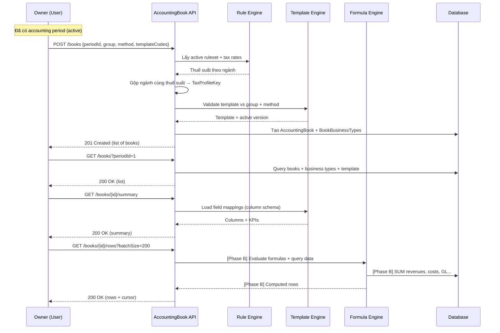

# Module Sổ Kế Toán (Accounting Book) — Tài liệu giải thích

> Tài liệu này giải thích **toàn bộ** database schema, seed data, và API đã xây dựng cho module Sổ Kế Toán theo Thông tư 152/2025/TT-BTC.

---

## Mục lục

1. [Tổng quan kiến trúc](#1-tổng-quan-kiến-trúc)
2. [Bảng dữ liệu (14 tables)](#2-bảng-dữ-liệu-14-tables)
3. [Dữ liệu seed đã insert](#3-dữ-liệu-seed-đã-insert)
4. [API Endpoints](#4-api-endpoints)
5. [Luồng hoạt động](#5-luồng-hoạt-động-end-to-end)

---

## 1. Tổng quan kiến trúc

```
┌─────────────────────────────────────────────────────────────────┐
│                     ACCOUNTING BOOK MODULE                       │
├────────────────┬──────────────────┬──────────────────────────────┤
│  Rule Engine   │ Template Engine  │       Formula Engine          │
│                │                  │                                │
│ TaxRulesets    │ AccountingTempl. │ FormulaDefinitions             │
│ TaxGroupRules  │ TemplateVersions │ FormulaResults (cache)         │
│ IndustryTaxRates│ MappableEntities│                                │
│                │ MappableFields   │                                │
│                │ FieldMappings    │                                │
├────────────────┴──────────────────┴──────────────────────────────┤
│                     Accounting Books                              │
│ AccountingBooks · BookBusinessTypes · AccountingExports            │
│ TaxPayments                                                       │
└─────────────────────────────────────────────────────────────────┘
```

Module gồm 3 engine chính:
- **Rule Engine**: Phân nhóm HKD (1-4), xác định thuế suất theo ngành nghề
- **Template Engine**: Quản lý mẫu sổ (S1a, S2a-e), mapping field → nguồn dữ liệu
- **Formula Engine**: Tính toán công thức (tổng quý, thuế GTGT, thuế TNCN, bình quân gia quyền...)

---

## 2. Bảng dữ liệu (14 tables)

### 2.1. Rule Engine (3 bảng)

#### `TaxRulesets` — Bộ quy tắc thuế (version container)
| Cột | Ý nghĩa |
|-----|---------|
| `RulesetId` | PK, auto-increment |
| `Code` | Mã bộ quy tắc, VD: `TT152_2025` |
| `Version` | Semantic version: `1.0.0` |
| `EffectiveFrom/To` | Thời gian hiệu lực |
| `IsActive` | Chỉ 1 bộ active tại 1 thời điểm |

**Vai trò**: Container cho tất cả rules + tax rates. Khi luật thuế thay đổi → tạo Ruleset mới (version mới), không sửa cái cũ.

---

#### `TaxGroupRules` — Phân nhóm HKD
| Cột | Ý nghĩa |
|-----|---------|
| `GroupNumber` | 1, 2, 3, hoặc 4 |
| `ConditionsJson` | Điều kiện phân nhóm (JSON): doanh thu min/max |
| `OutcomesJson` | Kết quả khi match (JSON): cách tính thuế, sổ bắt buộc |

**Vai trò**: Xác định HKD thuộc nhóm nào dựa trên doanh thu:

| Nhóm | Doanh thu/năm | Cách tính | Sổ bắt buộc |
|------|---------------|-----------|-------------|
| 1 | < 500 triệu | Miễn thuế | S1a |
| 2 | 500tr – 3 tỷ | Cách 1 HOẶC Cách 2 | Cách 1: S2a · Cách 2: S2b+S2c+S2d+S2e |
| 3 | 3 tỷ – 50 tỷ | Chỉ Cách 2 | S2b+S2c+S2d+S2e |
| 4 | ≥ 50 tỷ | Chỉ Cách 2 | S2b+S2c+S2d+S2e |

---

#### `IndustryTaxRates` — Thuế suất theo ngành nghề
| Cột | Ý nghĩa |
|-----|---------|
| `BusinessTypeId` | FK → `BusinessTypes` (ngành nghề) |
| `TaxType` | `VAT` hoặc `PIT_METHOD_1` |
| `TaxRate` | Thuế suất dạng DECIMAL. VD: `0.0100` = 1% |

**Vai trò**: Mỗi ngành nghề có thuế suất VAT + PIT khác nhau:

| Ngành | VAT | PIT (Cách 1) |
|-------|-----|-------------|
| Phân phối hàng hóa | 1% | 0.5% |
| Dịch vụ | 5% | 2% |
| Sản xuất, F&B | 3% | 1.5% |
| Vận tải | 3% | 1.5% |

---

### 2.2. Template Engine (5 bảng)

#### `AccountingTemplates` — Mẫu sổ kế toán
| Cột | Ý nghĩa |
|-----|---------|
| `TemplateCode` | `S1a`, `S2a`, `S2b`, `S2c`, `S2d`, `S2e` |
| `ApplicableGroups` | JSON — nhóm nào được dùng. VD: `[1]`, `[2,3,4]` |
| `ApplicableMethods` | JSON — cách tính thuế. VD: `["method_1"]`, `null` = tất cả |

**Vai trò**: Định nghĩa mẫu sổ. VD: S1a chỉ áp dụng cho Nhóm 1, S2a chỉ cho Nhóm 2 + Cách 1.

#### `AccountingTemplateVersions` — Version của mẫu sổ
Mỗi template có nhiều version. Chỉ 1 version active (v1.0). Khi cần sửa cấu trúc sổ → tạo version mới.

---

#### `MappableEntities` — Danh sách nguồn dữ liệu
Whitelist các bảng mà template field có thể lấy dữ liệu từ đó:

| EntityCode | DisplayName | Mô tả |
|------------|-------------|-------|
| `orders` | Đơn hàng | Đơn hàng đã hoàn tất |
| `order_details` | Chi tiết đơn hàng | Dòng sản phẩm trong đơn |
| `gl_entries` | Sổ cái (GL) | Bút toán sổ cái |
| `costs` | Chi phí | Chi phí nhập hàng + thủ công |
| `tax_payments` | Thuế đã nộp | Ghi nhận nộp thuế |
| `products` | Sản phẩm | Thông tin sản phẩm |

#### `MappableFields` — Danh sách field cho mỗi entity
VD: Entity `orders` có fields: `TotalAmount`, `CompletedAt`, `OrderCode`, `Status`, `CustomerName`.
Mỗi field ghi rõ `DataType` (decimal/date/text) và `AllowedAggregations` (sum/avg/count/none).

---

#### `TemplateFieldMappings` — Cấu trúc cột của sổ
> **Đây là bảng quan trọng nhất** — nó map mỗi cột trong sổ kế toán → nguồn dữ liệu hoặc công thức.

| Cột | Ý nghĩa |
|-----|---------|
| `FieldCode` | Mã cột: `stt`, `date`, `revenue`, `thue_gtgt`... |
| `FieldLabel` | Nhãn hiển thị: "STT", "Ngày tháng", "Thuế GTGT"... |
| `FieldType` | `auto_increment`, `date`, `text`, `decimal`, `computed` |
| `SourceType` | `auto` / `query` / `formula` / `static` |
| `SourceEntityId` → `SourceFieldId` | Lấy data từ entity nào, field nào |
| `FormulaId` | Nếu là cột tính toán → reference công thức |

**Ví dụ: Sổ S1a có 4 cột:**

| STT | Ngày tháng | Nội dung | Doanh thu |
|-----|-----------|----------|-----------|
| auto | orders.CompletedAt | orders.OrderCode | orders.TotalAmount |
| `auto_increment` | `query` | `query` | `query` |

**Ví dụ: Sổ S2a có 5 cột data + 3 cột tính toán:**
- 5 cột query: STT, Số hiệu, Ngày, Diễn giải, Số tiền
- Cộng quý = `SUM(so_tien)` → formula
- Thuế GTGT = `cong_quy × VAT_RATE` → formula
- Thuế TNCN = `MAX(0, TOTAL_REVENUE - 500M) × PIT_RATE` → formula

---

### 2.3. Formula Engine (2 bảng)

#### `FormulaDefinitions` — Pool công thức tính toán
| Cột | Ý nghĩa |
|-----|---------|
| `Code` | Mã công thức: `S2A_VAT`, `S2D_WEIGHTED_AVG`... |
| `FormulaType` | `AGGREGATE`, `CELL_REF`, `TAX_RATE`, `WEIGHTED_AVG`, `EXTERNAL_LOOKUP` |
| `ExpressionJson` | Cây biểu thức JSON (AST) — giải thích bên dưới |

**FormulaType giải thích:**

| Type | Ý nghĩa | Ví dụ |
|------|---------|-------|
| `AGGREGATE` | SUM/AVG/COUNT từ DB | SUM revenues WHERE sale |
| `CELL_REF` | Tham chiếu kết quả formula khác | `tong_dt - tong_cp` |
| `TAX_RATE` | Nhân với thuế suất từ IndustryTaxRates | `cong_quy × VAT_RATE` |
| `WEIGHTED_AVG` | Bình quân gia quyền | `(GT_tồn + GT_nhập) / (SL_tồn + SL_nhập)` |
| `EXTERNAL_LOOKUP` | Lấy giá trị từ bảng khác | Số dư tiền mặt đầu kỳ |

#### `FormulaResults` — Cache kết quả tính toán
Lưu kết quả đã tính để không phải query lại. Có flag `IsStale` — khi data gốc thay đổi → đánh dấu stale → tính lại.

---

### 2.4. Accounting Books (4 bảng)

#### `AccountingBooks` — Sổ kế toán (live view)
| Cột | Ý nghĩa |
|-----|---------|
| `BookId` | PK |
| `BusinessLocationId` | Thuộc cơ sở kinh doanh nào |
| `PeriodId` | Thuộc kỳ kế toán nào |
| `TemplateVersionId` | Dùng mẫu sổ version nào |
| `GroupNumber` | Nhóm HKD (1-4) |
| `TaxMethod` | `method_1`, `method_2`, hoặc `exempt` |
| `RulesetId` | Snapshot ruleset tại thời điểm tạo |

**Vai trò**: Mỗi "sổ" là 1 live view — không lưu data statically, mà query data từ orders/costs/GL theo field mapping của template.

---

#### `AccountingBookBusinessTypes` — Bảng trung gian (book ↔ ngành)
| Cột | Ý nghĩa |
|-----|---------|
| `BookId` | FK → AccountingBooks |
| `BusinessTypeId` | FK → BusinessTypes |
| `TaxProfileKey` | Key debug: `VAT_1.00\PIT_0.50\METHOD_method_1` |

**Tại sao cần bảng này?** Vì 1 HKD có thể kinh doanh nhiều ngành nghề. Các ngành có **cùng thuế suất** sẽ được **gộp chung 1 sổ**.

VD: Nếu "Phân phối hàng hóa" và "Vận tải" đều có VAT 3% + PIT 1.5% → gộp chung 1 sổ.
`TaxProfileKey` = `VAT_0.03|PIT_0.0150|METHOD_method_1` → dễ debug tại sao 2 ngành gộp chung.

---

#### `AccountingExports` — Lịch sử xuất sổ (snapshot PDF/Excel)
Mỗi lần user xuất sổ ra PDF/Excel → lưu 1 record snapshot (summary, file URL, data tại thời điểm xuất).

#### `TaxPayments` — Ghi nhận nộp thuế
Tracking tiền thuế đã nộp (VAT/PIT), ngày nộp, biên lai.

---

## 3. Dữ liệu seed đã insert

### Migration 058 — Seed Tax Rulesets
```
1 TaxRuleset: TT152_2025 v1.0.0 (active)
4 TaxGroupRules: Nhóm 1-4 (phân nhóm theo doanh thu)
4 BusinessTypes mẫu: Hàng hóa, Dịch vụ, F&B, Vận tải
8 IndustryTaxRates: 4 VAT + 4 PIT cho 4 ngành
```

### Migration 059 — Seed Templates
```
6 AccountingTemplates: S1a, S2a, S2b, S2c, S2d, S2e
6 AccountingTemplateVersions: v1.0 (active) cho mỗi template
```

### Migration 060 — Seed Metadata Registry
```
6 MappableEntities: orders, order_details, gl_entries, costs, tax_payments, products
~28 MappableFields: các field cho mỗi entity
```

### Migration 061 — Seed Field Mappings
```
~50 TemplateFieldMappings cho 6 templates:
  - S1a: 4 cột (STT, Ngày, Nội dung, Doanh thu)
  - S2a: 5 cột data + 3 cột formula
  - S2b: 5 cột data + 2 cột formula
  - S2c: 6 cột data + 4 cột formula
  - S2d: 11 cột data + 5 cột formula (kho XNT)
  - S2e: 7 cột data + 8 cột formula (tiền mặt + tiền gửi)
```

### Migration 062 — Seed Formulas
```
29 FormulaDefinitions:
  - S1a: 2 (cộng tháng, cộng quý)
  - S2a: 4 (cộng quý, tổng DT toàn bộ, VAT, PIT)
  - S2b: 2 (cộng quý, VAT)
  - S2c: 4 (tổng DT, tổng CP, chênh lệch, PIT Cách 2)
  - S2d: 9 (tồn ĐK, nhập, đơn giá BQ gia quyền, xuất, tồn CK)
  - S2e: 8 (tiền mặt + tiền gửi: đầu kỳ, thu, chi, cuối kỳ)
```

---

## 4. API Endpoints

Base URL: `api/locations/{locationId}/accounting/books`

### 4.1. `POST /` — Tạo sổ kế toán

**Request body:**
```json
{
    "periodId": 1,          // Kỳ kế toán nào
    "groupNumber": 2,       // Nhóm HKD (1-4)
    "taxMethod": "method_1",// Cách tính: exempt | method_1 | method_2
    "templateCodes": ["S2a"] // Danh sách mã mẫu sổ cần tạo
}
```

**Logic xử lý:**
1. Validate: period phải active (chưa finalize), ruleset phải active
2. Validate: template phải đúng nhóm + method (S1a chỉ cho nhóm 1, S2a chỉ cho method_1...)
3. Lấy tất cả business types của location
4. Tra thuế suất cho từng ngành → tạo `TaxProfileKey`
5. Gộp các ngành có **cùng TaxProfileKey** vào 1 sổ
6. Tạo 1 book per template × per tax profile group
7. Nếu book đã tồn tại (duplicate) → skip, không tạo trùng

**Response:** Danh sách các sổ đã tạo, bao gồm bookId, template info, tax profile, business types.

---

### 4.2. `GET /?periodId={id}` — Danh sách sổ trong kỳ

Trả về tất cả accounting books (active) cho location + period đó.
Mỗi item có: bookId, templateCode, templateName, groupNumber, taxMethod, businessTypes, taxProfileKey.

---

### 4.3. `GET /{bookId}/summary` — Thông tin tổng quan sổ

Trả về metadata của sổ:
- `templateCode`, `templateName` — mẫu sổ nào
- `columns[]` — danh sách cột (field schema): fieldCode, label, type
- KPI tổng hợp (Phase B sẽ bổ sung: totalRevenue, totalCost, totalTax)

Mục đích: **load nhanh** để render header bảng + KPI cards trước khi load data rows.

---

### 4.4. `GET /{bookId}/rows?cursor=...&batchSize=200` — Dữ liệu sổ (cursor-based)

Trả về dữ liệu dạng infinite scroll:
```json
{
    "rows": [ { "stt": 1, "date": "2026-01-15", "revenue": 5000000 }, ... ],
    "hasMore": true,
    "nextCursor": "2026-01-15_1234",
    "loadedCount": 200,
    "totalEstimated": 450
}
```

- `batchSize`: tối đa 200 dòng/request
- `cursor`: token từ response trước → gọi tiếp để lấy batch sau
- Dùng **cursor-based** (không dùng offset/page) vì data có thể thay đổi realtime

> ⚠️ Phase B mới wire render engine. Hiện tại trả về `rows: []`, `hasMore: false`.

---

## 5. Luồng hoạt động (End-to-End)



---

## Tóm tắt

| Thành phần | Số lượng | Trạng thái |
|-----------|----------|-----------|
| SQL Migrations | 12 files (051-062) | ✅ Applied |
| Domain Entities | 14 classes | ✅ Done |
| Repositories | 5 interfaces + 5 implementations | ✅ Done |
| DTOs | 6 classes | ✅ Done |
| Service | AccountingBookService (4 methods) | ✅ Done |
| Controller | 4 endpoints | ✅ Done |
| Formula Engine | FormulaEngine service | 🔲 Phase B |
| Render Engine | BookRenderingService | 🔲 Phase B |
| Unit Tests | AccountingBookService + FormulaEngine | 🔲 Phase F |
